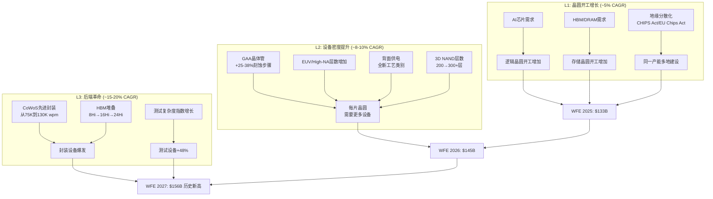
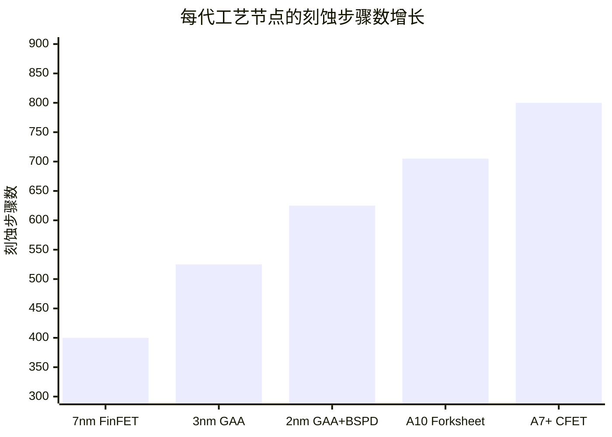
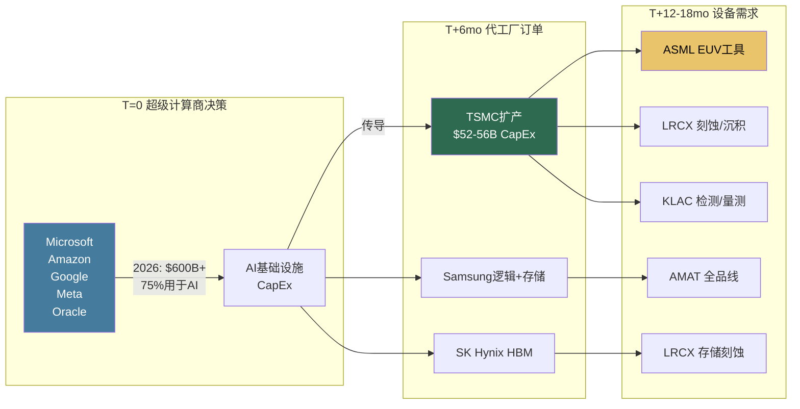
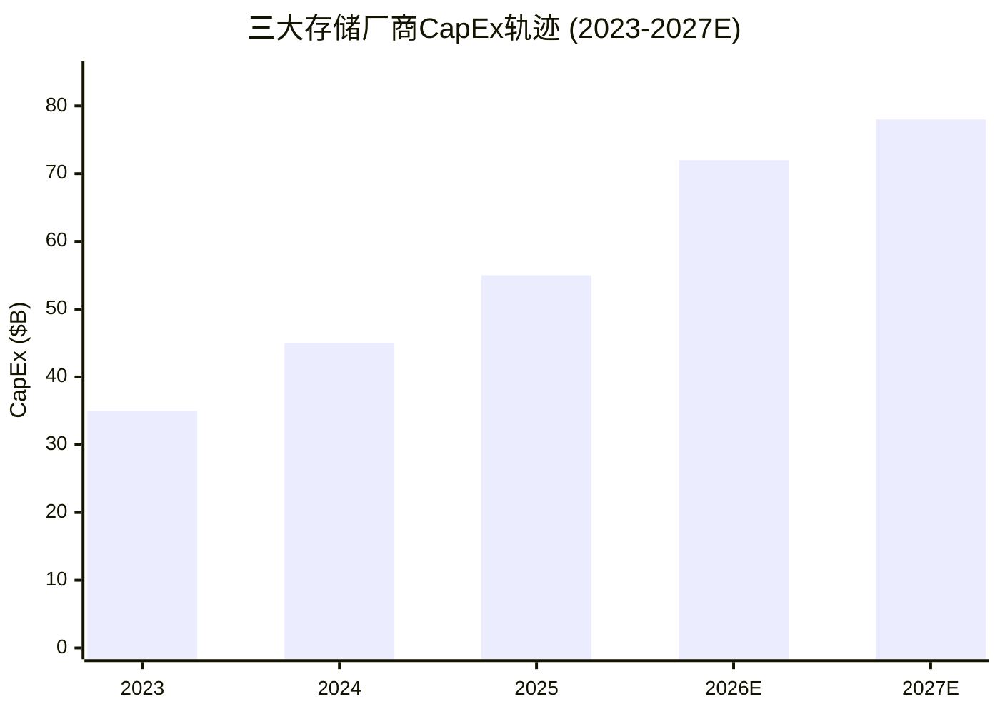
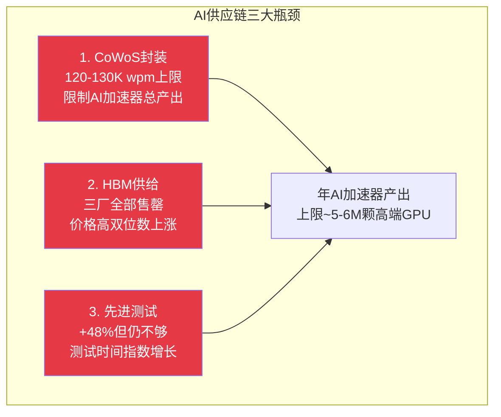
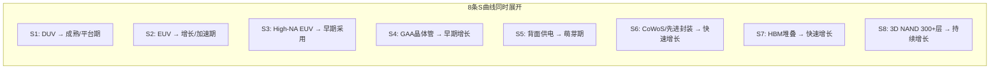
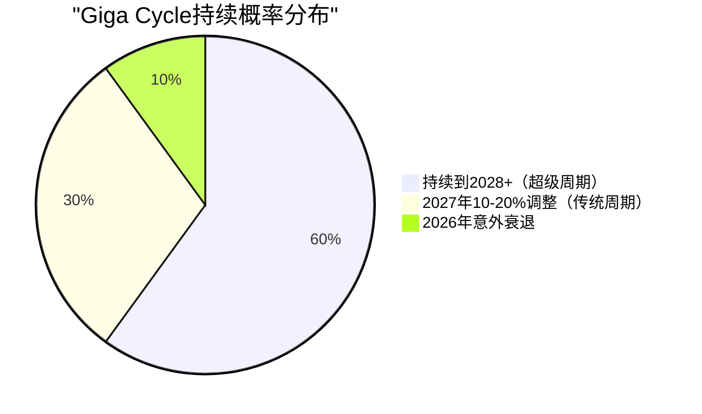
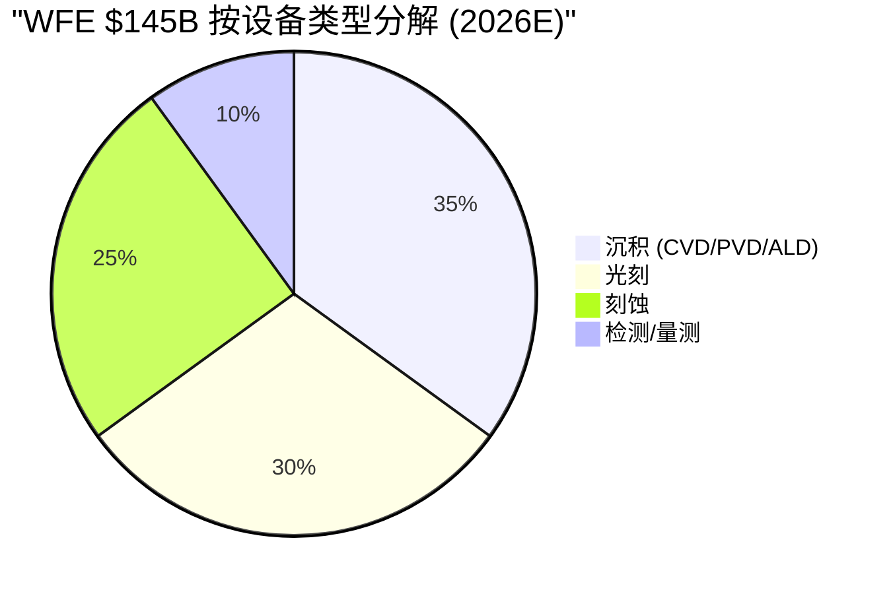

# Chapter 2: Giga Cycle解剖——一个持续到2028年的超级周期

> *"这不是一个普通的半导体周期。这是四五个技术转型同时发生的结构性重塑。"*
> *— 综合四位CEO的共识叙事*

---

## 2.1 WFE市场的三层增长模型

半导体设备市场（WFE）的增长不是单一驱动力。为CEO准确理解增长来源，我们将其分解为三个独立但叠加的增长层：

### L1: 晶圆开工增长——最传统、最周期性

| 驱动力 | 量化影响 | 周期性 | 可见度 |
|--------|---------|--------|--------|
| AI加速器产能 | TSMC $52-56B CapEx (+37-47%) | 高（依赖超级计算商CapEx） | 18-24个月（已锁定到2027） |
| HBM产能扩张 | SK Hynix $21.5B, Micron $20B, Samsung $30.4B | 高 | 12-18个月 |
| 地缘分散化 | 同一产能在美国/欧洲/日本重复建设 | 低（政策驱动） | 36-60个月（CHIPS Act拨款时间表） |
| 成熟节点（28nm+） | 中国国产fab持续建设 | 中等 | 12个月 |

**CEO关键洞察**：L1增长中，**TSMC单一公司驱动了WFE增量的80%+**。这意味着"WFE增长"本质上是"TSMC CapEx增长"的委婉说法。任何TSMC CapEx调整都会被设备行业杠杆放大。

### L2: 设备密度提升——结构性、非周期性

这是本轮Giga Cycle最被低估的驱动力。

| 技术转型 | 设备步骤增量 | 时间窗口 | 主要受益设备公司 |
|----------|:---:|---------|:---:|
| **GAA晶体管** (FinFET→GAA) | +25-38% 刻蚀/沉积步骤 | 2024-2028 | LRCX, AMAT |
| **EUV→High-NA EUV** | +40-60% 检测/量测步骤 | 2026-2030 | KLAC, ASML |
| **背面供电** (BSPDN) | 全新工艺类别 | 2026-2029 | AMAT, LRCX |
| **3D NAND 200→300+层** | +50% 刻蚀/沉积强度 | 2025-2028 | LRCX |
| **先进封装** (CoWoS/HBM) | 检测密度5-6x | 2024-2028 | KLAC, AMAT |
| **EUV DRAM** | +100-200bps 过程控制强度 | 2025-2027 | KLAC |

**从7nm到A7+（~2030），刻蚀步骤数大约翻倍（+87-113%）。** 这意味着即使全球晶圆开工数不增长、WFE总量不变，LRCX的刻蚀SAM仍会增长约87%——纯粹来自工艺复杂度提升。

### L3: 后端革命——增长最快、最被低估

2025年的数据揭示了一个结构性转变：

| 设备类别 | 2025增速 | vs 前端WFE增速 | 倍数 |
|---------|:---:|:---:|:---:|
| 测试设备 | **+48%** | +2% | **24x** |
| 封装设备 | **+20%** | +2% | **10x** |
| 前端WFE | +2% | 基准 | 1x |

**市场的心智模型仍然将设备公司的价值主要锚定在前端暴露度上。** 但数据显示后端设备增速是前端的10-24倍。这创造了定价不对称：拥有后端暴露度的公司（KLAC的先进封装检测、AMAT的HBM设备）可能被相对低估。

---

## 2.2 超级计算商CapEx传导链

从超级计算商到设备公司的传导链条有18个月的时间滞后，这为设备公司提供了罕见的需求可见度：

### 超级计算商CapEx数据（Goldman Sachs预测）

| 时期 | 累计超级计算商CapEx | vs 前三年 |
|------|:---:|:---:|
| 2022-2024 | $477B | 基准 |
| 2025-2027 | **$1.15T** | **2.4x** |

| 公司 | 2026 CapEx预估 | YoY |
|------|:---:|:---:|
| Amazon | ~$100B+ | +36% |
| Microsoft | ~$80B+ | +30% |
| Google | ~$75B+ | +40% |
| Meta | ~$65B+ | +35% |
| Oracle | ~$25B+ | +50% |
| **五大合计** | **$600B+** | **+36%** |

75%（~$450B）专门用于AI基础设施。

**CEO关键洞察**：当前超级计算商的承诺水平**保证了设备需求至少到2028年**。这使得本轮成为半导体设备历史上"可见度最高的周期"。但可见度不等于永恒——如果超级计算商2027-2028年对AI投资的ROI验证失败，传导链将反向运作，且设备公司由于18个月滞后会成为最后感知到衰退的环节。

---

## 2.3 存储CapEx加速——被忽视的第二引擎

AI对设备需求的传导不仅通过逻辑/代工（TSMC），还通过存储（Samsung/SK Hynix/Micron）：

| 存储厂商 | 2026 CapEx | YoY | 主要驱动力 |
|---------|:---:|:---:|---------|
| Samsung Semiconductor | ~$30.4B | +25% | HBM + DRAM EUV |
| SK Hynix | $21.5B | +38% (从$15.6B上调) | HBM产能翻倍 |
| Micron | $20.0B | +33% (上调) | HBM + NAND |
| **三大合计** | **~$72B** | **+30%** | |

### HBM市场规模

| 年份 | HBM市场 | YoY |
|------|:---:|:---:|
| 2024 | $15.2B | — |
| 2025 | ~$25B | +64% |
| 2026 | $32.6B | +30% |
| 2028 | ~$50B+ | CAGR 21.7% |

**对设备公司的含义**：

| 设备类别 | 受HBM驱动的需求 | 主要受益者 |
|---------|:---:|---------|
| 刻蚀 (TSV) | TSV深度每代+50% | LRCX |
| 沉积 (填充) | 高纵横比沉积 | AMAT, LRCX |
| 检测 (堆叠) | HBM4 16Hi vs 8Hi检测步骤翻倍 | KLAC |
| 键合 | 混合键合/热压键合 | AMAT, BESI |
| 测试 | 每层独立测试 | Advantest, Teradyne |

---

## 2.4 CoWoS瓶颈——真正的供给约束

AI基础设施的真正瓶颈不在于光刻（ASML）或刻蚀（LRCX），而在于先进封装：

| 指标 | 当前 | 2026年底目标 | 限制因素 |
|------|------|------------|---------|
| TSMC CoWoS产能 | 75-80K wpm | 120-130K wpm | 洁净室空间 |
| ASE CoWoS产能 | ~8K wpm | 20-25K wpm (3x) | 设备交付 |
| NVIDIA预订TSMC CoWoS占比 | >50% | 维持 | 2027年前满订 |
| SK Hynix HBM | 2026全部售罄 | — | 物理产能上限 |
| Micron HBM | 2025-2026全部订满 | — | 良率爬坡 |

**CEO关键洞察**：CoWoS是NVIDIA真正的产出约束。即使TSMC扩产到130K wpm，这限制了年高端GPU产出约为5-6M颗。对设备公司而言，先进封装设备需求拥有**最长跑道和最低周期风险**——因为瓶颈解除需要持续数年的设备投资。

---

## 2.5 S曲线叠加——为什么这次不一样

历史上，半导体设备周期由**单一技术转型**驱动：DUV→193nm浸润（2004-2008），3D NAND引入（2016-2018），EUV量产（2019-2021）。

本轮Giga Cycle的独特之处在于**4-5个技术转型同时发生**：

| 技术 | S曲线位置 | 设备含义 | 主要受益者 |
|------|---------|---------|---------|
| DUV光刻 | **成熟/平台期** | 稳定替换需求 + 中国 | ASML (DUV), Nikon |
| EUV光刻 | **增长/加速期** | ASML垄断，2nm采用驱动 | ASML |
| High-NA EUV | **早期采用** | $350M/台，Intel先行 | ASML |
| GAA晶体管 | **早期增长** | +15-20%刻蚀/沉积步骤 | LRCX, AMAT |
| 背面供电 | **萌芽期** | 全新设备品类 | AMAT, LRCX |
| CoWoS/先进封装 | **快速增长** | 瓶颈=大规模投资 | KLAC, AMAT, ASML |
| HBM堆叠 | **快速增长** | 存储+封装设备爆发 | LRCX, KLAC, AMAT |
| 3D NAND 300+层 | **持续增长** | 刻蚀/沉积强度持续上升 | LRCX |

**这创造了20年来设备密度/晶圆上升速度最快的时期。** 即使晶圆开工数增长放缓，设备收入仍通过增加的步骤数/晶圆来增长。WFE/晶圆开工比率正在结构性攀升，而非周期性波动。

---

## 2.6 Giga Cycle的寿命——它能持续多久？

### 看多方论据（60%概率权重）

1. **超级计算商承诺已锁定到2027-2028**：Goldman Sachs $1.15T三年CapEx预测
2. **CHIPS Act/EU Chips Act拨款尚在早期**：美国$3B仅用于先进封装
3. **技术转型有物理时间表**：GAA、High-NA、BSPDN不可能在2028年前完成
4. **AI推理增长才刚开始**：训练之后是推理，推理需要更多而非更少的芯片

### 看空方论据（40%概率权重）

1. **AI CapEx ROI验证窗口2027-2028**：如果ROI不达标，CapEx悬崖
2. **WFE历史上从未连续5年增长**：40年历史中零先例（LRCX B6承重墙）
3. **TSMC CapEx集中度风险**：TSMC CapEx调整=WFE调整
4. **估值已定价完美**：CAPE 39.78（98th百分位），Buffett Indicator 217%（99th百分位）

### 周期定位评估

| 层级 | 信号 | 评估 | 关键数据 |
|------|------|------|---------|
| L1 终端需求 | AI/HPC占WFE 35-40%，结构性重塑 | **正面** | 超级计算商CY2026 CapEx +36% |
| L2 Fab CapEx | TSMC $52-56B (+37-47%) | **强正面** | 单一公司驱动80%+ WFE增量 |
| L3 设备订单 | ASML Q4新订单EUR 13.2B（创纪录） | **强正面** | LRCX B/B >1.0x |
| L4 库存 | 管道适中，无严重堆积 | **中性偏正** | LRCX库存效率改善 |
| L5 估值 | CAPE 39.78（98th百分位） | **⚠️ 警告** | 宏观估值处于历史极端 |
| L6 宏观 | Buffett Indicator 217%（99th百分位） | **⚠️ 警告** | 但降息预期提供缓冲 |

### CEO战略含义

**"准备好天气变化，但不要因为可能下雨就不出门。"**

- 5/6层信号正面或中性，只有估值/宏观层发出警告
- 超级周期概率60%，但传统周期性调整（2027年-10~-20%WFE）概率不可忽略（30%）
- **最危险的组合**：AI CapEx高原 + 存储周期衰退 + 出口管制升级 = 三重打击（联合概率15-25%）

---

## 2.7 WFE市场结构——谁切走了哪块蛋糕

### 按设备类型分解（2026E近似份额）

| 设备类型 | 2026E市场规模 | 主导者 | 第二名 | 第三名 |
|---------|:---:|---------|--------|--------|
| 沉积 | ~$51B | AMAT (~25%) | TEL (~22%) | LRCX (~18%) |
| 光刻 | ~$44B | ASML (89%) | Nikon (~6%) | Canon (~5%) |
| 刻蚀 | ~$36B | LRCX (~45%) | TEL (~27%) | AMAT (~15%) |
| 检测/量测 | ~$14.5B | KLAC (~52%) | AMAT (~8%) | Hitachi (~15%) |

### 按终端应用分解

| 应用 | 2026E WFE份额 | 增速 | 主要受益设备公司 |
|------|:---:|:---:|---------|
| 代工/逻辑 | ~52% ($75B) | +5.5% | ASML, LRCX, AMAT |
| DRAM | ~18% | +15.1% | LRCX (EUV DRAM), KLAC |
| NAND | ~11% ($15.7B) | +12.7% | LRCX (通道孔), AMAT |
| 先进封装 | ~8% ($12B) | +35-45% | KLAC, AMAT, ASML |
| 测试 | ~8% ($11.2B) | +48% | Advantest, Teradyne |
| 其他 | ~3% | 持平 | — |

---

## 2.8 半导体行业的"逆向体量-价值"悖论

一个定义本轮Giga Cycle的反直觉数据点：

| 指标 | 数值 | 含义 |
|------|------|------|
| 2025年售出的芯片总数 | **1.05万亿颗** | — |
| 平均单价 | $0.74/颗 | — |
| AI芯片占**单位量**的比例 | **<0.2%** | 不到千分之二 |
| AI芯片占**收入**的比例 | **~50%** | 一半收入 |
| 年AI芯片产量 | ~2000万颗 | ~80万片晶圆×20颗/片 |

**半导体行业的价值创造已经从体量指标脱耦，脱耦程度超过历史上任何制造业。**

这对设备公司意味着什么？传统的设备周期模型基于晶圆开工预测。但在AI时代，设备需求由**"价值加权晶圆开工"**驱动，而非"体量加权晶圆开工"——一片用于AI加速器的晶圆消耗的设备价值可能是一片IoT芯片晶圆的10-50倍（更多EUV层、更多刻蚀步骤、更复杂的检测、更昂贵的封装）。

**传统WFE周期模型系统性低估了AI驱动的设备需求。**

---

## 2.9 对四位CEO的Giga Cycle启示

| CEO | Giga Cycle的最大机会 | Giga Cycle的最大风险 | 关键行动 |
|-----|-----------------|-----------------|---------|
| **Fouquet (ASML)** | EUV层数增加 + High-NA商业化 | TSMC延迟High-NA = 高端情景失败 | 确保2026年H2有来自TSMC的新High-NA插入订单决策 |
| **Archer (LRCX)** | GAA/BSPDN创造新刻蚀步骤 + NAND层数提升 | NAND复苏时间风险（2027-2028?）+ TEL侵蚀 | 确保"5年翻倍"目标不过度依赖NAND时间假设 |
| **Wallace (KLAC)** | 先进封装检测密度5-6x + EUV DRAM过程控制强度+200bps | H1 2026增长暂停 | 在3/12 Investor Day更新长期财务模型 |
| **Dickerson (AMAT)** | GAA >50%份额 + 先进封装设备TAM翻3倍 | ICAPS"消化"掩盖了AI增长故事 | 分部报告改革：让市场分别定价AI增长和ICAPS消化 |

---

## 2.10 Giga Cycle持续性——追踪仪表盘

以下信号将帮助CEO在Giga Cycle演进过程中做出战略调整：

| 追踪信号 | 牛市阈值 | 熊市触发 | 数据频率 | 来源 |
|---------|---------|---------|---------|------|
| 超级计算商CapEx YoY | >+20% | <-10% | 季度 | 财报 |
| TSMC CapEx指引 | >$50B | <$35B | 半年 | TSMC财报 |
| ASML季度新订单 | >EUR 4B | <EUR 2B | 季度 | ASML财报 |
| LRCX Book-to-Bill | >1.0x | <0.8x | 季度 | LRCX财报 |
| WFE YoY增速 | >+8% | <-5% | 年度 | SEMI |
| 存储CapEx大三合计 | >$60B | <$40B | 年度 | 财报 |
| CoWoS产能利用率 | >90% | <70% | 季度 | 供应链 |
| AI芯片ASP趋势 | 稳定/上升 | 下降>15% | 季度 | 行业跟踪 |
| Fab利用率 | >85% | <75% | 季度 | SEMI |
| 半导体库存天数 | <80天 | >90天 | 季度 | 行业数据 |

---

*[本章完 | 下一章: Ch3 利润池深度图——$145B WFE市场中，钱到底流向了哪里]*
