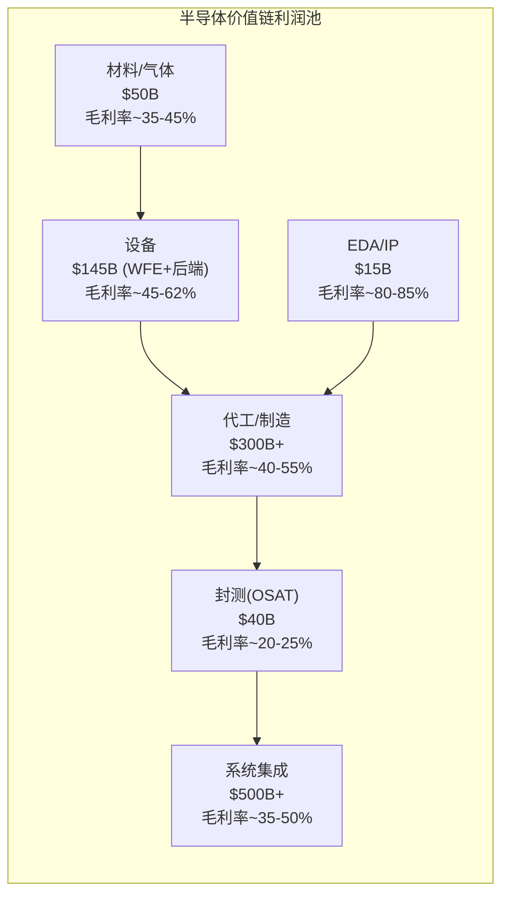
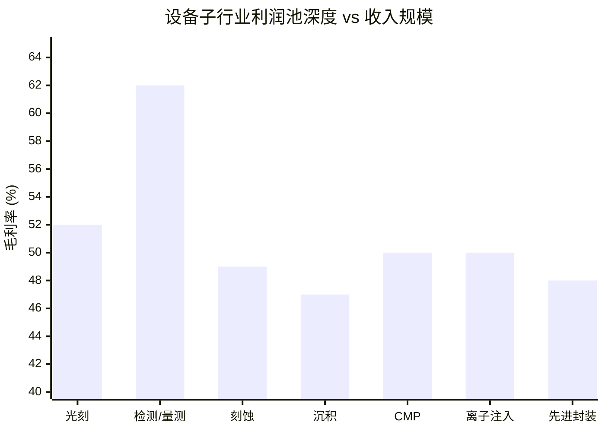
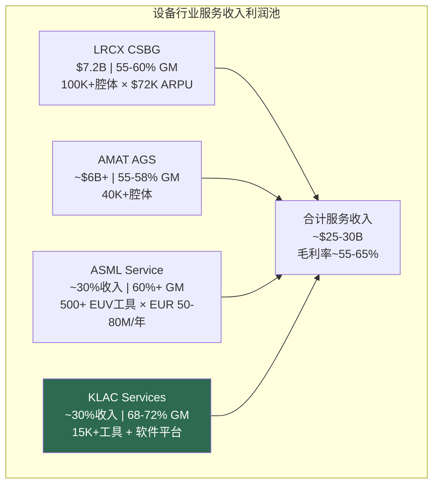
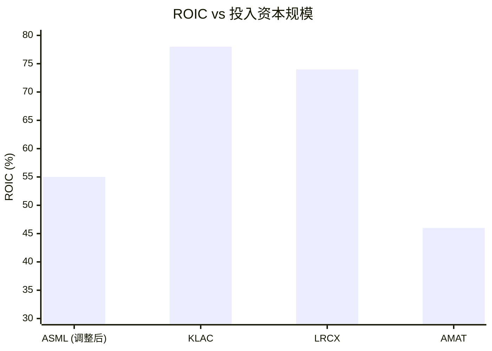
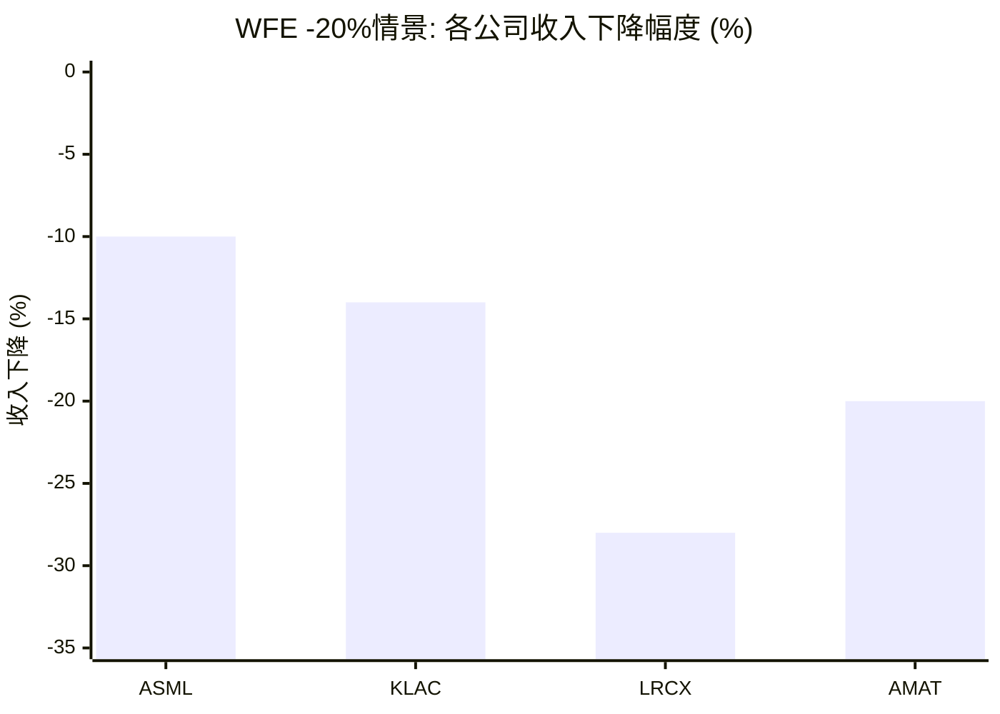

# Chapter 3: 利润池深度图——$145B WFE市场中，钱到底流向了哪里

> *"收入集中与利润集中往往截然不同。看不到这个差异的CEO会把资源投错地方。"*
> *— Bain & Company, "Profit Pools: A Fresh Look at Strategy"*

---

## 3.1 半导体行业利润池的极端集中

在讨论设备公司的利润池之前，先看整个半导体行业的利润分布——因为设备公司的客户就在这个分布中，客户的利润能力决定了设备公司的定价权。

| 指标 | 数值 | 来源 |
|------|------|------|
| 2024年全行业经济利润 | 集中在前5%的公司 | McKinsey |
| 前10家芯片公司总市值 (2025.12) | $9.5T | Deloitte |
| vs 2024.12 | +46% | |
| vs 2023.12 | +181% | |
| 前3家公司占前10市值 | 80% | |
| 北美(设计)占全球价值池 | ~60% | McKinsey |
| 亚洲占比 | ~36% | |
| 欧洲占比 | ~4% | |

**CEO关键洞察**：在没有任何其他$975B行业中，前5%的公司贡献100%的经济利润。这既是机会（供应这些顶级客户的设备公司享有不对称定价权），也是风险（你的收入命运越来越依赖越来越少的客户决策）。

---

## 3.2 设备价值链利润池图

Bain的利润池方法论要求我们不仅看收入规模，还要看每个活动环节的**利润深度**——即经济利润率。

### 利润池深度对比（经济利润率 = 收入 × [ROIC - WACC] / ROIC）

| 价值链环节 | 收入规模 | 毛利率 | 经济利润率估算 | 利润池结构特征 |
|-----------|:---:|:---:|:---:|---------|
| EDA/IP | $15B | 80-85% | **~35-40%** | 最深——双寡头(Synopsys/Cadence)，软件毛利 |
| **设备** | **$145B** | **45-62%** | **~15-25%** | **深——寡头结构，技术壁垒** |
| 代工/制造 | $300B+ | 40-55% | ~10-20% | 中深——TSMC独占经济利润 |
| 材料/气体 | $50B | 35-45% | ~8-12% | 中等——细分垄断(Entegris等) |
| 封测(OSAT) | $40B | 20-25% | ~3-5% | 浅——竞争激烈，低壁垒 |
| 系统集成 | $500B+ | 35-50% | 差异巨大 | 极分化——NVIDIA 60%+ vs 平均20% |

**设备行业的利润深度仅次于EDA/IP**——这是半导体价值链中第二深的利润池。而且，不同于EDA的相对稳定，设备利润池正在随Giga Cycle扩大。

---

## 3.3 设备行业内部的利润池分层

更有价值的分析是设备行业**内部**的利润池分布——因为四位CEO的战略选择直接影响他们在这个利润池中的位置。

### 按设备类型的利润池深度

| 设备类型 | 收入份额 | 毛利率范围 | 经济利润浓度 | 利润池领主 |
|---------|:---:|:---:|:---:|---------|
| **光刻** | ~30% ($44B) | 51-53% (含High-NA稀释) | **最高** | ASML (独占) |
| **检测/量测** | ~10% ($14.5B) | 60-62% | **极高** | KLAC (63%份额) |
| **刻蚀** | ~25% ($36B) | 47-50% | **高** | LRCX (45%), TEL (27%), AMAT (15%) |
| **沉积** | ~35% ($51B) | 45-49% | **中高** | AMAT (25%), TEL (22%), LRCX (18%) |
| **CMP** | ~2% ($3B) | ~50% | 高 | AMAT (65%) |
| **离子注入** | ~2% ($3B) | ~50% | 高 | AMAT (60%) |
| **先进封装** | ~8% (快速增长) | 待确认 | **待定义** | 竞争中 |

### 利润池的三个关键发现

**发现1: 利润集中度远超收入集中度**

KLAC的检测/量测只占WFE的10%（收入维度不突出），但其62%毛利率意味着它在利润池中的份额远高于10%。粗略估算：

| 公司 | 收入份额 (WFE) | 营业利润率 | 利润池份额估算 | 利润/收入比 |
|------|:---:|:---:|:---:|:---:|
| ASML | ~22% | ~35% | ~28% | 1.27x |
| **KLAC** | **~9%** | **~43%** | **~14%** | **1.56x** |
| LRCX | ~13% | ~32% | ~15% | 1.15x |
| AMAT | ~19% | ~29% | ~20% | 1.05x |
| TEL | ~11% | ~29% | ~11% | 1.00x |
| 其他 | ~26% | ~20% | ~12% | 0.46x |

**KLAC每美元收入创造的利润是行业平均水平的1.56倍——仅次于ASML的1.27倍。** 这解释了为什么KLAC的质量调整P/E（P/E ÷ A-Score）在四家公司中最低（最便宜/单位护城河）。

**发现2: "三座利润堡垒"——AMAT的隐藏价值**

AMAT的8条产品线中，三条是真正的利润堡垒：

| 产品线 | 市场份额 | SSG收入贡献 | SSG利润贡献 | 特征 |
|--------|:---:|:---:|:---:|---------|
| PVD | ~85% | ~15% | ~22% | 近垄断，Endura平台25年 |
| CMP | ~65% | ~8% | ~12% | 双寡头（vs Ebara） |
| 离子注入 | ~60% | ~10% | ~14% | 领导者（VIISta平台） |
| **三堡垒合计** | — | **~33-38%** | **~45-50%** | 利润集中 |

这三座堡垒占AMAT SSG收入的三分之一，但贡献了近一半的利润。它们的存在是AMAT即使在"通才折价"下仍能维持29%营业利润率的原因——没有它们，AMAT的利润率可能降至20-22%，彻底落入二线设备公司区间。

**发现3: 服务收入——最被低估的利润池**

| 公司 | 服务收入 | 服务毛利率 | 服务增速 | 真正经常性收入比例 | A6评分 |
|------|:---:|:---:|:---:|:---:|:---:|
| LRCX (CSBG) | $7.2B (~38%) | 55-60% | +16% | 60-67% | 7 |
| AMAT (AGS) | ~$6B+ (~23%) | 55-58% | +3% | — | 5 |
| KLAC | ~30%收入 | 68-72% | +14% | ~75% | 6 |
| ASML | ~30%收入 | 60%+ | 加速中 | 高 | 6 |

**KLAC的服务利润率（68-72%）是四家中最高的**——因为它的"服务"大量包含高利润率的软件分析（Klarity平台、5D Analyzer）。LRCX的CSBG体量最大（$7.2B），但利润率较低（55-60%），因为包含硬件密集的翻新设备（Reliant）。

**AMAT AGS是服务利润池中的弱势参与者**：仅+3%增速，远低于LRCX CSBG（+16%）和KLAC（+14%）。套件销售策略未能转化为服务渗透率提升。

---

## 3.4 经济利润公式：谁在创造价值，谁在消耗资本

McKinsey的Power Curve方法论使用经济利润（NOPAT - WACC × Invested Capital）而非营业利润来衡量真实价值创造。

| 公司 | ROIC | WACC估算 | ROIC-WACC | 投入资本 | 经济利润估算 |
|------|:---:|:---:|:---:|:---:|:---:|
| ASML | 135.6%* | ~9% | ~127% | ~$5.6B | ~$7.1B |
| KLAC | 78.3% | ~9% | ~69% | ~$5.3B | ~$3.7B |
| LRCX | 74.3% | ~9% | ~65% | ~$5.4B | ~$3.5B |
| AMAT | 45.8% | ~9% | ~37% | ~$14.0B | ~$5.2B |

*ASML的135.6% ROIC受客户预付款（负运营资本）扭曲。调整后ROIC ~50-60%，仍为最高，但不是异常值。

**AMAT的经济利润绝对值（$5.2B）高于KLAC和LRCX**——因为它投入的资本更多。但**资本效率**（ROIC-WACC）只有其他公司的一半。这正是"通才陷阱"的经济本质：更多资本产出更多利润，但每美元资本产出的价值更低。

---

## 3.5 "软件公司"测试——KLAC的利润池定位独特性

KLAC通过了四项定量"软件公司"测试：

| 测试维度 | KLAC | 软件公司中位数 | 半导体设备中位数 | 判定 |
|---------|:---:|:---:|:---:|:---:|
| 毛利率 | 61.9% | 70-75% | 47-50% | **接近软件** |
| CapEx/Revenue | 2.8% | 2-4% | 5-8% | **在软件范围内** |
| 固定资产周转率 | 9.7x | 8-15x | 3-5x | **在软件范围内** |
| CapEx < 折旧 | 是 | 是 | 否 | **软件特征** |

**战略含义**：KLAC的估值锚点不应完全参考纯设备公司P/E（中周期20-35x），而应部分参考软件公司P/E（30-45x中周期）。市场目前按设备公司估值KLAC（P/E 49x），但如果MACH SaaS平台持续渗透，将经常性收入从22%提升到30%+，KLAC可能获得永久性的估值重评级。

---

## 3.6 WFE下降20%压力测试——利润池的弹性

Giga Cycle不会永远持续。当它结束时，利润池如何变形？

| 指标 | ASML | KLAC | LRCX | AMAT |
|------|:---:|:---:|:---:|:---:|
| 收入下降幅度 | -8~-12% | -12~-15% | **-26~-30%** | -18~-22% |
| 毛利率 | 51~52% | 60~61% | 45~47% | 46~47% |
| FCF利润率 | 30~32% | 30~32% | 24~27% | **14~17%** |
| 能否维持回购? | 是 | 可能放缓 | 是(减量) | **可能需暂停** |
| 周期Beta | 0.5x (最低) | 0.7x | **1.3-1.5x (最高)** | 1.0x |

### 三个关键发现

1. **ASML是周期的避风港**：EUR 38.8B积压订单 + 客户预付款锁定 = 周期Beta仅0.5x。即使WFE下降20%，ASML收入仅下降8-12%。

2. **LRCX是周期的放大器**：存储50-55%暴露度 + 存储CapEx比逻辑波动性大2-3x = 周期Beta 1.3-1.5x。WFE下降20%意味着LRCX收入下降26-30%。

3. **AMAT面临EPIC Center现金覆盖风险**：FCF利润率降至14-17%，接近EPIC Center年度CapEx（$2.3B）覆盖门槛。AMAT是**唯一在衰退中被迫在投资和股东回报之间二选一的公司**。

---

## 3.7 利润池迁移预测——2030年谁赢谁输

| 利润池迁移方向 | 驱动力 | 受益者 | 受损者 |
|-------------|--------|--------|--------|
| 检测/量测占WFE比从10%→12-14% | 每代节点+100-200bps过程控制强度 | **KLAC** | — |
| 刻蚀占WFE比从25%→27-28% | GAA/CFET/BSPDN增加刻蚀步骤 | **LRCX** | — |
| 服务收入占比从25%→35%+ | 装机基数扩大 + 数字化渗透 | **LRCX, KLAC** | — |
| 先进封装从$12B→$35B+ | CoWoS/HBM/chiplet | **KLAC, AMAT** | — |
| DUV光刻利润池萎缩 | EUV替代 + 中国SMEE | ASML (转向EUV) | Nikon, Canon |
| 成熟节点设备利润池被压缩 | 中国国产替代 (35%→50%+) | **中国设备商** | **AMAT, TEL** |

---

## 3.8 对四位CEO的利润池启示

| CEO | 你在利润池中的位置 | 最大机会 | 最大威胁 | 建议行动 |
|-----|:---:|---------|---------|---------|
| **Fouquet** | 最深利润池（光刻垄断） | High-NA创造新的利润池层 | High-NA初期毛利率稀释 | 管理从51%到60%的毛利率路径叙事 |
| **Archer** | 刻蚀利润池扩大 + CSBG飞轮 | GAA/NAND/HBM三重利润池增长 | TEL侵蚀定价权→利润率压缩 | 将CSBG从收入引擎升级为利润引擎（ARPU提升） |
| **Wallace** | 每美元收入利润产出最高（1.56x） | 软件化提升利润池深度 | 增长暂停动摇利润率叙事 | 确认先进封装与核心业务利润率可比 |
| **Dickerson** | 利润集中在三堡垒（PVD/CMP/离子） | EPIC如果成功→创造新利润池 | PVD利润池被Naura侵蚀 | 保护三堡垒同时推动GAA/封装利润新增长 |

---

## 3.9 FCF收益率收敛异常——被市场忽视的定价错误

我们的横向对比分析发现了一个重要的利润池定价异常：

| 公司 | FCF收益率 | A-Score (质量) | 差值 |
|------|:---:|:---:|:---:|
| ASML | 2.25% | 8.12 | — |
| AMAT | 2.11% | 5.42 | — |
| LRCX | 2.13% | 7.02 | — |
| KLAC | 1.97% | 7.66 | — |
| **四家价差** | **仅28bp** | **2.70分** | **极端不匹配** |

FCF收益率四家公司仅相差28个基点（1.97%-2.25%），但全面质量评分（A-Score）相差2.70分（5.42-8.12）。**市场将所有四家作为"半导体设备板块"统一定价，而非根据个体质量差异定价。**

长期来看，质量差异将重新主张自身——KLAC的FCF收益率应该更低（更贵/每美元FCF）vs AMAT，合理差距为50-80bp（vs当前-14bp）。这个收敛过程是KLAC结构性跑赢的驱动力。

**CEO语言翻译**：如果你是KLAC的Wallace，市场给你的定价与质量远低于你的AMAT相似——时间是你的朋友。如果你是AMAT的Dickerson，市场对你异常慷慨——你需要用EPIC和GAA来证明这份慷慨是合理的，否则均值回归会很痛苦。

---

*[本章完 | 下一章: Ch4 Porter堡垒——为什么这个行业一直赚钱]*
