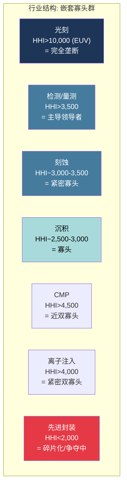
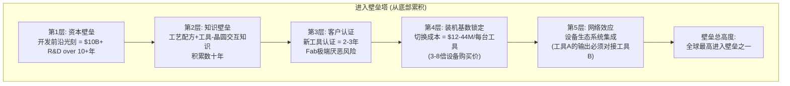
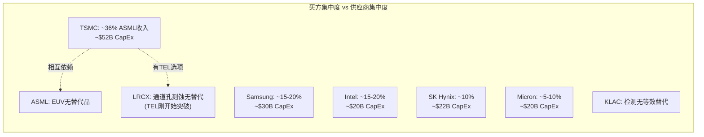
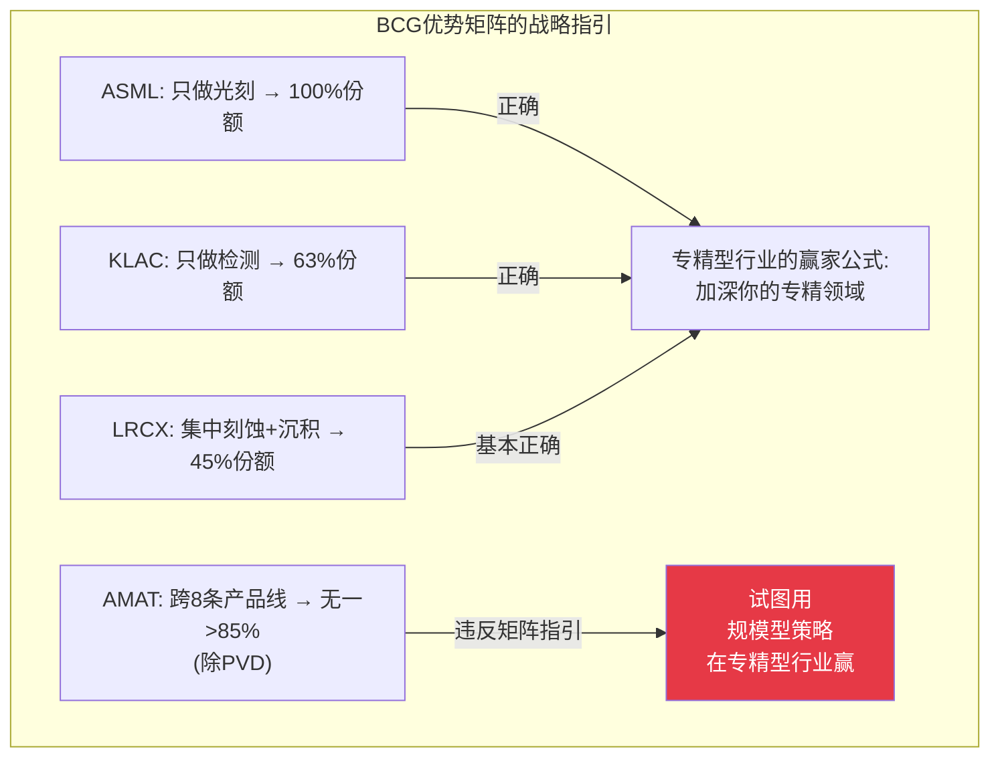
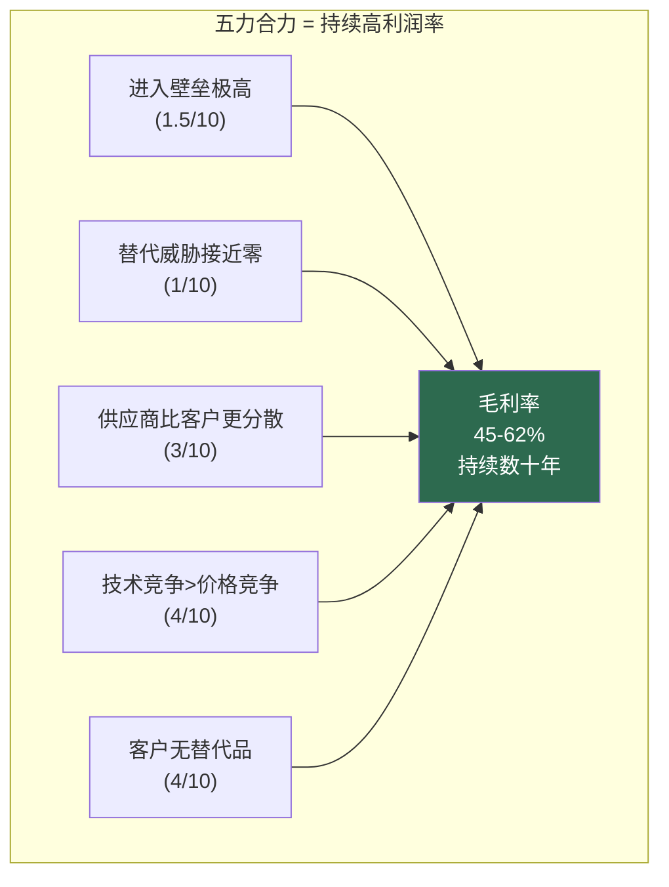
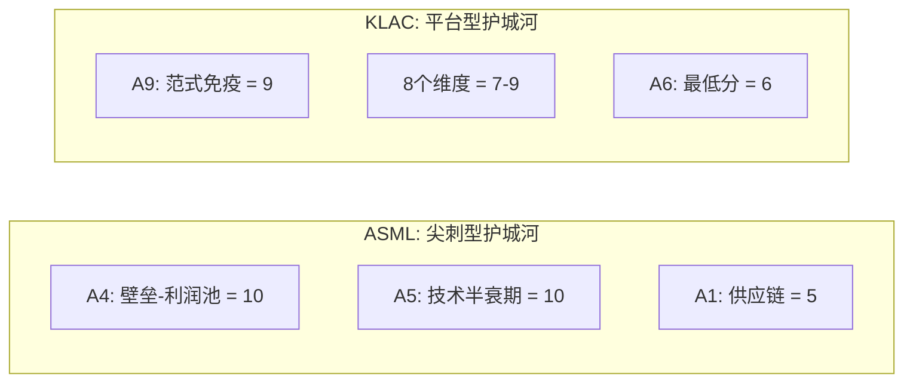

# Chapter 4: Porter堡垒——为什么这个行业一直赚钱

> *"理解一个行业为什么赚钱，比理解一家公司为什么赚钱更重要——因为前者决定了后者的上限。"*
> *— Michael Porter, "The Five Competitive Forces That Shape Strategy"*

---

## 4.1 行业结构总览：嵌套寡头的堡垒群

半导体设备行业不是一个单一的寡头。它是一个**嵌套寡头群**——在每个工艺步骤中都存在独立的寡头结构，而这些寡头之间又通过客户需求和技术路线图相互关联。

| 子行业 | 2025收入 | 前三名 | 近似HHI | DOJ分类 | 竞争结构 |
|--------|:---:|---------|:---:|---------|---------|
| **光刻(EUV)** | ~$40B | ASML (100%), — , — | >10,000 | 垄断 | 零竞争 |
| **检测/量测** | ~$14.5B | KLAC (~52%), Hitachi (~15%), AMAT (~8%) | >3,500 | 高度集中 | 主导+追随 |
| **刻蚀** | ~$36B | LRCX (~45%), TEL (~27%), AMAT (~15%) | ~3,000-3,500 | 高度集中 | 紧密三寡头 |
| **沉积** | ~$51B | AMAT (~25%), TEL (~22%), LRCX (~18%) | ~2,500-3,000 | 高度集中 | 四寡头 |
| **CMP** | ~$3B | AMAT (~65%), Ebara (~30%) | >4,500 | 高度集中 | 近双寡头 |
| **离子注入** | ~$3B | AMAT (~60%), Axcelis (~30%) | >4,000 | 高度集中 | 紧密双寡头 |
| **先进封装** | 快速增长 | AMAT, LRCX, ASML, BESI, Onto | <2,000 | 非集中 | 碎片化/争夺 |

**HHI（赫芬达尔-赫希曼指数）超过2,500 = 美国司法部"高度集中"标准。** 大多数半导体设备子行业超过此阈值，意味着竞争性进入在结构上被阻止。

**唯一例外是先进封装**——这是行业中竞争最流动、CEO决策最重要的领域。

---

## 4.2 Porter五力量化分析

### 力量1: 新进入者威胁——1.5/10 (极低)

| 壁垒类型 | 量化指标 | 按子行业差异 |
|---------|---------|------------|
| 资本壁垒 | 前沿光刻: $10B+, 10-20年; 刻蚀/沉积: $2-5B, 5-10年 | 光刻 >> 刻蚀 > 检测 > 沉积 |
| 知识壁垒 | 累积数十年的工艺配方数据库不可复制 | KLAC 30年缺陷数据库; LRCX 30年刻蚀配方 |
| 认证壁垒 | 每个工具在每个fab的认证: 2-3年 + $10-100M | 所有子行业一致 |
| 切换成本 | LRCX: $12-44M/工具; TSMC全面切换KLAC: $2.5-5.0B | 光刻最高, 检测次之 |
| 声誉效应 | 单次路线图失误需5+年恢复 | 所有子行业一致 |

**CEO关键洞察**：进入壁垒的高度不均匀。光刻（ASML）的壁垒用物理定律衡量——任何新进入者都需要从基础物理开始。检测（KLAC）的壁垒用数据衡量——30年的缺陷数据库不可快速复制，即使有更好的算法。刻蚀/沉积的壁垒用配方衡量——每一个工艺配方都是在特定工具上优化的，切换意味着重新开发。

### 力量2: 供应商议价能力——3/10 (低到中)

| 供应关系 | 议价动态 | 关键例外 |
|---------|---------|---------|
| 设备公司设计高度专业化零部件 | 设备公司控制设计, 拥有议价权 | — |
| 长期合同锁定供应商 | 供应商被设备公司绑定 | — |
| **Carl Zeiss ↔ ASML** | **ASML持有Zeiss ~25%股份以确保供应** | **唯一关键例外** |

**Zeiss例外值得CEO关注**：ASML的整个生产能力——因此也是收入能力——受限于Zeiss的光学镜面产能。每面镜面需要4-6个月制造。ASML通过持有Zeiss ~25%股份来管理这个依赖，但这仍然是ASML A-Score中得分最低的维度（A1 = 5/10，供应链韧性）。

### 力量3: 买方议价能力——4/10 (中等)

买方议价能力分析需要区分两个维度：

| 维度 | 评估 | 证据 |
|------|------|------|
| **买方集中度** | 高——前5客户占WFE 60-70%+ | TSMC单独驱动WFE增量80%+ |
| **但: 替代品可得性** | 极低（前沿）到中（成熟） | EUV: 零替代; 刻蚀: TEL可选但切换成本巨大 |
| **技术路线图依赖** | 双向——客户需要下代工具按时交付 | ASML: 分配稀缺EUV = 拍卖动态 |
| **制衡力量** | 大买家可以谈批量折扣和优先交付 | TSMC/Intel/Samsung的购买力量级 |

**净评估**：买方在理论上拥有高集中度带来的议价权，但在实践中被更高的供应商集中度（垄断/双寡头）抵消。结果是"相互依赖"而非"买方控制"。

**唯一例外**：在多供应商领域（刻蚀中的LRCX vs TEL vs AMAT），买方可以——也确实会——在供应商之间制造竞争。TSMC在刻蚀供应商之间的竞标是这个行业中买方议价权最活跃的场景。

### 力量4: 替代品威胁——1/10 (极低)

| 替代品类型 | 威胁等级 | 时间窗口 |
|-----------|---------|---------|
| 非半导体计算（量子计算） | 极低 | 2040年+ |
| 技术内替代（EUV vs 多重曝光DUV） | 低（EUV正在获胜） | 过渡中 |
| 工艺替代（减少某些步骤） | 极低 | 每代反而增加步骤 |
| 芯片架构替代（chiplet减少单芯片需求） | 低（增加封装设备需求） | 进行中 |

**CEO关键洞察**：每一个被提出的"替代威胁"实际上都增加了设备需求——量子计算需要全新的制造设备，chiplet架构增加封装设备需求，EUV取代DUV意味着单价从$50M提升到$200M+。**替代品威胁在半导体设备中是结构性看多因素，而非看空因素。**

### 力量5: 现有竞争对手之间的竞争——4/10 (低到中，按子行业差异大)

| 子行业 | 竞争强度 | 竞争模式 | 定价竞争? |
|--------|:---:|---------|---------|
| EUV光刻 | **1/10** | 垄断，无竞争 | 无——稀缺品定价 |
| 检测/量测 | **3/10** | 主导领导者 + 利基追随者 | 极少——技术差异化 |
| 刻蚀 | **6/10** | 三强竞争（技术驱动，非价格驱动） | 偶尔——但技术领先仍是决定因素 |
| 沉积 | **6/10** | 四方竞争 | 偶尔——AMAT/TEL/ASM在ALD竞争激烈 |
| 先进封装 | **7/10** | 多方争夺，标准未定 | 是——价格和技术都在竞争 |
| 成熟节点 | **8/10** | 中国国产替代 + 价格战 | 是——补贴驱动的价格压力 |

---

## 4.3 BCG优势矩阵：专精型 vs 通才陷阱

BCG优势矩阵框架将行业按两个维度分类：(1) 可获取竞争优势的大小，(2) 获取优势的可行路径数量。

| 象限 | 优势大小 | 路径数 | 行业类型 | 设备子行业 |
|------|---------|--------|---------|---------|
| **专精型** | 大 | 多 | 细分主导可行 | 光刻、刻蚀、检测、沉积 |
| **规模型** | 大 | 少 | 规模制胜 | 半导体制造（TSMC） |
| **碎片型** | 小 | 多 | 多利基共存 | 后端封测 |
| **僵持型** | 小 | 少 | 同质化，价格竞争 | 成熟节点设备（趋向此方向） |

**半导体设备属于"专精型"——这是最有利的竞争环境。**

专精型的关键特征：
- 大优势可获取——ASML的垄断利润率、KLAC的60%+毛利率证明了这一点
- 多条可行路径——光刻、刻蚀、沉积、检测各自独立可行
- **多个高利润专精者可以同时共存**——这就是为什么行业支撑四家公司同时获得45-62%毛利率

### 战略含义：加深专精 vs 追求广度

**AMAT面临的战略困境用BCG矩阵语言表述**：它试图在一个专精型行业中用规模型策略获胜。广度确实提供了一些优势（客户关系共享、跨产品协同、周期对冲），但这些优势在专精型行业中**不够大**，无法弥补每条产品线上被专家级竞争对手压制的劣势。

EPIC中心可以理解为AMAT的反矩阵赌注——试图将"广度"从被动属性转化为主动竞争武器（通过共创平台把广度变成客户深度嵌入）。如果EPIC成功，它将重新定义AMAT在矩阵中的位置。如果失败，矩阵的规律将继续惩罚通才。

---

## 4.4 为什么这个行业"一直"赚钱——五力的合力效应

将五力评分综合：

| 力量 | 对行业利润率的压力 | 评分 | 关键驱动 |
|------|:---:|:---:|---------|
| 新进入者威胁 | 极低 | 1.5/10 | 物理/知识/认证三重壁垒 |
| 供应商议价能力 | 低 | 3/10 | 设备公司控制设计，锁定供应商 |
| 买方议价能力 | 中 | 4/10 | 买方集中但无替代供应商 |
| 替代品威胁 | 极低 | 1/10 | 每个"替代"反而增加设备需求 |
| 竞争强度 | 低到中 | 4/10 | 技术竞争而非价格竞争 |
| **合力: 行业吸引力** | | **8.7/10** | **全球最有吸引力的工业行业之一** |

**五力配置解释了为什么半导体设备公司维持45-62%毛利率**——这在任何资本商品行业中都是异常值：

- 进入壁垒全球最高
- 替代威胁接近零
- 供应商集中度甚至高于买方集中度（垄断/双寡头动态）
- 竞争以技术为导向而非以价格为导向

---

## 4.5 五力的时间动态——哪些在变强，哪些在变弱

五力不是静态的。以下是关键演变方向：

| 力量 | 变化方向 | 原因 | 影响 |
|------|---------|------|------|
| 新进入者威胁 | **略增** ↑ | 中国NAURA/AMEC在成熟节点渗透 | 成熟节点利润池被侵蚀 |
| 买方议价能力 | **略增** ↑ | 代工整合（TSMC份额增加）= 更大议价权 | TSMC CapEx决策权放大 |
| 替代品威胁 | **不变** → | 每个"替代"增加设备需求 | 结构性看多 |
| 供应商议价能力 | **不变** → | 设备公司继续控制设计 | 稳定 |
| 竞争强度 | **分化** ↕ | 前沿: 稳定; 成熟: 加剧; 先进封装: 争夺 | 利润池分化 |

### 最值得CEO关注的结构性变化

**变化1: 中国进入者正在将成熟节点从"专精型"推向"僵持型"**

中国设备公司（NAURA、AMEC、Piotech）在28nm+工艺的清洗、刻蚀、CVD领域已达到40%+国内替代率。随着中国政府强制新fab使用50%+国产设备，这些领域的竞争正在从"技术驱动"转向"政策驱动+价格驱动"——BCG矩阵中从"专精型"向"僵持型"迁移。

这对AMAT的影响最大（PVD份额每年下降2-5pp给NAURA），对KLAC的影响最小（检测领域中国替代率<5%，差距5-10年）。

**变化2: 先进封装正在从"碎片型"向"专精型"演进**

先进封装设备目前HHI<2,000（碎片化），但随着ASML进入（XT:360封装光刻系统）、KLAC扩大（先进封装检测$950M，+70%）、标准开始形成，这个领域将在2027-2028年前演进为"专精型"——少数公司确立各自的主导细分领域。

**先行者优势在这里最为重要。** 现在投资确立装机基数和工艺认证的公司将在标准固化后受益——因为客户切换成本将从低（碎片型特征）转向高（专精型特征）。

**变化3: ASML进入封装——改变了竞争边界**

ASML在2025年末发运了第一台先进封装光刻系统（XT:360）。这将一家"纯光刻公司"带入了AMAT和LRCX的竞争领地。虽然目前影响有限，但信号意义重大——如果ASML成功定义封装光刻标准，它将在一个全新的利润池中复制其EUV垄断模式。

---

## 4.6 护城河形状——"高度"vs"形态"

我们的横向对比分析揭示了一个重要洞察：**护城河的"形态"可能比"高度"更重要**。

| 公司 | A-Score (高度) | 标准差 (形态) | 护城河类型 | 95%时间 | 5%尾部事件 |
|------|:---:|:---:|---------|---------|---------|
| ASML | 8.12 (最高) | 1.68 (最大) | **尖刺型**——两个10分+一个5分 | 高度致胜 | 形态决定存亡 |
| KLAC | 7.66 | 1.06 (最小) | **平台型**——8/11维度在7-9区间 | 稳定高分 | 无单点失效 |
| LRCX | 7.02 | — | **偏斜型**——刻蚀+服务双引擎 | 中高分 | A8侵蚀风险 |
| AMAT | 5.42 (最低) | — | **扁平型**——最高7分，最低4分 | 平庸 | 无抵抗力 |

**在95%的时间里，ASML的护城河更深（8.12 > 7.66）。但在5%的尾部事件中，KLAC的护城河更安全——因为它没有单点失效模式。** ASML的A1=5（供应链/Zeiss依赖）是结构性的阿喀琉斯之踵。

---

## 4.7 赢家通吃 vs 共存——行业会走向哪里？

学术研究和平台竞争理论识别了决定行业走向赢家通吃还是多强共存的关键条件：

| 因素 | 赢家通吃有利 | 共存有利 | 半导体设备现实 |
|------|-----------|---------|------------|
| 网络效应 | 强直接/间接效应 | 弱/无效应 | **弱**: 一台LRCX工具不会因TSMC买了另一台而更有价值 |
| 切换成本 | 极端锁定 | 高但可管理 | **极高**: $12-44M/工具, 但fab确实使用多供应商 |
| 多归属 | 不可能/代价高 | 容易/便宜 | **中等**: fab可以且确实使用多供应商工具 |
| 差异化 | 低(同质化) | 高(专业化) | **极高**: 每个供应商在不同工艺步骤和架构有优势 |
| 客户需求多样性 | 同质需求 | 异质需求 | **高**: 存储fab vs 逻辑代工有不同需求 |
| 监管约束 | 无 | 反垄断、出口管制 | **显著**: 客户需要供应链多元化; 政府需要竞争 |

**结论: 半导体设备强烈倾向于每个子行业2-4个玩家的稳定共存**——而非赢家通吃。

**唯一例外是EUV光刻**，因为极端技术壁垒创造了自然垄断。在所有其他子行业中，技术差异化、客户需求多样性和监管约束共同确保了多强共存。

### 四种结果原型

| 原型 | 示例 | 稳定性 | CEO含义 |
|------|------|--------|---------|
| **赢家通吃** | ASML (EUV) | 稳定 | 投资扩大领先; 任何偏差=灾难 |
| **赢家通吃大部分** | KLAC (检测, ~52-63%) | 稳定 | 投资扩大领先; 追随者应专精利基 |
| **稳定共存** | 刻蚀 (LRCX/TEL/AMAT) | 稳定 | 技术路线图和服务质量竞争, 非价格竞争 |
| **不稳定共存** | 先进封装 | 流动 | **现在投资=定义标准=未来锁定** |

---

## 4.8 定价权可持续性——$400M High-NA工具的临界点

五力分析假设的一个前提是"客户不会推回设备定价"。但存在物理和经济临界点：

| 价格里程碑 | 客户反应 | 替代行为 |
|-----------|---------|---------|
| EUV $200M → $300M | 接受（ROI仍优异） | 无——零替代 |
| **High-NA $350-400M** | **犹豫开始** (TSMC公开偏好多重曝光) | 推迟采用, 用更多廉价工具+更多步骤 |
| 假设High-NA >$500M | 强烈抵制 | 积极寻找替代方案; EDA优化减少层数 |

**$400M是一个心理和经济临界点。** TSMC对High-NA的公开犹豫不是技术问题——TSMC完全有能力使用High-NA。这是一个**经济选择**：在$350-400M/台时，多重曝光在成本上仍可与High-NA竞争。只有当High-NA吞吐量提升到200+ wafers/hour且价格/性能比改善时，经济天平才会明确倾向High-NA。

**对Fouquet的含义**：你的定价权在EUV时代是绝对的，但在High-NA时代可能面临第一次真正的弹性测试。你需要通过展示High-NA在成本/晶体管上的优势来赢得TSMC——而不能仅仅依赖"无替代品"的论据，因为多重曝光就是替代品。

---

## 4.9 对四位CEO的Porter堡垒启示

| CEO | 你在堡垒中的位置 | 堡垒的裂缝 | 需要加固的地方 |
|-----|:---:|---------|---------|
| **Fouquet** | 堡垒核心——物理垄断 | A1=5供应链(Zeiss) + High-NA定价临界点 | 确保TSMC的High-NA经济论证成功; 评估Veldhoven以外的制造 |
| **Archer** | 堡垒第二圈——技术寡头 | TEL低温刻蚀打开了第一个裂缝 | 用下代技术重新密封NAND通道孔刻蚀壁垒 |
| **Wallace** | 堡垒第二圈——数据垄断 | AI模型可能缩小算法差距 | 将数据飞轮从"被动积累"转为"主动平台化"(MACH SaaS) |
| **Dickerson** | 堡垒外围——多面防御但每面较薄 | 60%收入在份额下降领域 | EPIC是唯一能将"广度"转化为"深度"的武器——必须成功 |

---

*[本章完 | 下一章: Ch5 中国悖论——最佳客户变最大对手]*
