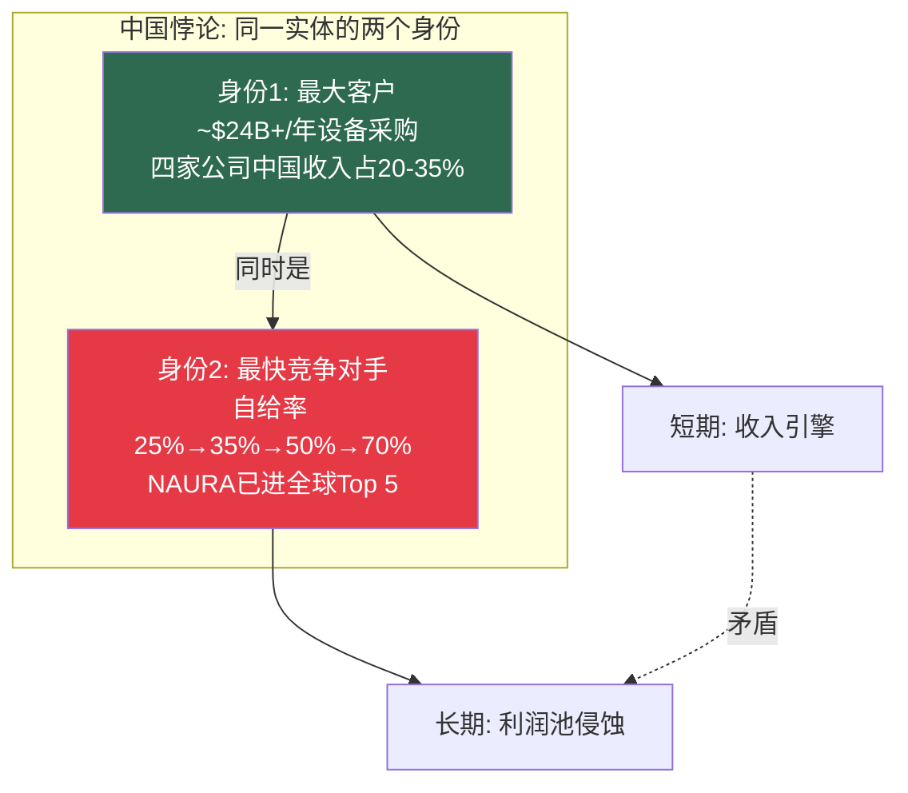
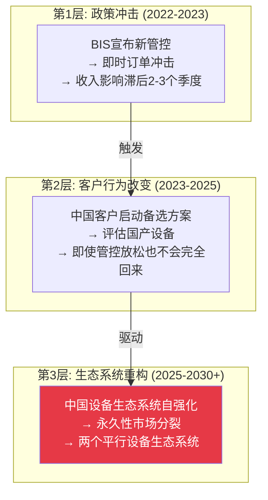
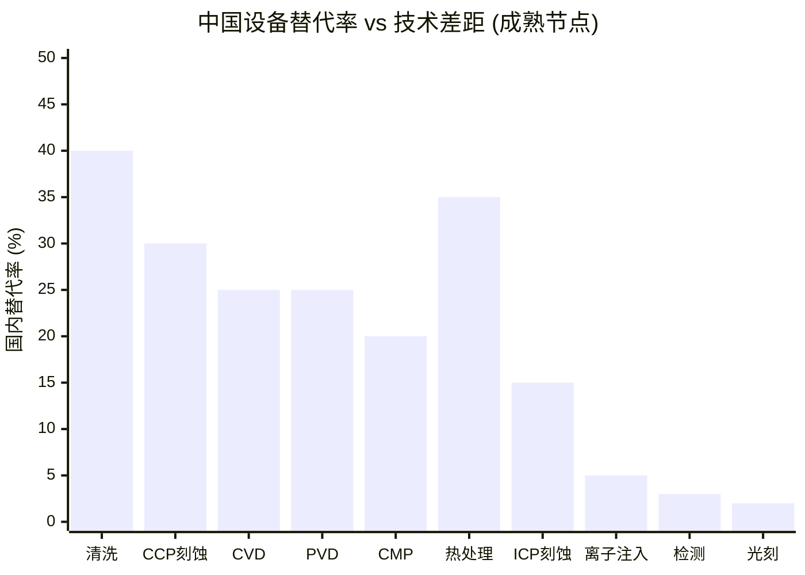
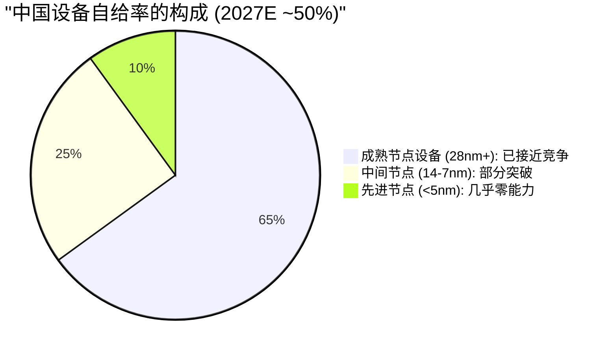
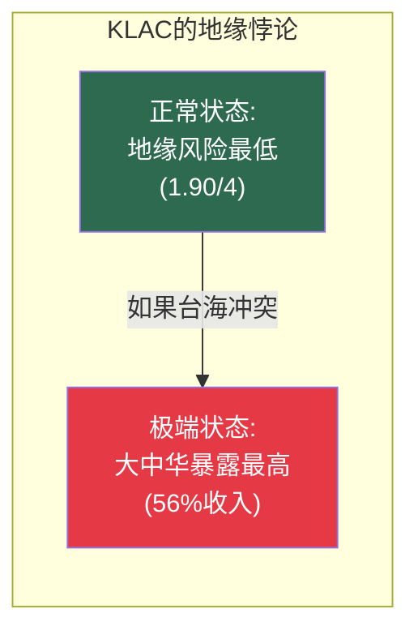
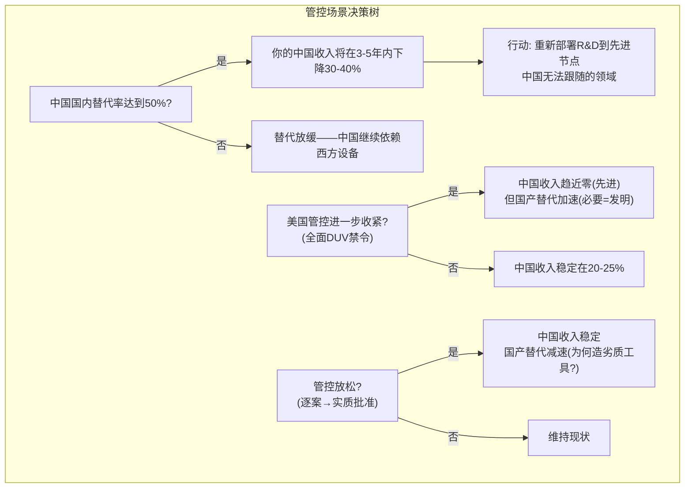

# Chapter 5: 中国悖论——最佳客户变最大对手

> *"你们面临的不是一个中国问题。你们面临的是一个同时作为最大客户和最快成长竞争对手的实体——这在工业史上没有先例。"*

---

## 5.1 悖论的量化

先把核心矛盾用一张表说清楚：

| 指标 | 中国作为客户 | 中国作为竞争对手 |
|------|-----------|-------------|
| ASML DUV系统2024年中国销售占比 | **70%** | — |
| 中国国产设备自给率 | — | **35%** (2025年初) |
| 新fab国产设备强制比例 | — | **50%+** (政策要求) |
| 中国设备公司全球排名 | — | NAURA: **#5** (2025) |
| 四大设备公司中国收入合计 | **~$24B+/年** | — |
| 2027目标自给率 | — | **70%** (成熟节点) |

---

## 5.2 四家公司的中国暴露度对比

### 收入暴露

| 公司 | 中国收入% (FY2025) | 绝对金额 | FY2026E指引 | 趋势 |
|------|:---:|:---:|:---:|:---:|
| **LRCX** | **~34%** | **$6.2B** | <30% | 加速下降 |
| **AMAT** | **~28-30%** | **~$8.5B** | 低20s% | 结构性下降 |
| KLAC | ~26% | ~$3.3B | 中高20s% | **企稳** |
| ASML | ~20-27% | ~EUR 6.0B | ~15-20% | 已从峰值下降 |
| *对比: TEL* | *~34%* | *~$5.3B* | *~30%* | *从峰值50%下降* |

### 综合地缘政治风险评分

| 维度 | AMAT | LRCX | KLAC | ASML |
|------|:---:|:---:|:---:|:---:|
| 中国收入(绝对) | **4** | 3 | 2 | 2 |
| 受限品类暴露 | **4** | 3 | 1 | 3 |
| 国产替代威胁 | **4** | 3 | 1 | 1 |
| 台海冲突暴露 | 2 | 2 | **4** | 3 |
| 合规风险 | **4** ($2.52亿罚款前例) | 2 | 1 | 2 |
| 管控减弱趋势 | 2 | 2 | **4** (最正面) | 3 |
| **加权地缘风险总分** | **3.45** | **2.60** | **1.90** | **2.20** |

**排名（从最安全到最危险）**：
1. **KLAC (1.90)** — 检测管控最晚/最窄，影响递减（$500M→$300-350M），国产替代率<5%
2. **ASML (2.20)** — EUV从未出口中国; 荷兰政策独立变量; 危机中可能获得"战略稀缺"溢价
3. **LRCX (2.60)** — CSBG服务中断风险是独特隐性威胁（~$1.0-1.5B/年，如果政策扩展到维保）
4. **AMAT (3.45)** — "三重挤压": BIS管控从上方 + 国产替代从下方 + TEL侧翼; $2.52亿罚款前例

---

## 5.3 三层瀑布模型——管控的演进路径

出口管控的影响不是一次性冲击。它遵循一个三层瀑布模型：

| 层级 | 时间窗口 | 当前状态 | 关键判断 |
|------|---------|---------|---------|
| **L1: 政策冲击** | 2022.10 - 2024 | **已过** | BIS管控 + 荷兰DUV扩展 + 日本对齐 |
| **L2: 行为改变** | 2023 - 2026 | **进行中** | 中国fab正在评估国产替代品 |
| **L3: 生态重构** | 2025 - 2030+ | **开始** | 自给率35%并加速; 50%强制要求 |

**CEO关键洞察**：**管控已持续约4年（2022年10月至今）。如果持续超过5年，第3层几乎确定发生。** 我们目前处于L2-L3过渡期——中国客户不仅是被迫使用国产设备，而是开始**主动选择**国产设备（因为价格更低、无管控风险、政府补贴）。

---

## 5.4 中国国产替代——按设备类别的真实差距

不要把"中国设备威胁"当作一个整体。真相是高度不均匀的：

| 设备类别 | 中国替代状态 | 技术差距 | 主要中国公司 | 受冲击的西方公司 |
|---------|:---:|---------|---------|---------|
| **清洗** | 高 (~40%+国内采用) | 窄(成熟) / 中(先进) | ACM Research | LRCX, TEL |
| **刻蚀(CCP介电)** | 中高 (~30%+) | 中等; AMEC有5nm声称 | AMEC | LRCX, AMAT |
| **刻蚀(ICP/HAR)** | 低-中 | 宽; 先进端差3+代 | AMEC | LRCX, TEL |
| **CVD/PECVD** | 中 (~25%) | 中等; Piotech增长最快 | Piotech, NAURA | **AMAT** |
| **PVD** | 中 | 中等; NAURA在12%全球 | NAURA | **AMAT** |
| **ALD** | 低 | 宽; ASM International主导 | 早期 | ASM Int'l |
| **CMP** | 中 | 中等; Hwatsing增长 | Hwatsing | AMAT |
| **热处理/炉管** | 高 | 窄(成熟) / 中(先进) | NAURA | TEL |
| **离子注入** | 低 | 宽; AMAT全球主导 | NAURA (入门级) | AMAT |
| **量测/检测** | **极低** | **极宽; KLAC领先5+代** | 微不足道 | — |
| **涂胶/显影** | **极低** | **极宽; TEL 92%全球** | 几乎零能力 | — |
| **光刻(DUV)** | **极低** | **宽; SMEE在28nm** | SMEE | Nikon, Canon |
| **光刻(EUV)** | **零** | **巨大; 原型阶段 vs HVM** | — | — |

### 五大中国设备公司速写

| 公司 | 2024收入 | 类比 | 最大威胁目标 | 技术天花板 |
|------|:---:|---------|---------|---------|
| **NAURA(北方华创)** | ~$4.4B (#6全球) | "中国版AMAT" | AMAT (PVD/CVD/刻蚀) | 28nm量产; 14nm开发 |
| **AMEC(中微)** | ~$1.3B | "中国版LRCX" | LRCX (刻蚀) | 28nm量产; 5nm声称 |
| **Piotech(拓荆)** | ~$600M | "中国版AMAT沉积" | AMAT (CVD) | 成熟节点; 增长124% YoY |
| **ACM Research** | ~$900M | 清洗专家 | LRCX/TEL (清洗) | 已有国际业务(NASDAQ: ACMR) |
| **SMEE(上微)** | 小 | "中国版ASML的尝试" | 理论上ASML | 28nm DUV刚交付; 差ASML 15-20年 |

---

## 5.5 替代时间表——诚实评估

### 成熟节点 (28nm+) — 正在发生

- 自给率已达35%且上升
- 清洗、刻蚀、CVD、热处理: 中国工具越来越有竞争力
- 到2027-2028年: 50-60%国内替代现实可行
- **AMAT、LRCX、TEL已经看到成熟节点中国收入份额下降**

### 中间节点 (14nm-7nm) — 2027-2030窗口

- AMEC声称14nm刻蚀在SMIC验证中; 量产未确认
- SMEE的28nm光刻理论上可通过多重曝光延伸到14nm（成本高、慢）
- NAURA和AMEC可能在2027-2028年达成14nm级设备验证
- **完整14nm生态系统（所有设备类型国产）在2030年前不太可能**

### 先进节点 (5nm及以下) — 2030年+，如果可能的话

- EUV光刻仍是约束瓶颈; SMEE原型离HVM还有数年
- 即使单个中国刻蚀或沉积工具声称"5nm能力"，完整工艺流程需要**每种设备类型同时达到5nm能力**
- ALD、先进量测/检测、EUV涂胶/显影没有可信的中国替代品
- **完整5nm国产生态系统的现实时间表: 2032-2035, 如果能实现的话**

### "50%自给率"标题数字的误导性

"50%自给率"听起来令人震惊，但需要拆解：

**50%的标题数字被成熟节点体量主导——中国在成熟节点确实越来越有竞争力。但先进节点的差距仍然以年/十年计，而非以季度计。**

---

## 5.6 Co-opetition框架下的中国博弈

用Brandenburger-Nalebuff的Co-opetition框架分析中国，可以看到一个独特的"合作→竞争"迁移：

### 2020年前：主要是"客户"关系

| 关系 | 合作面 | 竞争面 |
|------|--------|--------|
| 西方设备 → 中国fab | 销售设备, 提供服务 | 最小（中国设备能力弱） |
| 西方设备 → 中国设备 | 技术授权（部分）, 培训工程师 | 最小 |

### 2022-2026：快速转向"竞争"

| 关系 | 合作面 | 竞争面 |
|------|--------|--------|
| 西方设备 → 中国fab | 仍在销售（DUV、成熟节点）| 出口管控限制先进设备 |
| 西方设备 → 中国设备 | **几乎为零** | 直接产品替代（成熟节点） |
| 中国政府 → 中国设备 | 补贴、政策保护、保证客户 | — |

### PARTS分析——CEO需要知道的

**P (Players)**: 中国国产玩家的加入将西方5家寡头变为7-8家竞争者（成熟节点）。NAURA收入$4.4B已超过KLA的一半。

**A (Added Value)**: 在成熟节点，中国设备的添加值正在趋近西方设备——因为28nm+的技术差距已经足够窄。在先进节点，西方设备的添加值仍然接近100%（无替代品）。

**R (Rules)**: **出口管控已成为最重要的"规则"设定者。** 美国政府实际上在决定市场分配规则——哪些公司可以向哪些客户销售。

**T (Tactics)**: 中国的战术是"先在成熟节点建立装机基数→积累经验→向上攀爬"。这与日本/韩国半导体崛起的路径完全相同，只是速度更快（政府驱动vs市场驱动）。

**S (Scope)**: NAURA进入光刻R&D（2024年4月宣布）标志着竞争范围的扩大——中国最大的设备公司开始瞄准最后一个无国产替代的品类。虽然EUV光刻差距巨大（15-20年），但这个信号不应被忽视。

---

## 5.7 四位CEO各自的中国战略

### Fouquet (ASML): "防火墙最高，但DUV收入在萎缩"

| 维度 | 评估 |
|------|------|
| EUV暴露 | **零** — 从未出口到中国 |
| DUV暴露 | 高 — 2024年70%的DUV销售到中国 |
| 管控影响 | 直接收入损失~EUR 3.7B（2024基准下降） |
| 国产替代威胁 | 极低（EUV）/ 长期低威胁（DUV: SMEE在28nm）|
| **净地缘溢价** | **+12-18%估值提升** — 管控强化了垄断 |

**ASML是唯一一家出口管控净正面的公司。** 它牺牲了~EUR 4B/年的中国收入，但获得了12-18%的全球估值提升（通过垄断加固）。这个等式只在中国无法突破EUV时成立——共识时间表是8-10年。

### Archer (LRCX): "CSBG服务中断是最阴险的路径"

| 维度 | 评估 |
|------|------|
| 中国收入占比 | ~34% ($6.2B) — 四家中最高 |
| 管控影响 | 概率加权年收入影响: -$1.155B |
| 最危险路径 | **路径4: 成熟节点管控/CSBG服务中断** |
| CSBG中国服务收入 | ~$1.0-1.5B/年面临风险 |
| vs ASML关键区别 | LRCX有替代供应商(TEL), ASML没有 |

**路径4（CSBG服务中断）是最值得Archer关注的场景**——因为它直接攻击LRCX最有差异化的资产。如果出口管控扩展到成熟节点的维保服务，$1.0-1.5B的经常性收入将受到威胁，这将损害"类SaaS"估值叙事。

### Wallace (KLAC): "和平时期最安全，极端时最脆弱"

| 维度 | 评估 |
|------|------|
| 中国收入占比 | ~26% — 稳定化 |
| 管控影响 | 递减: $500M → $300-350M |
| 国产替代威胁 | **极低** — 检测是中国最弱的领域（<5%国产率） |
| 特殊风险 | **大中华区收入集中56%** = 台湾30% + 中国26% |
| 台海冲突暴露 | **最高** — 和平时最安全, 极端时最脆弱 |

### Dickerson (AMAT): "三重挤压——从每个方向承压"

| 维度 | 评估 |
|------|------|
| 中国收入占比 | ~28-30% → 低20s% |
| 管控影响 | 结构性下降 -$2.0-2.5B |
| 国产替代威胁 | **最高** — PVD/CVD/刻蚀全面面临NAURA/AMEC/Piotech |
| 合规风险 | **$2.52亿罚款前例** — 业内唯一 |
| 三重挤压 | BIS管控(上方) + 国产替代(下方) + TEL侧翼(侧面) |

**AMAT是中国悖论中受损最严重的公司。** 它在更多产品线上面临国产替代（NAURA/Piotech在沉积, AMEC在刻蚀, Hwatsing在CMP），同时因为$2.52亿罚款前例而面临更高的合规风险，而且TEL在不受美国单边管控的情况下可以继续向中国销售。

---

## 5.8 实物期权框架——中国暴露的战略价值

传统分析将中国收入视为"风险"。但实物期权框架提供了一个更nuanced的视角：

| 期权类型 | 描述 | 行权触发 | 对设备公司的含义 |
|---------|------|---------|-------------|
| **增长期权** | 如果管控放松→中国收入恢复 | 政策转向, 新一届政府 | 当前被低估的上行可能 |
| **学习期权** | 中国竞争迫使加速创新 | 国产替代压力 | 长期有利于技术领先公司 |
| **放弃期权** | 如果管控全面→退出中国 | 全面禁令 | 短期收入损失, 长期重新聚焦 |
| **转换期权** | 将中国R&D/服务资源重新部署到非中国市场 | 中国收入下降到<15% | 释放资源到更高回报领域 |

**CEO关键洞察**：中国暴露不是纯粹的风险——它包含期权价值。问题是你是否在利用当前的高峰中国收入来**为未来投资**（在中国无法跟随的先进技术中），还是在将利润**返还给股东**。前者增加长期竞争力；后者在短期内讨好华尔街。

---

## 5.9 出口管控的最新政策动态 (2026年初)

| 政策动态 | 日期 | 影响 |
|---------|------|------|
| Trump关税公告: 半导体及设备25%进口关税 | 2026.01.14 | 增加美国fab建设成本; 对设备出口影响有限 |
| BIS许可审查政策修订: 从"推定拒绝"转为"逐案审查" | 2025-2026 | 略微放松——商业可得性条件下可批准 |
| Samsung/SK Hynix获2026年度许可 | 2026 | 年度续期给美国更灵活的调整杠杆 |
| ASML VEU豁免被撤销 | 2025-2026 | 政策常态化——向更严格方向 |
| 荷兰许可政策可能2026年中调整 | 待定 | **关键拐点——DUV出口到中国的未来取决于此** |

### CEO决策矩阵：管控场景响应

---

## 5.10 温水煮青蛙——为什么每个季度的影响都"不够大"

出口管控和国产替代的最阴险特征是**渐进性**：

| 季度 | 事件 | 单季收入影响 | 累计影响 |
|------|------|:---:|:---:|
| Q1 | 新一轮管控宣布 | -2~3% | -2~3% |
| Q2 | 中国客户部分转向国产 | -1~2% | -3~5% |
| Q3 | 管控执行细节落地 | -1~2% | -4~7% |
| Q4 | NAURA获新合同 | -1% | -5~8% |
| 年2 | 循环重复 | — | -8~12% |
| 年3 | 国产生态系统开始自强化 | — | -12~18% |
| 年5 | 第3层(生态重构)启动 | — | -20~30%+ |

**没有任何单个季度的影响大到触发止损。** 每个季度都是"可管理的"、"预期中的"、"已在指引中反映"。但5年累计效应可以重塑竞争格局——这正是"温水煮青蛙"的定义。

**追踪指标**：监测**NAURA的收入增长率**作为领先指标。如果NAURA维持>25% YoY增长，替代曲线在加速。如果增速降至<15%，能力天花板正在约束增长。

---

## 5.11 TEL——中国博弈中的外卡

TEL在中国竞争动态中扮演一个独特角色：

| 维度 | TEL vs 美国四大 |
|------|-------------|
| 管控管辖 | 日本政府（与美国协调但非完全对齐） | 美国BIS直接管辖 |
| 中国峰值暴露 | **50%** (Q1 FY2025) — 远超任何美国公司 | 最高~43% (LRCX) |
| 地缘套利 | **不受美国单边管控** | 全面受制 |
| 产品竞争力 | 涂胶/显影92%全球份额 + 低温刻蚀突破 | 各有专长 |
| 对中国客户的吸引力 | **更高** — 供应连续性风险更低 | 管控风险更高 |

**TEL在中国博弈中对美国设备公司的威胁是双重的**：
1. **直接竞争**：TEL可以在美国公司受限的领域继续向中国销售
2. **间接影响**：中国客户可能系统性偏好TEL（更低的管控中断风险），即使在TEL技术并非最优的领域

这对LRCX和AMAT的影响最大——它们在刻蚀和沉积领域与TEL直接竞争，而TEL在中国市场的可达性更高。对ASML和KLAC的影响最小——TEL没有光刻业务（与ASML不重叠），也没有有意义的检测/量测业务（与KLAC不重叠）。

---

## 5.12 对四位CEO的中国战略建议

| CEO | 核心中国战略 | 不要做 | 追踪信号 |
|-----|-----------|-------|---------|
| **Fouquet** | 利用管控作为垄断加固工具; DUV中国收入按自然下降管理 | 不要试图游说放松EUV管控——管控是你的护城河 | 荷兰许可政策(2026年中); SMEE 28nm产能爬坡 |
| **Archer** | 评估CSBG服务管控的预案; 将高峰中国利润重新投入先进技术 | 不要假设CSBG服务收入是管控免疫的 | 成熟节点维保管控扩展信号; AMEC 14nm验证 |
| **Wallace** | 利用检测护城河的持久性（中国差距最宽）; 监控台湾集中度 | 不要忽视56%大中华集中度的尾部风险 | 中国检测能力进展; 台海风险指标 |
| **Dickerson** | 加速EPIC和GAA投资——用在中国无法复制的先进技术拉开距离 | 不要试图捍卫成熟节点PVD份额——让出给NAURA,专注先进 | NAURA增速; PVD份额年变化; EPIC合作伙伴进展 |

---

## 5.13 CEO应该问自己的五个中国问题

1. **如果我的中国收入在3年内减半，我的利润率会保持在什么水平？** （如果答案是"不可接受"，你的中国依赖度过高。）

2. **我是否在利用当前的高峰中国利润来投资中国无法跟随的技术？** （如果"否"，你在用未来的竞争力换取今天的股东回报。）

3. **我的服务/维保收入中有多少面临管控扩展风险？** （特别是LRCX——CSBG是"类SaaS"叙事的基础，如果服务被限制，叙事崩溃。）

4. **TEL是否正在利用其"非美国"身份系统性地取代我在中国的位置？** （LRCX和AMAT需要正视这个问题。）

5. **在管控全面放松的情景下，中国客户会回来吗？** （第2层瀑布效应意味着：不完全回来。一旦替代品被验证，回归是不完全的。）

---

*[本章完 | Part I战略全景结束 | 下一Part: Part II 博弈引擎——如果你做X，对手做Y]*
