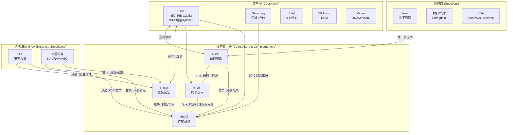
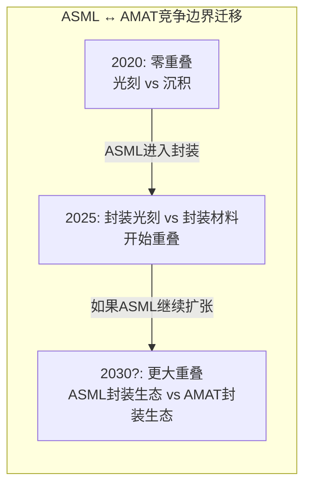
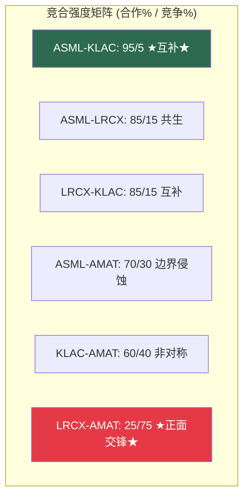
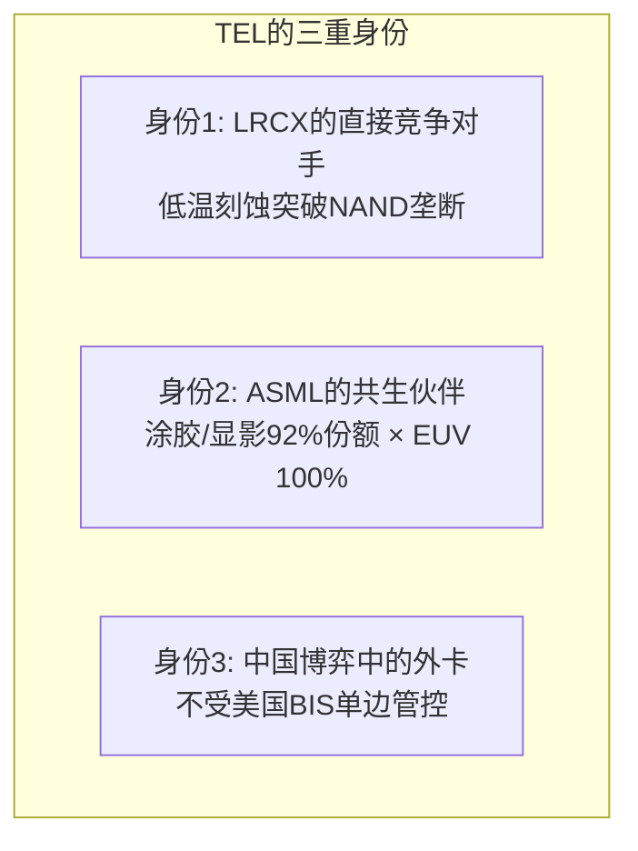

# Chapter 6: 4×4 Co-opetition价值网——既是盟友又是对手

> *"商业不是战争，也不是和平。它是'竞合'——同时在创造价值和争夺价值。"*
> *— Adam Brandenburger & Barry Nalebuff, Co-opetition*

---

## 6.1 半导体设备价值网全图

Brandenburger-Nalebuff框架的核心洞察：竞争与合作不是二选一，而是同时存在于**每一对关系**中。半导体设备行业是这个框架最完美的工业案例——四家公司在某些维度上深度合作（共推技术路线图），同时在另一些维度上激烈竞争（争夺WFE份额和客户co-development名额）。

---

## 6.2 六对竞争互动的PARTS解剖

四家公司之间有C(4,2)=6对竞争关系。每一对都有独特的合作-竞争张力。

### 互动1: ASML ↔ KLAC — "完美互补"

| PARTS维度 | 分析 |
|-----------|------|
| **Players** | 产品线零重叠——光刻 vs 检测/量测 |
| **Added Value** | **互补型**: ASML做图案化，KLAC验证图案精度。每增加一层EUV，检测需求增加2-3x |
| **Rules** | 技术路线图共享——ASML的High-NA需要KLAC的新量测精度(±1nm overlay) |
| **Tactics** | 各自在自己领域深耕；无需防御对方 |
| **Scope** | ASML进入封装光刻可能创造小范围重叠（KLAC的封装检测 vs ASML的封装光刻生态） |

**净评估**: **95%合作 / 5%竞争** — 行业中最纯粹的互补关系

**CEO含义**: 这是为什么"ASML+KLAC等权双持"在投资维度是最优组合——它们的成功条件不冲突。在战略维度，Fouquet和Wallace可以放心深度合作，不用担心对方成为竞争对手。

### 互动2: ASML ↔ LRCX — "上下游共生"

| PARTS维度 | 分析 |
|-----------|------|
| **Players** | 主产品线不重叠——光刻 vs 刻蚀/沉积 |
| **Added Value** | **互补型**: 光刻定义图案 → 刻蚀转移图案。EUV层数增加 = 刻蚀步骤增加 |
| **Rules** | 技术依赖：EUV多重曝光增加刻蚀需求；但LRCX的干法光刻胶直接威胁TEL涂胶（间接影响ASML生态） |
| **Tactics** | 合作开发光刻-刻蚀集成工艺 |
| **Scope** | ASML的封装光刻进入LRCX的封装刻蚀领地 = 长期边界模糊风险 |

**净评估**: **85%合作 / 15%竞争** — 上下游天然共生，封装领域开始产生边界摩擦

### 互动3: ASML ↔ AMAT — "合作正在被竞争侵蚀"

| PARTS维度 | 分析 |
|-----------|------|
| **Players** | 传统上不重叠——光刻 vs 沉积/刻蚀/CMP |
| **Added Value** | 传统互补：ASML光刻 → AMAT沉积/刻蚀完成工艺。但ASML XT:360进入封装 = 新竞争面 |
| **Rules** | ASML的TAM扩张改变了竞争边界——从"纯光刻"到"光刻+封装光刻" |
| **Tactics** | AMAT的EPIC中心是防御性回应——通过co-development绑定客户，即使ASML进入封装 |
| **Scope** | **正在扩大**: ASML进入$42-51B先进封装设备市场 vs AMAT在同一市场的材料工程地位 |

**净评估**: **70%合作 / 30%竞争** — ASML封装扩张是AMAT需要认真对待的战略信号

### 互动4: LRCX ↔ AMAT — "刻蚀/沉积的直接正面交锋"

| PARTS维度 | 分析 |
|-----------|------|
| **Players** | **最直接的竞争对**——刻蚀和沉积两个领域直接重叠 |
| **Added Value** | 竞争型：LRCX刻蚀45% vs AMAT刻蚀15%；沉积领域AMAT领先但LRCX(ALD)追赶 |
| **Rules** | 客户（TSMC）在两者之间制造竞争——刻蚀标书同时邀请LRCX/AMAT/TEL |
| **Tactics** | LRCX: 集中深耕刻蚀+ALD；AMAT: 用广度(suite selling)对抗LRCX深度 |
| **Scope** | ALD是关键争夺点——GAA晶体管需要更多ALD步骤，LRCX(ALTUS Halo) vs AMAT vs ASM International |

**净评估**: **25%合作 / 75%竞争** — 行业中最直接的竞争对

**关键博弈**: AMAT的Sym3 Magnum刻蚀系统在DRAM EUV图案化刻蚀取得$1.2B突破，这是AMAT十年来最显著的进攻性份额增长——直接从LRCX领地抢夺。LRCX的ALTUS Halo Mo ALD工具则是反向进攻AMAT的沉积领地。

### 互动5: LRCX ↔ KLAC — "互补但有AI分析边界"

| PARTS维度 | 分析 |
|-----------|------|
| **Players** | 主产品线不重叠——刻蚀 vs 检测 |
| **Added Value** | 互补：KLAC检测验证LRCX刻蚀质量；良率改进需要两者协同 |
| **Rules** | 客户同时需要两者；无零和关系 |
| **Tactics** | LRCX的Equipment Intelligence(Sense.i)开始进入工艺分析领域 → 可能与KLAC的Klarity分析平台产生边界 |
| **Scope** | 如果"设备即数据平台"趋势持续，LRCX和KLAC可能在工艺优化AI分析层产生竞争 |

**净评估**: **85%合作 / 15%竞争** — 长期AI分析平台可能产生边界争议

### 互动6: KLAC ↔ AMAT — "检测领域的非对称竞争"

| PARTS维度 | 分析 |
|-----------|------|
| **Players** | KLAC(63%) vs AMAT(~8%)在检测/量测领域——极度非对称 |
| **Added Value** | AMAT的e-beam检测("边境摩擦而非核心入侵")威胁KLAC ~25-30%的检测收入(CD-SEM+缺陷review) |
| **Rules** | KLAC通过30年数据飞轮防御；AMAT通过e-beam技术差异化进攻 |
| **Tactics** | KLAC: 用AI(aiSIGHT)加速数据优势固化；AMAT: 用PDC(Process Diagnostics & Control)作为进攻楔子 |
| **Scope** | 有限——AMAT在KLAC核心光学检测领域无可信进攻路径 |

**净评估**: **60%合作 / 40%竞争** — AMAT在检测是持续的骚扰者但不是颠覆者

---

## 6.3 竞合强度热力图

| 关系对 | 合作% | 竞争% | 关键张力 | 5年趋势 |
|--------|:---:|:---:|---------|---------|
| ASML ↔ KLAC | 95 | 5 | 封装生态边界 | 合作维持 |
| ASML ↔ LRCX | 85 | 15 | 封装领域 | 竞争略增 |
| LRCX ↔ KLAC | 85 | 15 | AI分析平台 | 竞争略增 |
| ASML ↔ AMAT | 70 | 30 | ASML封装扩张 | **竞争增加** |
| KLAC ↔ AMAT | 60 | 40 | e-beam vs 光学 | 稳定 |
| LRCX ↔ AMAT | 25 | 75 | 刻蚀+ALD全面竞争 | 竞争加剧 |

---

## 6.4 Added Value排序——谁对行业更不可替代

Co-opetition框架的"Added Value"维度衡量：如果一家公司从行业中消失，总行业价值会减少多少？

| 公司 | Added Value (不可替代性) | 原因 | 如果消失... |
|------|:---:|---------|---------|
| **ASML** | **10/10** | EUV无替代品；消失=先进制程停止 | 半导体行业倒退5-8年，$5T市值蒸发 |
| **KLAC** | **8/10** | 先进检测无等效替代；消失=良率崩溃 | 所有先进fab良率下降30-50%，产能有效减半 |
| **LRCX** | **7/10** | 刻蚀有TEL/AMAT替代但切换需2-3年 | 短期产能危机，2-3年后TEL/AMAT可部分补位 |
| **AMAT** | **6/10** | 每条产品线都有替代者；PVD除外 | LRCX/TEL/ASM/KLAC分别补位各领域；PVD出现缺口 |

**CEO语言翻译**：Added Value是你在谈判桌上的终极筹码。ASML的Added Value=10意味着客户在EUV工具上基本没有议价权。AMAT的Added Value=6意味着客户总能指向另一家供应商——这就是"通才折价"的博弈论根源。

---

## 6.5 TEL: 价值网中的第五力量

TEL不在"四巨头"之内，但它在价值网中扮演独特角色：

| 维度 | TEL对ASML | TEL对LRCX | TEL对KLAC | TEL对AMAT |
|------|---------|---------|---------|---------|
| 竞争强度 | **极低** (共生) | **高** (刻蚀直接对抗) | **极低** (无重叠) | **中** (CVD/沉积竞争) |
| 合作潜力 | **极高** (涂胶+EUV) | 低 | 中 | 低 |
| 中国市场竞争 | 非竞争 | **高** (TEL地缘套利) | 非竞争 | **中** (TEL可继续售华) |

**对四位CEO的含义**：TEL是价值网中的"外卡"——它与ASML深度共生（每个EUV曝光层需要TEL涂胶/显影），同时直接威胁LRCX的核心（低温刻蚀）。**LRCX的Archer是唯一需要同时在技术和地缘两个维度应对TEL的CEO。**

---

## 6.6 客户层的力量博弈

价值网中被低估的一面是客户之间的竞争如何影响设备公司。

### TSMC的Stackelberg领导地位

TSMC不是普通客户——它是WFE增量的80%+来源，这赋予它Stackelberg领导者地位：

| TSMC的杠杆 | 影响 |
|-----------|------|
| CapEx规模 ($52-56B) | 单独决定WFE增长率 |
| 技术路线图定义权 | TSMC选择GAA/BSPDN时间表 = 设备公司必须跟随 |
| 供应商竞标权 | 刻蚀标书同时邀请LRCX/TEL/AMAT |
| High-NA采用决策权 | TSMC犹豫 = ASML 2030目标高端情景失效 |

但TSMC的力量有一个硬约束：**在EUV领域，TSMC没有议价权**。ASML的工具分配是稀缺资源，TSMC需要排队。这创造了一个有趣的动态——TSMC在刻蚀/沉积供应商面前是Stackelberg领导者，但在ASML面前是价格接受者。

### 客户之间的竞争=设备公司的机会

| 客户竞争 | 对设备公司的含义 |
|---------|-------------|
| TSMC vs Samsung vs Intel争夺先进节点 | 三方竞相投资 = WFE需求放大 |
| SK Hynix vs Micron vs Samsung争夺HBM份额 | 三方扩产 = 存储设备需求翻倍 |
| 各国政府争夺半导体制造能力 (CHIPS Act) | 同一产能多地建设 = 需求乘数 |

**CEO关键洞察**：客户之间的竞争是设备公司最强大的结构性顺风。它确保了即使总需求增速放缓，竞争驱动的"军备竞赛"效应仍会维持设备投资。

---

## 6.7 对四位CEO的Co-opetition行动建议

| CEO | 最重要的合作关系 | 最需警惕的竞争变化 | 建议行动 |
|-----|:---:|:---:|---------|
| **Fouquet** | Zeiss (供应链生命线) | AMAT/LRCX在封装领域的反应 | 在封装光刻建立标准后锁定客户——先行者优势窗口~2年 |
| **Archer** | ASML (EUV层数↑=刻蚀↑) | TEL低温刻蚀 + AMAT Sym3进攻 | 双线防御：技术层（下代刻蚀）+ 服务层（CSBG深度绑定）|
| **Wallace** | ASML (High-NA=更多检测) | AMAT e-beam + AI缩小算法差距 | 将30年数据优势转化为SaaS平台——从被动积累到主动变现 |
| **Dickerson** | Samsung (EPIC创始成员) | ASML封装扩张 + LRCX ALD反击 | 争取TSMC/Intel加入EPIC——网络效应需要≥3个节点 |

---

*[本章完 | 下一章: Ch7 12个战略互动场景——如果你做X，对手做Y]*
