# Chapter 7: 12个战略互动场景——如果你做X，对手做Y

> *"战略的本质不是计划——而是对手可能的反应。"*

---

## 7.1 场景设计逻辑

每位CEO有3个关键战略决策点。对于每个决策，我们用序贯博弈分析推演：你的行动→竞争对手最可能的反应→你的最优回应→均衡结果。

**时间窗口**：所有场景设定在2026-2028年。

---

## 7.1b 博弈论基础——三个支付矩阵

在展开12个场景之前，先建立三个核心博弈的形式化分析。

### 博弈1: R&D军备竞赛（囚徒困境）

半导体设备行业的R&D投入遵循囚徒困境结构——双方都"被迫"重度投资，即使合作(同时降低R&D)对双方更好。

**LRCX vs TEL 刻蚀R&D博弈:**

| | **TEL重度投入R&D (¥300B)** | **TEL维持R&D (¥150B)** |
|--|:---:|:---:|
| **LRCX重度投入 ($2.5B+)** | LRCX: 维持份额, 利润率-1pp / TEL: 维持份额, 利润率-1pp | **LRCX: 扩大领先 / TEL: 失去路线图位置** |
| **LRCX维持R&D ($2.1B)** | **LRCX: 路线图落后2年 / TEL: 低温刻蚀加速渗透** | LRCX: 份额稳定, 利润率+0.5pp / TEL: 份额稳定, 利润率+0.5pp |

**Nash均衡**: (重度投入, 重度投入) — 双方都选择重度投入，即使(维持, 维持)对利润率更好。**因为单边削减R&D的惩罚(路线图落后2年)远大于双方加码的成本(利润率-1pp)。**

这解释了为什么设备行业R&D强度(12-17%)结构性高于大多数资本商品行业(3-5%)——R&D军备竞赛的Nash均衡锁定了高投入。[参阅: Ch8资本配置]

### 博弈2: 封装设备标准战（Stackelberg领导博弈）

先进封装设备市场正在从碎片化向专精化演进。ASML(XT:360)进入封装光刻 = Stackelberg领导者的先行承诺。

**ASML vs AMAT 封装博弈:**

| | **AMAT加大封装投资** | **AMAT维持现有水平** |
|--|:---:|:---:|
| **ASML积极推广XT:360** | ASML: 定义光刻标准, +$2-3B / AMAT: 材料差异化, +$1-2B | **ASML: 定义标准+抢占材料边界 / AMAT: 份额被侵蚀** |
| **ASML缓慢推进** | **AMAT: 封装材料主导 / ASML: 错失窗口** | 双方: 市场碎片化持续, 都赚不到溢价 |

**均衡**: ASML已选择积极推广(Stackelberg领导者先行)→AMAT的最优反应是加大封装投资(跟随者最佳回应)。**结果: 双方都在封装加码, 但ASML有先行者优势定义光刻标准。**

### 博弈3: CSBG定价博弈（寡头定价均衡）

服务定价遵循寡头定价均衡——LRCX(CSBG)和AMAT(AGS)不会互相打价格战，因为服务市场的切换成本确保了"各自装机基数各自服务"的稳定均衡。

**LRCX CSBG vs AMAT AGS:**

| | **AMAT提高AGS价格** | **AMAT维持AGS价格** |
|--|:---:|:---:|
| **LRCX提高CSBG价格** | 双方: ARPU+$5-8K, 利润率各+1-2pp | LRCX: ARPU+$5-8K / AMAT: 份额不变 |
| **LRCX维持CSBG价格** | LRCX: 份额微增 / AMAT: 价格被客户回推 | 双方: 稳定, ARPU持平 |

**均衡**: (提高, 提高) — 因为服务市场的切换成本足够高，客户不会因为5-10%价格上涨而更换服务供应商。**这就是为什么CSBG ARPU可以从$72K增长到$85-95K而不丢客户——服务定价博弈支持稳定的价格上涨均衡。** [参阅: Ch10安装基数]

---

## 7.2 A组场景: ASML (Fouquet)

### 场景A1: 进入封装光刻——XT:360全面推广

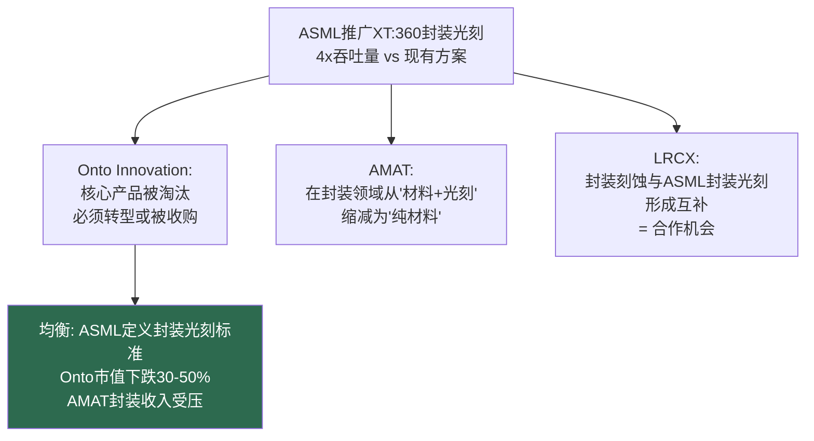
```mermaid
graph TD
    A["ASML推广XT:360封装光刻<br/>4x吞吐量 vs 现有方案"] --> B["Onto Innovation:<br/>核心产品被淘汰<br/>必须转型或被收购"]
    A --> C["AMAT:<br/>在封装领域从'材料+光刻'<br/>缩减为'纯材料'"]
    A --> D["LRCX:<br/>封装刻蚀与ASML封装光刻<br/>形成互补<br/>= 合作机会"]

    B --> E["均衡: ASML定义封装光刻标准<br/>Onto市值下跌30-50%<br/>AMAT封装收入受压"]

    style E fill:#2d6a4f,color:#fff
```

| 因素 | 评估 |
|------|------|
| **ASML行动** | 积极推广XT:360进入CoWoS/HBM封装光刻 |
| **AMAT反应** | 通过EPIC中心加强封装材料工程差异化——"你做光刻，我做材料" |
| **LRCX反应** | 合作——封装刻蚀可与ASML封装光刻形成工艺套件 |
| **均衡结果** | ASML在封装光刻建立新的标准地位；Onto Innovation最受冲击 |
| **概率** | 70% (已在执行中) |
| **对Fouquet的建议** | 继续推进但管理节奏——太快会激起AMAT联合客户的防御联盟 |

### 场景A2: High-NA定价€400M+——TSMC延迟采用

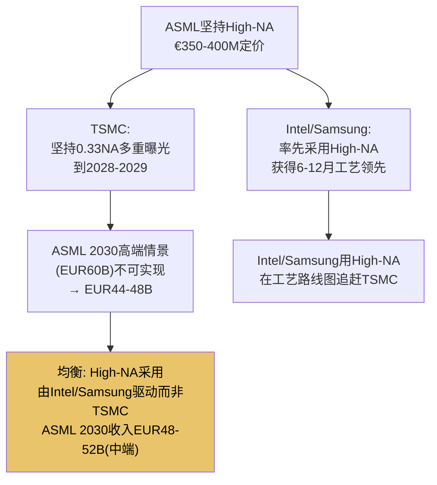
```mermaid
graph TD
    A["ASML坚持High-NA<br/>€350-400M定价"] --> B["TSMC:<br/>坚持0.33NA多重曝光<br/>到2028-2029"]
    A --> C["Intel/Samsung:<br/>率先采用High-NA<br/>获得6-12月工艺领先"]
    B --> D["ASML 2030高端情景<br/>(EUR60B)不可实现<br/>→ EUR44-48B"]
    C --> E["Intel/Samsung用High-NA<br/>在工艺路线图追赶TSMC"]

    D --> F["均衡: High-NA采用<br/>由Intel/Samsung驱动而非TSMC<br/>ASML 2030收入EUR48-52B(中端)"]

    style F fill:#e9c46a,color:#000
```

| 因素 | 评估 |
|------|------|
| **ASML行动** | 维持€350-400M High-NA定价，不降价 |
| **TSMC反应** | 延迟High-NA到2028-2029，用更多0.33NA EUV多重曝光 |
| **Intel/Samsung反应** | 积极采用High-NA，试图在工艺路线图上追赶TSMC |
| **均衡结果** | High-NA商业化推迟但不失败；ASML 2030中端情景(EUR48-52B) |
| **概率** | 45% |
| **对Fouquet的建议** | 需要Plan B——不依赖TSMC在2028前采用High-NA的收入路径 |

### 场景A3: 收购量测公司——垂直整合检测能力

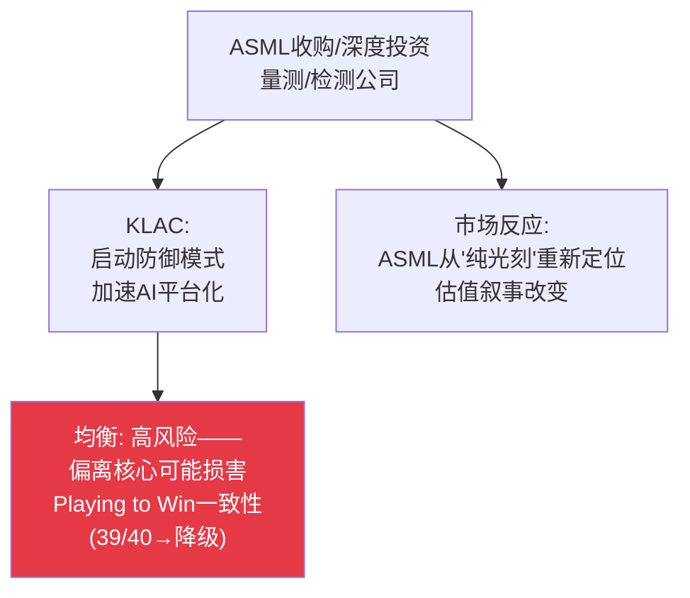
```mermaid
graph TD
    A["ASML收购/深度投资<br/>量测/检测公司"] --> B["KLAC:<br/>启动防御模式<br/>加速AI平台化"]
    A --> C["市场反应:<br/>ASML从'纯光刻'重新定位<br/>估值叙事改变"]

    B --> D["均衡: 高风险——<br/>偏离核心可能损害<br/>Playing to Win一致性<br/>(39/40→降级)"]

    style D fill:#e63946,color:#fff
```

| 因素 | 评估 |
|------|------|
| **ASML行动** | 收购或深度合作一家量测公司(如HMI多束电子束) |
| **KLAC反应** | 视为入侵信号——加速MACH SaaS平台建设和AI差异化 |
| **均衡结果** | 高风险——ASML偏离"只做光刻"的完美战略一致性 |
| **概率** | 15% (Fouquet的工程师本能倾向聚焦) |
| **对Fouquet的建议** | **不建议**——你的Playing to Win评分39/40基于极致聚焦，任何多元化都会降低一致性 |

---

## 7.3 B组场景: LRCX (Archer)

### 场景B1: 干法光刻胶挑战TEL涂胶垄断

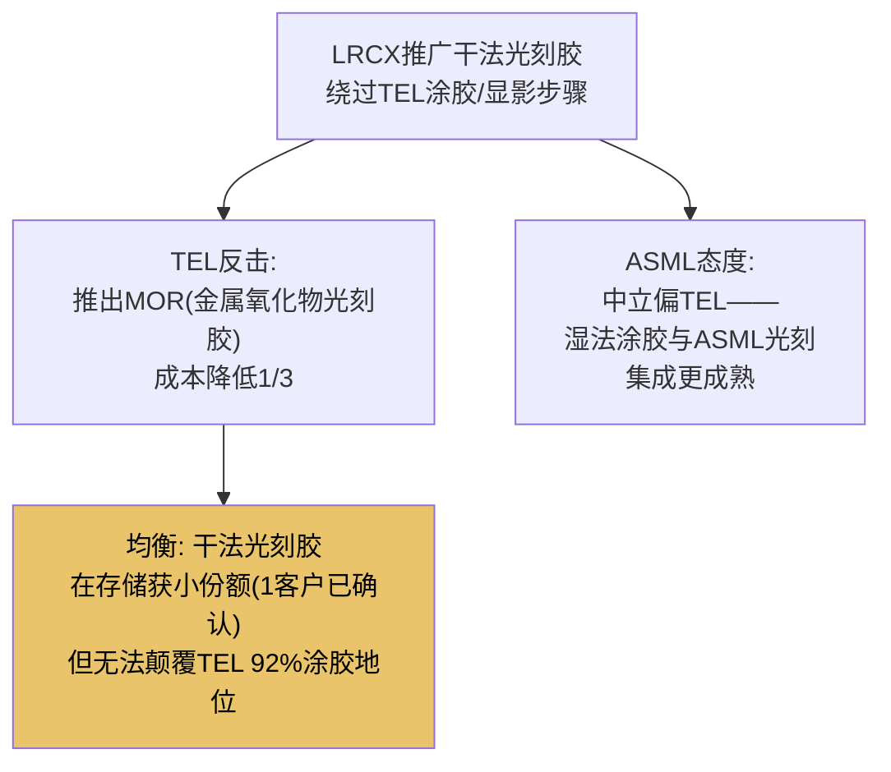
```mermaid
graph TD
    A["LRCX推广干法光刻胶<br/>绕过TEL涂胶/显影步骤"] --> B["TEL反击:<br/>推出MOR(金属氧化物光刻胶)<br/>成本降低1/3"]
    A --> C["ASML态度:<br/>中立偏TEL——<br/>湿法涂胶与ASML光刻<br/>集成更成熟"]
    B --> D["均衡: 干法光刻胶<br/>在存储获小份额(1客户已确认)<br/>但无法颠覆TEL 92%涂胶地位"]

    style D fill:#e9c46a,color:#000
```

| 因素 | 评估 |
|------|------|
| **LRCX行动** | 推广干法光刻胶技术，试图替代TEL涂胶/显影步骤 |
| **TEL反应** | MOR(金属氧化物光刻胶)反击——成本优势1/3，兼容现有湿法工艺 |
| **均衡结果** | 干法光刻胶获利基市场但不颠覆TEL——TEL壁垒太深 |
| **概率** | 60% (已在执行) |
| **对Archer的建议** | 继续但不过度投资——这是牵制TEL的侧翼，不是决定性战役 |

### 场景B2: CSBG翻倍投资——从收入引擎到利润引擎

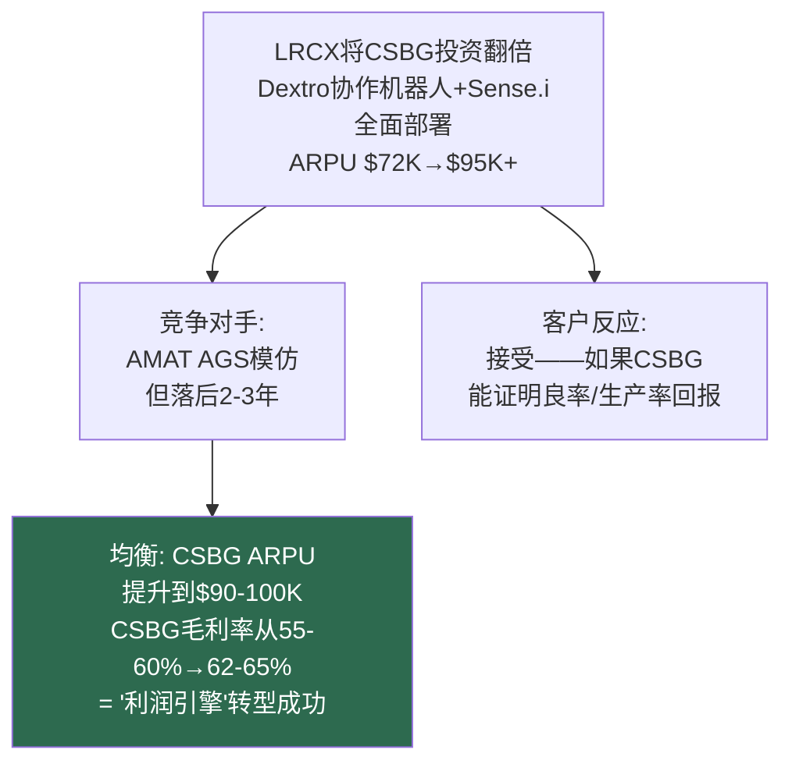
```mermaid
graph TD
    A["LRCX将CSBG投资翻倍<br/>Dextro协作机器人+Sense.i全面部署<br/>ARPU $72K→$95K+"] --> B["竞争对手:<br/>AMAT AGS模仿<br/>但落后2-3年"]
    A --> C["客户反应:<br/>接受——如果CSBG<br/>能证明良率/生产率回报"]

    B --> D["均衡: CSBG ARPU<br/>提升到$90-100K<br/>CSBG毛利率从55-60%→62-65%<br/>= '利润引擎'转型成功"]

    style D fill:#2d6a4f,color:#fff
```

| 因素 | 评估 |
|------|------|
| **LRCX行动** | 将CSBG从被动服务升级为主动数字化平台(Equipment Intelligence全面部署) |
| **竞争反应** | AMAT AGS模仿但增速仅+3%(vs CSBG +16%)——执行差距2-3年 |
| **均衡结果** | CSBG成为真正的利润引擎——毛利率从55-60%提升到62-65% |
| **概率** | 55% |
| **对Archer的建议** | **第二优先级**——CSBG是你最持久的竞争优势，每$1投入的长期ROI最高 |

### 场景B3: 收购封装刻蚀专家

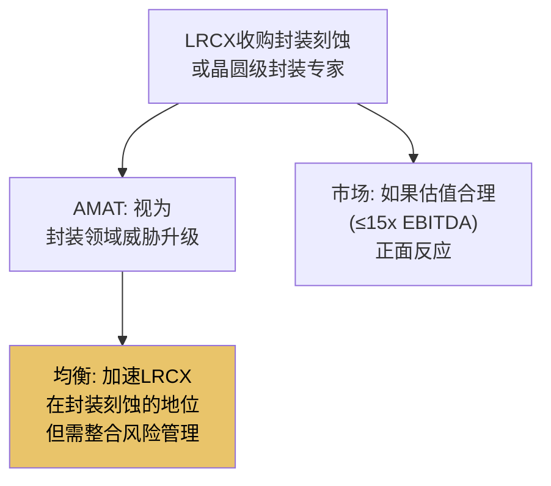
```mermaid
graph TD
    A["LRCX收购封装刻蚀<br/>或晶圆级封装专家"] --> B["AMAT: 视为<br/>封装领域威胁升级"]
    A --> C["市场: 如果估值合理<br/>(≤15x EBITDA)<br/>正面反应"]

    B --> D["均衡: 加速LRCX<br/>在封装刻蚀的地位<br/>但需整合风险管理"]

    style D fill:#e9c46a,color:#000
```

| 因素 | 评估 |
|------|------|
| **LRCX行动** | 收购封装相关设备公司以加速先进封装布局 |
| **竞争反应** | AMAT可能反击性收购以保护封装地位 |
| **均衡结果** | 取决于标的和价格——半导体设备领域缺乏明显的、估值合理的标的 |
| **概率** | 20% |
| **对Archer的建议** | 保持观察——当前半导体设备估值过高，不利于M&A |

---

## 7.4 C组场景: KLAC (Wallace)

### 场景C1: 宣布继任计划——3月12日Investor Day

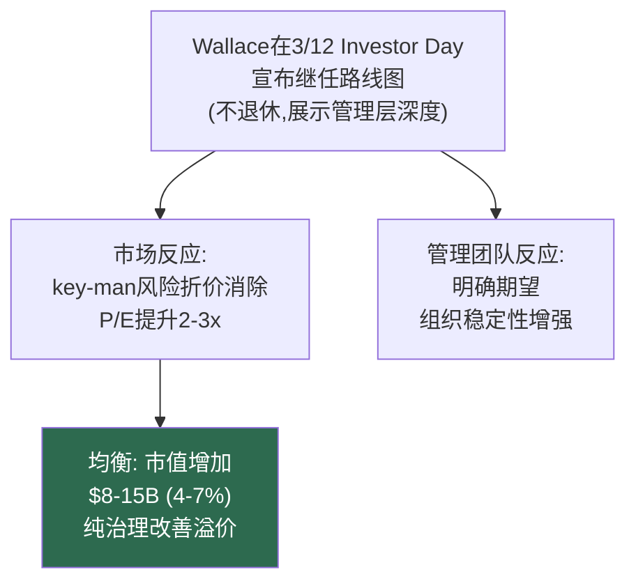
```mermaid
graph TD
    A["Wallace在3/12 Investor Day<br/>宣布继任路线图<br/>(不退休,展示管理层深度)"] --> B["市场反应:<br/>key-man风险折价消除<br/>P/E提升2-3x"]
    A --> C["管理团队反应:<br/>明确期望<br/>组织稳定性增强"]

    B --> D["均衡: 市值增加<br/>$8-15B (4-7%)<br/>纯治理改善溢价"]

    style D fill:#2d6a4f,color:#fff
```

| 因素 | 评估 |
|------|------|
| **KLAC行动** | 展示继任计划(不是宣布退休,而是展示"Wallace之后KLAC依然强大") |
| **市场反应** | 正面——消除20年CEO任期的key-man风险折价 |
| **均衡结果** | 市值增加$8-15B,纯治理改善驱动 |
| **概率** | 40% (Wallace历来回避这个话题) |
| **对Wallace的建议** | **第一优先级**——成本为零,收益$8-15B市值 |

### 场景C2: 进入AI SaaS——MACH平台全面商业化

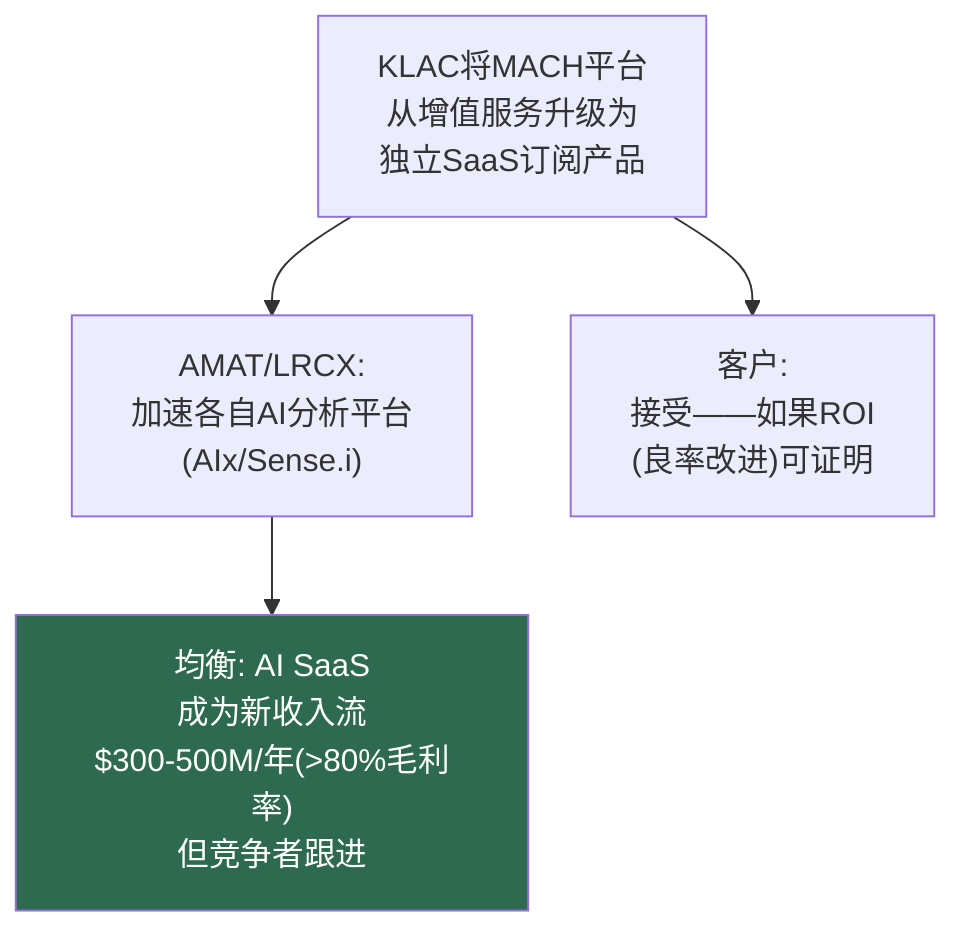
```mermaid
graph TD
    A["KLAC将MACH平台<br/>从增值服务升级为<br/>独立SaaS订阅产品"] --> B["AMAT/LRCX:<br/>加速各自AI分析平台<br/>(AIx/Sense.i)"]
    A --> C["客户:<br/>接受——如果ROI<br/>(良率改进)可证明"]

    B --> D["均衡: AI SaaS<br/>成为新收入流<br/>$300-500M/年(>80%毛利率)<br/>但竞争者跟进"]

    style D fill:#2d6a4f,color:#fff
```

| 因素 | 评估 |
|------|------|
| **KLAC行动** | MACH从"工具附加"升级为独立SaaS产品——按晶圆/按分析收费 |
| **竞争反应** | AMAT(AIx)和LRCX(Sense.i)跟进,但KLAC的30年数据优势难以复制 |
| **均衡结果** | AI SaaS成为新利润池——$300-500M/年,>80%毛利率 |
| **概率** | 50% (正在渐进执行) |
| **对Wallace的建议** | **持续推进**——这是将数据飞轮从被动资产转化为主动收入的唯一路径 |

### 场景C3: 确认封装检测利润率——消灭熊方论点

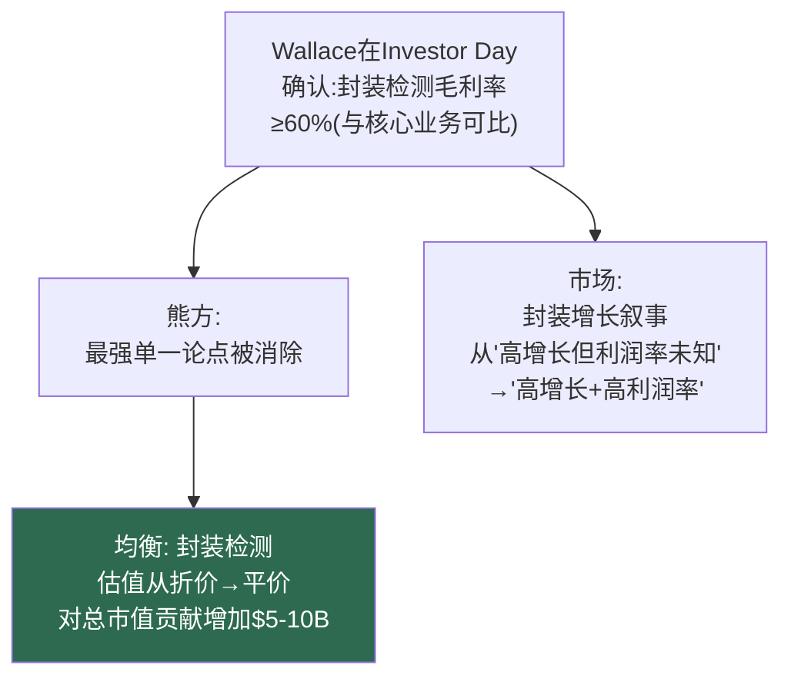
```mermaid
graph TD
    A["Wallace在Investor Day<br/>确认:封装检测毛利率<br/>≥60%(与核心业务可比)"] --> B["熊方:<br/>最强单一论点被消除"]
    A --> C["市场:<br/>封装增长叙事<br/>从'高增长但利润率未知'<br/>→'高增长+高利润率'"]

    B --> D["均衡: 封装检测<br/>估值从折价→平价<br/>对总市值贡献增加$5-10B"]

    style D fill:#2d6a4f,color:#fff
```

| 因素 | 评估 |
|------|------|
| **KLAC行动** | 公开确认先进封装检测毛利率与核心业务可比(≥60%) |
| **均衡结果** | 熊方最强论点被消除,封装增长获全额估值信用 |
| **概率** | 55% |
| **对Wallace的建议** | 如果数据支持,没有理由不做——沉默只会助长负面猜测 |

---

## 7.5 D组场景: AMAT (Dickerson)

### 场景D1: EPIC获得第一个Tier-1量产POR

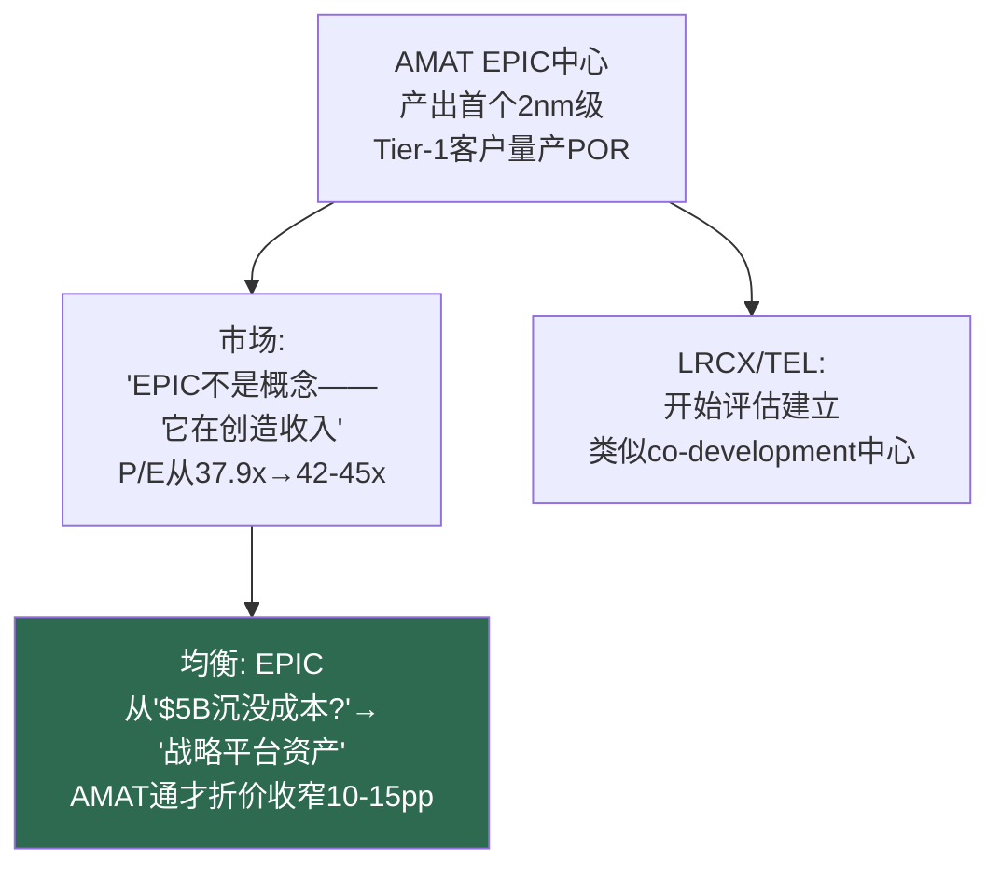
```mermaid
graph TD
    A["AMAT EPIC中心<br/>产出首个2nm级<br/>Tier-1客户量产POR"] --> B["市场:<br/>'EPIC不是概念——<br/>它在创造收入'<br/>P/E从37.9x→42-45x"]
    A --> C["LRCX/TEL:<br/>开始评估建立<br/>类似co-development中心"]

    B --> D["均衡: EPIC<br/>从'$5B沉没成本?'→<br/>'战略平台资产'<br/>AMAT通才折价收窄10-15pp"]

    style D fill:#2d6a4f,color:#fff
```

| 因素 | 评估 |
|------|------|
| **AMAT行动** | EPIC中心产出首个可归因的Tier-1量产工艺认证 |
| **市场反应** | EPIC叙事从"概念"转为"收入驱动"——通才折价收窄 |
| **均衡结果** | AMAT P/E提升4-7x,市值增加$30-50B |
| **概率** | 25% (FY2028前) |
| **对Dickerson的建议** | **最重要的中期里程碑**——每季更新EPIC进展以建立可信度 |

### 场景D2: 剥离ICAPS——聚焦AI增长

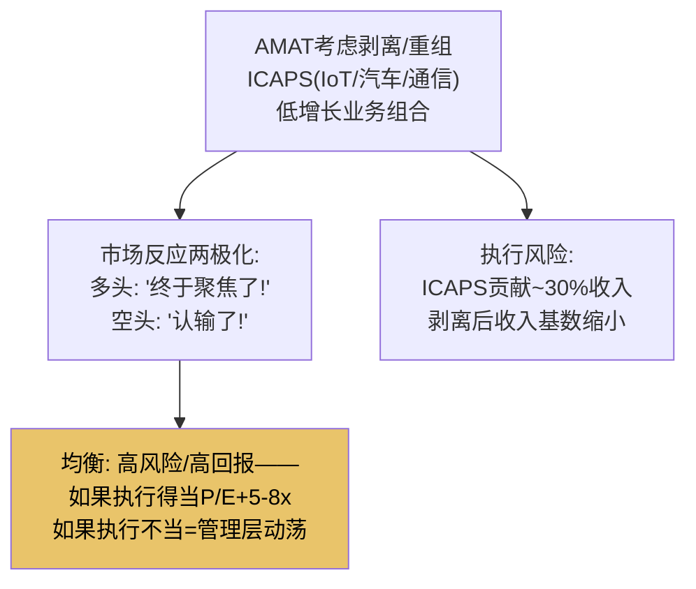
```mermaid
graph TD
    A["AMAT考虑剥离/重组<br/>ICAPS(IoT/汽车/通信)<br/>低增长业务组合"] --> B["市场反应两极化:<br/>多头: '终于聚焦了!'<br/>空头: '认输了!'"]
    A --> C["执行风险:<br/>ICAPS贡献~30%收入<br/>剥离后收入基数缩小"]

    B --> D["均衡: 高风险/高回报——<br/>如果执行得当P/E+5-8x<br/>如果执行不当=管理层动荡"]

    style D fill:#e9c46a,color:#000
```

| 因素 | 评估 |
|------|------|
| **AMAT行动** | 将ICAPS业务组合分拆或合并到独立实体 |
| **均衡结果** | 聚焦后的"AI-AMAT"可能获得更高倍数,但执行风险巨大 |
| **概率** | 10% (Dickerson不太可能如此激进) |
| **对Dickerson的建议** | **暂不建议**——先试分部报告改革(更低风险),如果仍无法消除折价再考虑 |

### 场景D3: 收购ASM International

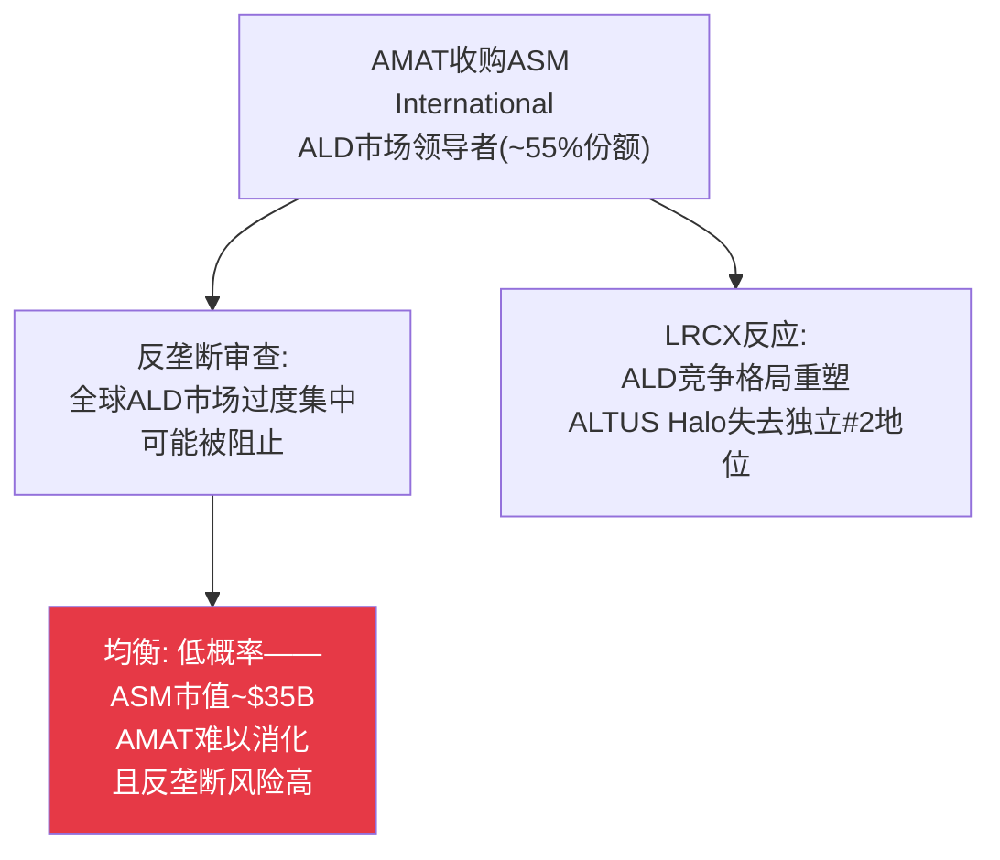
```mermaid
graph TD
    A["AMAT收购ASM International<br/>ALD市场领导者(~55%份额)"] --> B["反垄断审查:<br/>全球ALD市场过度集中<br/>可能被阻止"]
    A --> C["LRCX反应:<br/>ALD竞争格局重塑<br/>ALTUS Halo失去独立#2地位"]

    B --> D["均衡: 低概率——<br/>ASM市值~$35B<br/>AMAT难以消化<br/>且反垄断风险高"]

    style D fill:#e63946,color:#fff
```

| 因素 | 评估 |
|------|------|
| **AMAT行动** | 收购ASM International以获得ALD领导地位(GAA关键工艺) |
| **均衡结果** | 反垄断几乎肯定阻止——半导体设备行业整合面临监管壁垒 |
| **概率** | 5% |
| **对Dickerson的建议** | **不建议**——选择有机竞争ALD,通过EPIC中心建立GAA ALD能力 |

---

## 7.6 场景优先级矩阵

| 场景 | 概率 | 影响 | 紧迫度 | CEO行动优先级 |
|------|:---:|:---:|:---:|:---:|
| C1: Wallace继任计划 | 40% | 中 | **9天** | ★★★★★ |
| A1: ASML封装光刻 | 70% | 高 | 进行中 | ★★★★ |
| B2: CSBG利润引擎化 | 55% | 高 | 2026 | ★★★★ |
| C3: 封装利润率确认 | 55% | 中 | **9天** | ★★★★ |
| D1: EPIC首个POR | 25% | 极高 | 2026-2028 | ★★★★ |
| A2: High-NA定价/TSMC延迟 | 45% | 高 | 2026 H2 | ★★★ |
| C2: MACH SaaS | 50% | 中高 | 渐进 | ★★★ |
| B1: 干法光刻胶 | 60% | 中 | 进行中 | ★★ |
| B3: 封装刻蚀收购 | 20% | 中 | 观察 | ★★ |
| D2: 剥离ICAPS | 10% | 极高 | 暂缓 | ★ |
| A3: 收购量测公司 | 15% | 中 | 不建议 | ★ |
| D3: 收购ASM | 5% | 极高 | 不建议 | — |

---

## 7.7 跨场景交互——连锁反应

某些场景会触发其他场景的概率变化：

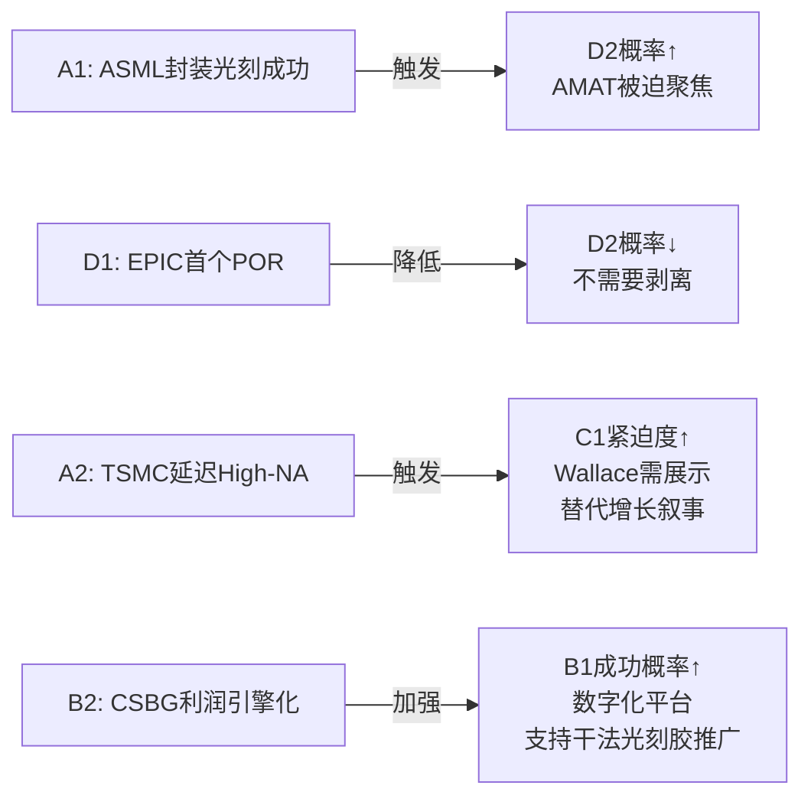
```mermaid
graph LR
    A1["A1: ASML封装光刻成功"] -->|"触发"| D2_up["D2概率↑<br/>AMAT被迫聚焦"]
    D1["D1: EPIC首个POR"] -->|"降低"| D2_down["D2概率↓<br/>不需要剥离"]
    A2["A2: TSMC延迟High-NA"] -->|"触发"| C1_up["C1紧迫度↑<br/>Wallace需展示<br/>替代增长叙事"]
    B2["B2: CSBG利润引擎化"] -->|"加强"| B1_up["B1成功概率↑<br/>数字化平台<br/>支持干法光刻胶推广"]
```

---

*[本章完 | 下一章: Ch8 资本配置锦标赛——谁把钱花在了刀刃上]*
