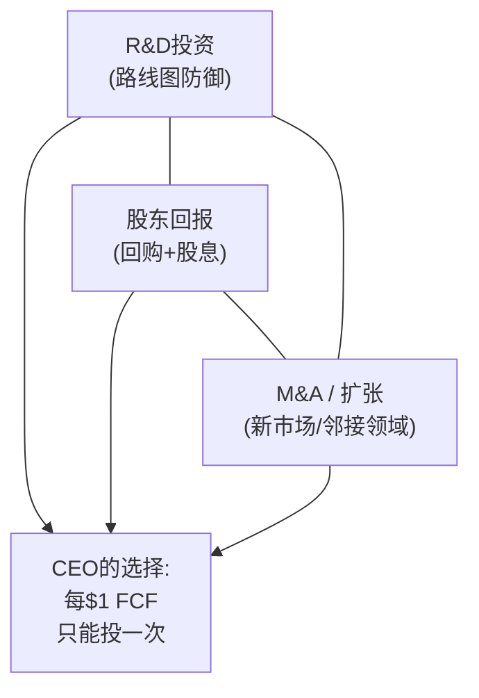
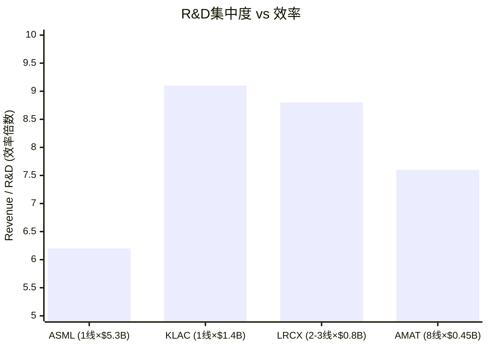
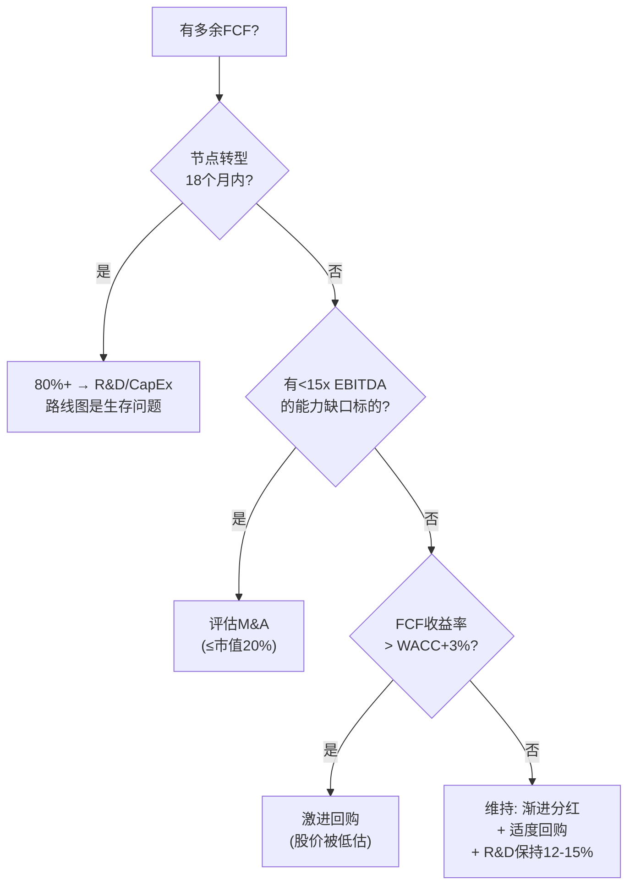

# Chapter 8: 资本配置锦标赛——谁把钱花在了刀刃上

> *"管理层质量的终极测试不是他们赚了多少钱，而是他们如何分配赚到的钱。"*
> *— Warren Buffett*

---

## 8.1 半导体设备CEO的资本配置三难困境

每位CEO面临一个永恒的三角——而这个三角在当前估值环境下变得格外尖锐：

**核心张力**：在P/E 37-51x的环境下，回购的隐含IRR仅为2-3%——低于无风险利率(4.3%)、低于研发增量IRR(8-12%)、低于战略收购IRR(10-15%)。**但华尔街期待>85% FCF返还——偏离这个预期会触发卖出。**

---

## 8.2 资本配置全面对比

### FY2025实际配置

| 维度 | ASML | KLAC | LRCX | AMAT |
|------|:---:|:---:|:---:|:---:|
| **R&D ($B)** | **$5.3** (14.4%) | $1.4 (10.5%) | $2.1 (11.4%) | $3.6 (12.5%) |
| **CapEx ($B)** | ~$2.5 (8%) | $0.4 (2.8%) | ~$0.7 (4.1%) | $2.3+ (8%) |
| **回购 ($B)** | 持续 | ~$2.5 | ~$4.9 (年化) | ~$4 |
| **股息收益率** | ~0.8% | ~0.8% | ~1.0% | ~0.8% |
| **FCF返还率** | >85% | >85% | >85% | >85% |
| **M&A活跃度** | 极低 | 选择性 | 极低 | 战略型(EPIC) |
| **净现金/净债务** | 净现金 | 净现金 | 净现金$1.6B | 净现金 |

### R&D效率对比——每$1 R&D产出了什么

| 公司 | R&D ($B) | R&D产品线数 | $/产品线 | R&D效率 (Rev/$R&D) |
|------|:---:|:---:|:---:|:---:|
| **ASML** | $5.3 | 1 (光刻) | **$5.3B/线** | 6.2x |
| **KLAC** | $1.4 | 1 (检测/量测) | **$1.4B/线** | 9.1x |
| **LRCX** | $2.1 | 2-3 (刻蚀+沉积) | ~$0.8B/线 | 8.8x |
| **AMAT** | $3.6 | 8 | **$0.45B/线** | 7.6x |

**KLAC的R&D效率最高(9.1x)**——每$1研发支出创造$9.1收入，因为检测领域的算法/软件密集属性使R&D具有更高的边际回报。AMAT的$0.45B/产品线仅为KLAC的1/3——这是"通才陷阱"在资本配置层面的直接体现。

---

## 8.3 回购效率审计——华尔街的期望 vs 股东的利益

### 回购隐含IRR (= E/P = 1/PE)

| 公司 | TTM P/E | 回购隐含IRR | vs 10Y UST (4.3%) | vs R&D IRR (8-12%) | 判定 |
|------|:---:|:---:|:---:|:---:|:---:|
| ASML | 51.7x | **1.93%** | -237bp | -600~-1000bp | ❌ 低效 |
| KLAC | 49.0x | **2.04%** | -226bp | -600~-1000bp | ❌ 低效 |
| LRCX | 50.9x | **1.96%** | -234bp | -600~-1000bp | ❌ 低效 |
| AMAT | 37.9x | **2.64%** | -166bp | -540~-940bp | ❌ 低效 |

**所有四家公司在当前估值水平的回购隐含IRR都低于无风险利率。**

这意味着从纯财务角度，每$1用于回购的资金还不如买国债。但停止回购会触发分析师评级下调和卖出——这是一个**制度约束**而非经济最优。

### 历史对比：回购时机决定回报

| 时点 | LRCX回购价格(分拆调整) | 至今回报 | 判定 |
|------|:---:|:---:|:---:|
| FY2022 (周期底部) | ~$45 | +433% | ★★★ 极佳 |
| FY2024 | ~$75 | +220% | ★★ 良好 |
| FY2025 | ~$105 | +129% | ★ 尚可 |
| H1 FY2026 (当前) | ~$240 | **TBD** | **? 隐含IRR 2%** |

**规律清晰**：回购在周期底部创造巨大价值，在估值高峰则是价值破坏。但管理层被制度约束绑定——不能因为"估值太高"就停止回购。

---

## 8.4 资本配置决策树——CEO应该怎么做

### 四位CEO的当前位置

| CEO | 节点转型? | 有M&A标的? | FCF>WACC+3%? | **最优行动** |
|-----|:---:|:---:|:---:|---------|
| **Fouquet** | ✅ High-NA | ❌ | ❌ | **80% R&D——High-NA是存亡之战** |
| **Archer** | ✅ GAA/CFET | ❌ | ❌ | **减回购$1-1.5B→增R&D(CFET/Equipment Intelligence)** |
| **Wallace** | 部分(封装) | 可能(利基) | ❌ | **维持——但MACH SaaS需要更多投资** |
| **Dickerson** | ✅ GAA/EPIC | ❌ | ❌ | **EPIC已锁定CapEx; 确保运营效率** |

---

## 8.5 McKinsey五大杠杆评估

McKinsey的研究显示，只有**同时拉动2+杠杆**才能显著改变公司在Power Curve中的位置。

### 五大杠杆评分

| 杠杆 | ASML | KLAC | LRCX | AMAT |
|------|:---:|:---:|:---:|:---:|
| **1. 程序化M&A** | 2/10 (几乎不做) | 5/10 (选择性) | 2/10 (几乎不做) | 6/10 (Kokusai+EPIC) |
| **2. 动态资源重配** | 7/10 (DUV→EUV→HNA) | 6/10 (核心→封装) | 5/10 (刻蚀→ALD) | 4/10 (分散不聚焦) |
| **3. 超越对手的投资** | **9/10** ($5.3B R&D) | 6/10 | 7/10 | 7/10 (含EPIC) |
| **4. 生产率提升** | 8/10 (Fouquet效率) | **9/10** (62%毛利率) | 7/10 | 5/10 |
| **5. 强差异化** | **10/10** (垄断) | **9/10** (数据飞轮) | 8/10 (HAR刻蚀) | 5/10 (广度≠差异化) |
| **总分** | **36/50** | **35/50** | **29/50** | **27/50** |
| **拉动≥2杠杆?** | ✅ (3+4+5) | ✅ (4+5) | ✅ (3+5) | ❌ (无杠杆≥8) |

**关键发现**: AMAT是唯一没有任何杠杆达到8+/10的公司。McKinsey研究表明，没有"大动作"的公司从Power Curve中间60%跳到顶部20%的概率仅为8%。**EPIC是Dickerson试图创造一个8+杠杆的努力——如果成功，它将同时满足"超越对手投资"和"强差异化"两个杠杆。**

---

## 8.6 CapEx密度与资本效率

| 指标 | ASML | KLAC | LRCX | AMAT |
|------|:---:|:---:|:---:|:---:|
| CapEx/Revenue | 8.0% | **2.8%** | 4.1% | 8.0% |
| 固定资产周转率 | 5.8x | **9.7x** | 4.2x | 3.1x |
| FCF利润率 | 34.2% | **34.4%** | 32.4% | 22.0% |
| FCF/Revenue (排名) | #2 | **#1** | #3 | #4 |
| CapEx < 折旧? | 否 | **是** | 接近 | 否 |

**KLAC的资本效率在设备行业中独一无二**——CapEx低于折旧(资产变"轻")，固定资产周转率9.7x(在工业硬件公司中几乎闻所未闻)，FCF利润率与ASML垄断者相当。

**AMAT的CapEx负担最重**——8%的CapEx/Revenue中，EPIC中心占据很大比例。这意味着在WFE下降周期中，AMAT的FCF弹性最差(14-17% FCF margin vs KLAC的30-32%)。

---

## 8.7 资本配置终极评分

| 维度 (权重) | ASML | KLAC | LRCX | AMAT |
|------------|:---:|:---:|:---:|:---:|
| R&D效率 (25%) | 8 | **9** | 8 | 6 |
| 回购时机纪律 (20%) | 6 | 7 | 5 | 6 |
| 资本效率 (25%) | 7 | **9** | 7 | 5 |
| 战略投资方向 (20%) | **9** | 7 | 7 | 7 |
| 平衡力 (10%) | 7 | **8** | 6 | 6 |
| **加权总分** | **7.5** | **8.1** | **6.7** | **5.9** |

**KLAC是资本配置的冠军。** 它在R&D效率、资本效率和平衡力三个维度都是最高分，唯一不及ASML的维度是战略投资方向(ASML的High-NA EUV是可能重新定义行业的赌注，KLAC没有等量级的战略赌注)。

**AMAT排名最低**——不是因为它的任何单一决策是错误的，而是因为资本在8条产品线间的分散使得每个方向的投入都不够"大"。EPIC中心($5B)是试图打破这个困境的"all-in"赌注。

---

## 8.8 对四位CEO的资本配置建议

| CEO | 当前最大的资本配置问题 | 建议调整 |
|-----|:---:|---------|
| **Fouquet** | R&D高度集中(正确)但CapEx也高(8%用于供应链) | 维持——High-NA需要大CapEx。评估是否过度依赖Veldhoven |
| **Archer** | 在P/E 50x回购是隐含IRR最低的资本用途 | **将$1-1.5B从回购转向R&D**——CFET/Equipment Intelligence商业化/封装刻蚀 |
| **Wallace** | R&D效率已极高(9.1x)但MACH SaaS可能需要更多投资 | 适度增加MACH平台投入；维持低CapEx模型——这是你的估值护城河 |
| **Dickerson** | EPIC已锁定$5B——问题不是配置方向而是执行 | **确保EPIC有可度量的ROI里程碑——每季向市场更新** |

---

*[本章完 | Part II博弈引擎结束 | 下一Part: Part III 共享战略动力]*
