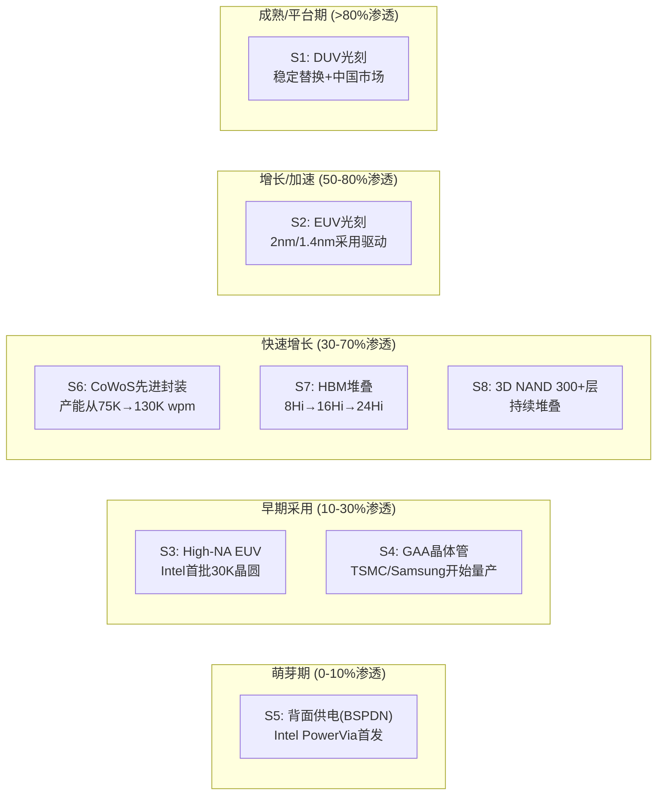
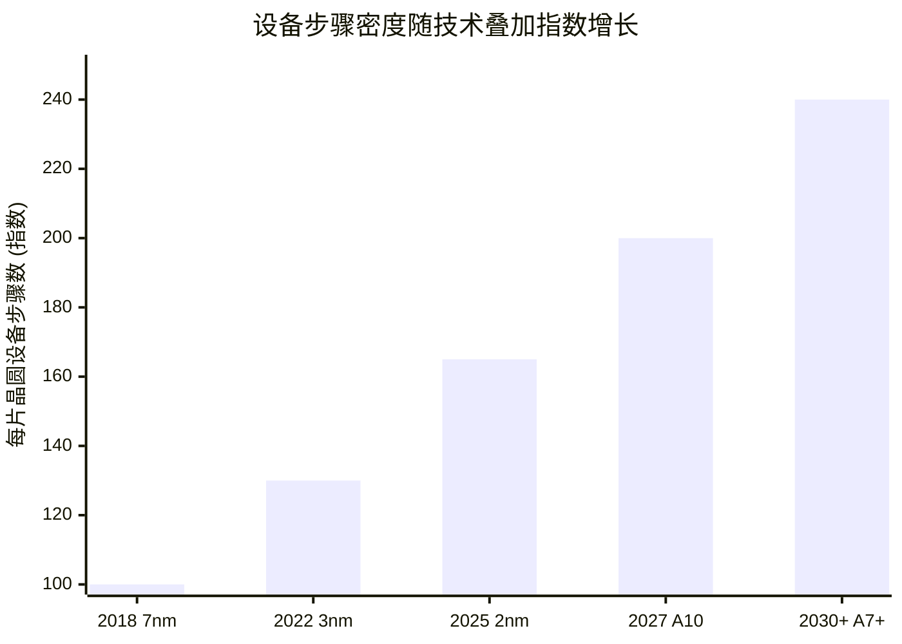

# Chapter 9: 技术S曲线——8条曲线同时展开

> *"每一次S曲线转换都是一次财富重新分配。问题是你在曲线的哪个位置。"*

---

## 9.1 为什么CEO需要理解S曲线

S曲线不是学术概念——它是CEO最实用的战略工具之一。每条S曲线都意味着：

- **早期采用期**：高R&D投入、低收入、高不确定性——但**先行者优势窗口打开**
- **增长加速期**：收入快速增长、市场标准形成——**装机基数锁定开始**
- **成熟平台期**：稳定现金流、增长放缓——**利润最大化但创新动力下降**

在任何正常时期，设备行业通常只有1-2条S曲线在转换。

**此刻有8条同时展开——这在半导体设备40年历史中前所未有。**

---

## 9.2 八条S曲线定位图

### 每条曲线的设备含义

| S曲线 | 当前位置 | 主要受益者 | 设备需求增量 | 峰值时间 |
|-------|---------|---------|:---:|---------|
| **S1: DUV** | 成熟 | ASML(存量), Nikon, Canon | 稳定 | 已过 |
| **S2: EUV** | 增长加速 | **ASML**(垄断), KLAC(量测) | 高且持续 | 2028-2030 |
| **S3: High-NA EUV** | 早期采用 | **ASML**, KLAC(新量测) | 初期低,后期高 | 2029-2032 |
| **S4: GAA晶体管** | 早期增长 | **LRCX, AMAT** | +25-38%刻蚀/沉积 | 2027-2030 |
| **S5: BSPDN** | 萌芽 | **AMAT, LRCX** | 全新品类 | 2028-2031 |
| **S6: CoWoS** | 快速增长 | **KLAC, AMAT, ASML** | 检测密度5-6x | 2027-2029 |
| **S7: HBM** | 快速增长 | **LRCX, KLAC, AMAT** | TSV+键合+检测 | 2027-2029 |
| **S8: 3D NAND 300+** | 持续增长 | **LRCX** | HAR刻蚀强度↑ | 2028-2030 |

---

## 9.3 实物期权框架：两个$5B+赌注

每条处于早期采用期的S曲线本质上是一个**实物期权**——传统NPV分析会系统性低估其价值。

### Mega-Bet 1: ASML High-NA EUV ($10B+ 累计R&D)

| 期权类型 | 描述 | 行权触发 |
|---------|------|---------|
| **增长期权** (看涨) | 每台安装的High-NA = 下一代平台基础 | 客户承诺量产 |
| **切换期权** | 可优化吞吐量 vs 分辨率 | 客户需求组合变化 |
| **放弃期权** (看跌) | 如果采用停滞,R&D可转向封装光刻 | 2028年前<5台High-NA订单 |
| **学习期权** (复合) | 每台出货积累数据→改进下一台 | 良率学习曲线超预期 |

**当前状态**：增长期权正在被行权——Intel已安装并生产30K晶圆，Samsung和SK Hynix评估中。TSMC的犹豫使期权价值不确定但未归零。

**CEO含义 (Fouquet)**：High-NA不是NPV项目——它是一个**期权链**，其中每个成功行权创造下一个期权。停止投资不仅失去当前收入，还消灭整个未来期权链（Hyper-NA、Beyond EUV）。**你不能按NPV决定是否继续——你必须按期权价值决策。**

### Mega-Bet 2: AMAT EPIC中心 ($5B)

| 期权类型 | 描述 | 行权触发 |
|---------|------|---------|
| **平台期权** | 每个新合作伙伴 = 新的收入期权 | Samsung之后第2/3个成员加入 |
| **速度期权** | 压缩R&D→量产周期"数年变数月" | 首个2nm工艺在EPIC完成验证 |
| **知识期权** (复合) | 背面供电+GAA集成学习 | 技术转移到客户fab |
| **锁定期权** | 共创→深度嵌入客户工艺 | 客户依赖性在时间中固化 |

**当前状态**：平台期权刚开始行权（Samsung为创始成员）。关键变量是TSMC和Intel是否加入——如果加入，网络效应使EPIC价值指数增长；如果不加入，$5B可能成为沉没成本。

**CEO含义 (Dickerson)**：EPIC的ROI无法用传统方式计算。它的价值是**所有衍生期权的总和**——每个合作伙伴、每项技术验证都创造新的期权。**但市场不会自动认可期权价值——你需要给出可度量的里程碑让市场跟踪。**

---

## 9.4 S曲线叠加的宏观效应

**从7nm到A7+，每片晶圆的设备步骤数增长约140%。** 这意味着即使全球晶圆厂数量不增加、每座厂的晶圆开工不增长，设备行业的收入仍能翻倍——纯粹来自工艺复杂度提升。

这是Giga Cycle与历史半导体周期的根本区别：**历史周期由晶圆开工驱动（周期性），本轮周期由步骤密度驱动（结构性）。**

---

## 9.5 S曲线对各CEO的机会窗口

| S曲线 | Fouquet机会 | Archer机会 | Wallace机会 | Dickerson机会 |
|-------|---------|---------|---------|---------|
| High-NA EUV | **定义性** | 间接(更多刻蚀) | 新量测需求 | 间接 |
| GAA | 间接(EUV层数) | **核心**(选择性刻蚀) | 检测强度+200bps | **核心**(沉积/刻蚀/EPIC) |
| BSPDN | 间接 | **全新TAM** | 新检测品类 | **全新TAM** |
| CoWoS | 封装光刻(XT:360) | 封装刻蚀 | **封装检测$950M** | 封装材料 |
| HBM | 间接 | TSV刻蚀 | **HBM检测翻倍** | 键合+沉积 |
| 3D NAND 300+ | 间接 | **核心**(HAR刻蚀) | NAND检测 | 沉积 |

**关键洞察**：LRCX和AMAT受益的S曲线最多（5-6条），但每条曲线上都面临对方或TEL的竞争。ASML和KLAC受益的曲线较少（3-4条），但在每条曲线上几乎没有竞争——这是"专精 vs 广度"战略在S曲线层面的映射。

---

*[本章完 | 下一章: Ch10 安装基数——最被低估的资产]*
