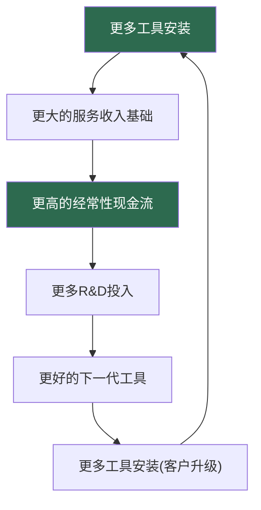
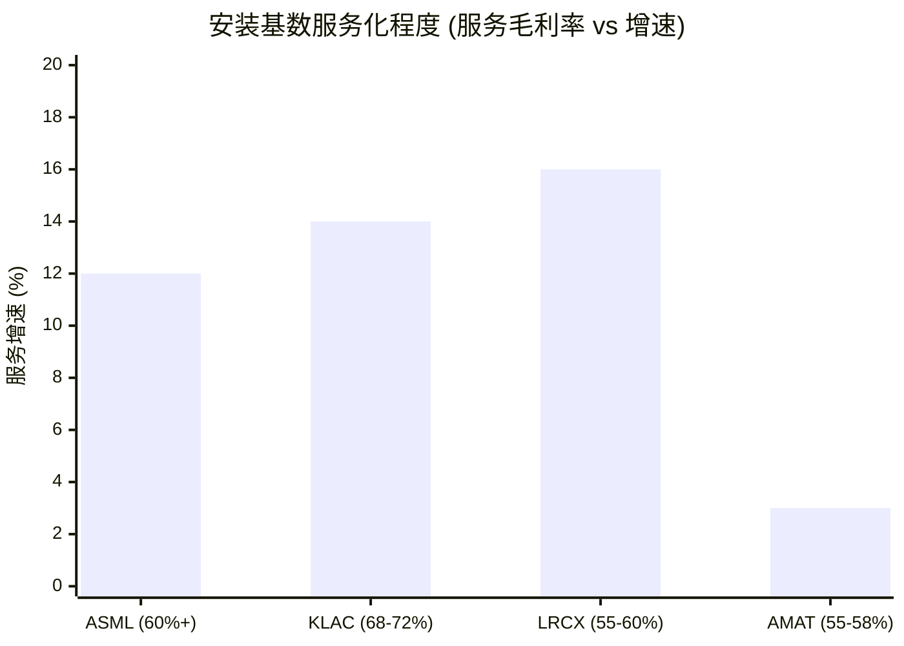
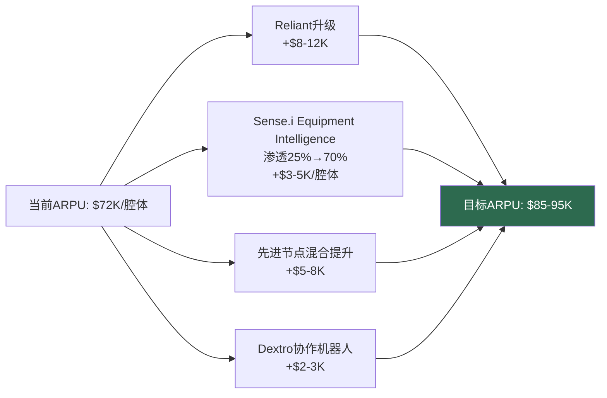
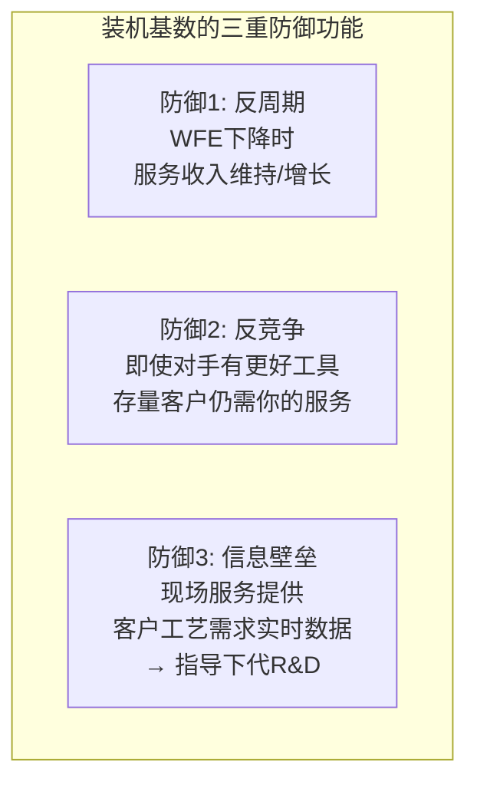

# Chapter 10: 安装基数——最被低估的资产

> *"设备公司最常犯的错误是低估自己的安装基数价值。"*
> *— Bain & Company, "An Overlooked Ace: Finding Value in Your Installed Base"*

---

## 10.1 剃刀-刀片飞轮

半导体设备公司运营一个修改版的剃刀-刀片模型：

- **剃刀** = 设备销售（一次性、大额、周期性）
- **刀片** = 服务合同、备件、升级、耗材（经常性、稳定、增长中）

**飞轮的关键特性**：每一圈都强化下一圈。装机基数越大→服务收入越稳→R&D投入越多→下代产品越强→装机基数越大。**这个飞轮一旦转起来，竞争对手即使造出更好的单一工具，也无法快速复制已积累的装机基数。**

---

## 10.2 四家公司的安装基数对比

| 指标 | ASML | KLAC | LRCX (CSBG) | AMAT (AGS) |
|------|:---:|:---:|:---:|:---:|
| **装机规模** | 5,500+ DUV + 500+ EUV | ~15,000工具 | **100,000+ 腔体** | **~40,000+ 腔体** |
| **服务收入** | ~30%总收入 | ~30%总收入 | $7.2B (~38%) | ~$6B+ (~23%) |
| **服务毛利率** | 60%+ | **68-72%** | 55-60% | 55-58% |
| **服务增速** | 加速中 | +14% | **+16%** | +3% |
| **年度服务费/工具** | EUR 50-80M (EUV) | $80-350K (按tier) | **$72K/腔体(ARPU)** | ~$15K/腔体 |
| **续约率** | 极高(强制性) | 95% | **>90%** | 未披露 |
| **服务收入评分 (A6)** | 6/10 | 6/10 | **7/10** | 5/10 |

---

## 10.3 LRCX CSBG——行业最强服务特许经营

LRCX的CSBG (Customer Support Business Group)是四家公司中最值得CEO深入理解的服务业务：

### CSBG收入结构分解

| 收入流 | 年收入估算 | 占CSBG% | 毛利率 | 经常性质量 |
|--------|:---:|:---:|:---:|---------|
| 维保合同/服务 | $2.3-2.5B | 32-35% | 55-60% | 高(多年,~90%续约) |
| 备件/耗材 | $2.0-2.3B | 28-32% | 60-65% | 高(物理消耗驱动) |
| 设备升级 | $1.4-1.6B | 20-22% | 45-50% | 准经常性(3-5年周期) |
| Reliant翻新系统 | $1.0-1.4B | 14-19% | 40-45% | 周期性(客户CapEx驱动) |

**真正经常性收入**: 60-67% ($4.3-4.8B) — 维保+备件

### CSBG独立估值

我们的LRCX深度报告使用三方法收敛：

| 方法 | 估值范围 | 中值 |
|------|:---:|:---:|
| SaaS可比(含65-75%折扣) | $30-38B | $34B |
| 逐腔体NPV | $21-54B | $34B |
| FCF归因 | $26-47B | $36B |
| **三方法重叠** | **$30-40B** | **$35B** |

**关键修正**：初始SOTP将CSBG估值为$90-126B(使用13-18x EV/Sales无折扣)。深度分析后下调70%至$30-40B。原因：仅60-67%真正经常性; Reliant是被归类为服务的设备销售; SaaS对标需65-75%折扣(硬件含量、周期性、客户集中度)。

**CEO关键洞察 (Archer)**：CSBG的价值是**估值地板而非天花板**。$35B的CSBG→隐含系统估值=$302B-$35B=$267B→隐含系统EV/Sales=23.2x——远超任何同行。CSBG不能证明$302B市值是合理的，但它确保了即使在深度衰退中LRCX也有$30-35B的硬底估值。

### CSBG ARPU增长路径

---

## 10.4 ASML服务——垄断者的永续收入机器

ASML的服务模型与其他三家有一个根本区别：**它是强制性的。**

| 维度 | ASML服务 | 其他三家服务 |
|------|---------|-----------|
| 客户选择 | **无选择**——EUV复杂度要求ASML专员 | 客户可选择自行维护(但通常不选) |
| 定价权 | **绝对**——无第三方维保选项 | 有限——客户可比较或自建 |
| 地缘工具化 | **是**——中国服务/备件需出口许可 | 有限 |
| 收入增长驱动 | **机械式**——每台新EUV工具=EUR 50-80M/年 | 依赖渗透率提升 |

**CEO含义 (Fouquet)**：你的500+ EUV装机基数× EUR 50-80M/年= EUR 25-40B的年经常性收入流，且随每台新出货工具机械增长。这是全球工业企业中最可预测的收入流之一——在衰退中是你的护盾，在出口管控中是你的地缘武器。

---

## 10.5 KLAC服务——软件含量最高的"服务"

KLAC的服务模型有一个独特之处：它的"服务收入"大量包含**高利润率软件分析**。

| 服务层级 | 年费/工具 | 内容 | 毛利率 |
|---------|:---:|---------|:---:|
| Basic | $80-120K | 标准维保+备件 | ~55% |
| Advanced | $150-200K | + 数据分析(5D Analyzer) | ~70% |
| Full/Premium | $250-350K | + AI缺陷分类(aiSIGHT) + 预测性维护 | **~80%+** |

**阶梯化服务定价**的战略含义：当客户从Basic升级到Full时，增量毛利率>80%（因为增量内容是软件/算法）。这使KLAC的服务毛利率(68-72%)远高于同行——并解释了为什么它通过了"软件公司"经济测试。

**未来方向**: MACH平台如果成功从增值服务升级为独立SaaS产品，可能在FY2028-2030增加$300-500M/年的>80%毛利率收入——将经常性收入从22%提升到30%+。

---

## 10.6 AMAT AGS——需要加速的短板

AMAT的AGS (Applied Global Services)在2026年初完成了结构调整——将200mm设备业务从AGS转移到半导体系统部门，使AGS成为纯经常性收入业务。

| 指标 | AGS调整前 | AGS调整后 | vs LRCX CSBG |
|------|:---:|:---:|:---:|
| 经常性收入占比 | ~70-75% | 80-85% | 60-67% |
| 增速 | +3% | TBD | +16% |
| 透明度 | 低(混合设备销售) | 高(纯服务) | 中 |

**AGS是四家中最弱的服务业务**：+3%增速远低于LRCX(+16%)和KLAC(+14%)。Dickerson需要回答的问题是——为什么拥有行业最大装机基数(40,000+腔体)的公司，服务增速反而最慢？答案很可能在于ARPU($15K vs LRCX的$72K)——AMAT的服务渗透率和tier升级率远落后于LRCX。

---

## 10.7 安装基数是最不可颠覆的资产

安装基数有一个常被忽视的战略属性：**它是半导体设备行业中唯一无法被单一技术创新颠覆的资产。**

- 如果竞争对手造出更好的刻蚀工具？客户仍需为现有装机基数购买服务和备件。
- 如果技术路线改变(FinFET→GAA)？旧工具需要升级，不是替换——升级是设备公司的收入。
- 如果WFE衰退？新设备购买推迟，但服务和备件需求不受周期影响。

**CEO关键洞察**：如果你必须选择——宁要10万台装机基数和第二好的新产品，也不要最好的新产品和1万台装机基数。**装机基数是时间的函数，不是金钱的函数——你买不到30年的累积安装。**

---

## 10.8 服务收入追踪仪表盘

| 追踪指标 | 牛市信号 | 熊市信号 | 频率 |
|---------|---------|---------|------|
| 服务收入增速 vs 设备收入增速 | 服务增长更快 | 设备增长更快 | 季度 |
| 服务占收入比 | 趋向30%+ | 停滞或下降 | 季度 |
| ARPU(如LRCX) | 趋向$85-95K | 停滞在$72K | 年度 |
| AI/数字化渗透率(如KLAC MACH) | >50% | <30% | 半年 |
| 服务续约率 | >90% | <85% | 年度 |
| 服务毛利率趋势 | 上升 | 下降 | 季度 |

**终极指标**：服务收入作为总收入的百分比。如果这个比例在上升且服务增速快于设备增速——商业模型正在变得更抗周期。目标: >30% = 结构性防御。

---

*[本章完 | 下一章: Ch11 风险拓扑——温水煮青蛙]*
