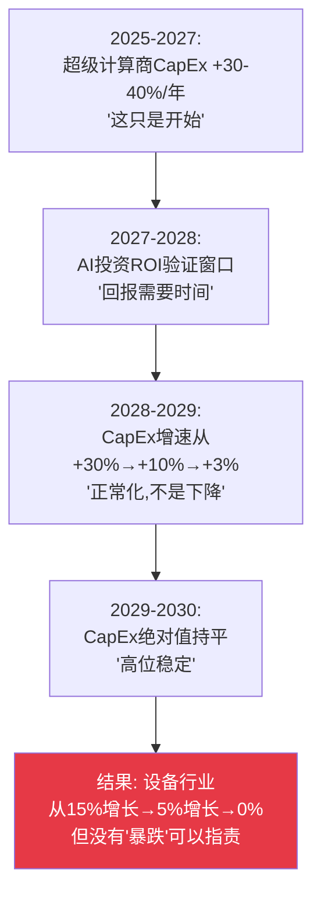
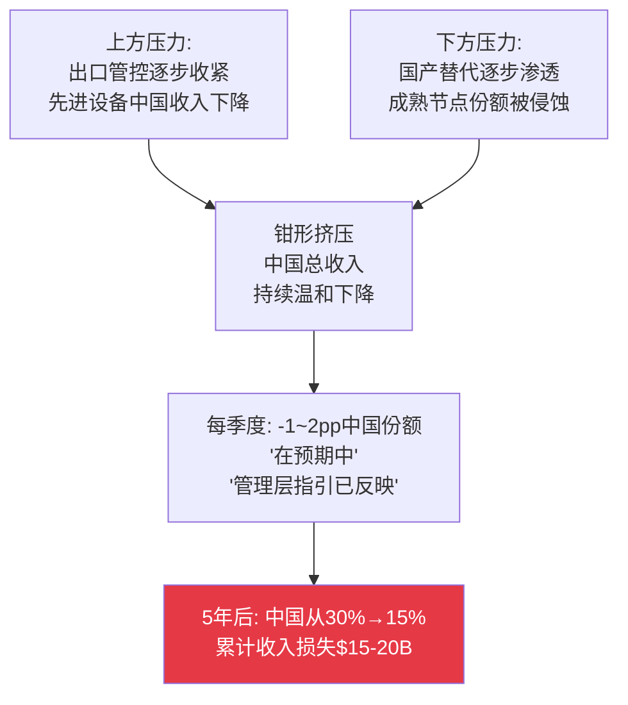
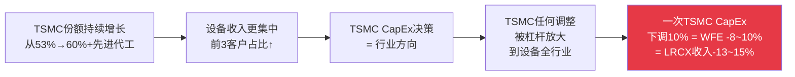
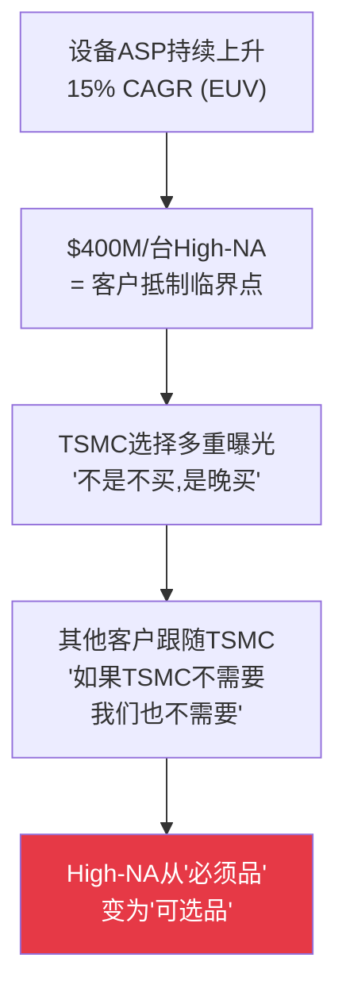
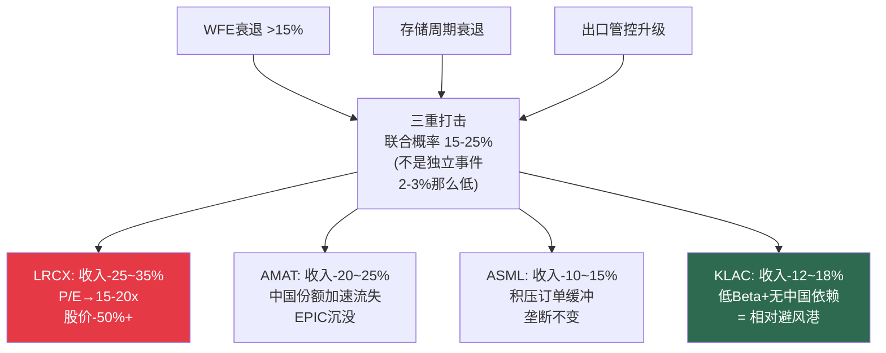

# Chapter 11: 风险拓扑——温水煮青蛙

> *"最危险的风险不是突然的灾难——而是每个季度'不够大到触发行动'的渐进衰退。五年后你回头看，才发现青蛙已经被煮熟了。"*

---

## 11.1 为什么CEO需要"温水煮青蛙"框架

传统风险管理关注**冲击事件**——AI泡沫破裂、台海冲突、WFE暴跌。这些是重要的但概率较低。

真正杀死战略位置的往往是**渐进衰退**——每个季度的影响"在预期范围内"、"已在指引中反映"、"影响可控"。没有任何单个季度的变化大到触发战略调整。但5年累计效应可以重塑竞争格局。

**我们识别了四条温水煮青蛙路径，每一条都遵循相同的模式**：季度影响可控→年度影响"可管理"→5年累计效应不可逆。

---

## 11.2 四条温水煮青蛙路径

### 路径1: AI CapEx高原 (2028-2030)

| 年份 | 超级计算商CapEx YoY | WFE影响 | 每季度看起来... |
|------|:---:|:---:|---------|
| 2025-2026 | +30-40% | WFE→$145B | "创纪录!" |
| 2027 | +15-20% | WFE→$156B | "仍在增长" |
| 2028 | +5-10% | WFE→$155-160B | "正常化,健康的" |
| 2029 | 0% ~ -5% | WFE→$145-150B | "温和调整" |
| 2030 | -5% ~ -10% | WFE→$135-140B | "周期性,预期中的" |

**没有任何单个季度是"灾难"——但2027-2030的轨迹是从$156B缓慢下滑到$135B (-13%)。** 对于周期Beta 1.3-1.5x的LRCX，这意味着收入-17~-20%。对P/E 50x的股票，收入-20% + P/E压缩至30x = 股价-50%。

**CEO关键洞察**: AI CapEx高原不需要"泡沫破裂"就能伤害设备公司。增速从+30%放缓到+5%就足以让设备股从"增长股"重新定价为"周期股"。

### 路径2: 中国钳形攻势 (成熟端替代 + 先进端封锁)

| 季度 | 事件 | 单季中国收入影响 | CEO解释 |
|------|------|:---:|---------|
| Q1 | 新管控规则执行 | -2~3% | "在预期中" |
| Q2 | NAURA获新合同 | -1% | "边际影响" |
| Q3 | 管控细则落地 | -1~2% | "已在指引中反映" |
| Q4 | 中国fab验证国产替代品 | -1% | "长期过程" |
| **年度累计** | — | **-5~8%** | "影响可管理" |
| **5年累计** | — | **中国从30%→15%** | **"好像一直这样..."** |

**最受影响的公司**: AMAT(地缘风险3.45/4, PVD/CVD面临NAURA/Piotech替代), LRCX(CSBG服务管控风险$1.0-1.5B)

### 路径3: 客户集中螺旋 (60-70%收入来自3-4家)

| 度量 | 当前 | 趋势 |
|------|------|------|
| TSMC占全球先进代工 | ~53% | ↑ (Intel IFS未证实, Samsung落后) |
| TSMC占ASML收入 | ~30-35% | ↑ |
| 前3客户占WFE | ~50-55% | ↑ (TSMC+Samsung+Intel) |
| 前5客户占WFE | ~60-70%+ | ↑ |

**没有任何设备CEO公开承认客户集中度在增加。** 所有人都把它框架为"我们服务所有客户"——但数据显示WFE增量越来越由更少的客户决策驱动。

### 路径4: 定价权侵蚀 ($400M High-NA = 临界点)

**这条路径只影响ASML**——但如果发生，影响是定义性的。ASML的整个估值叙事建立在"客户别无选择"的前提上。$400M High-NA首次挑战了这个前提——因为在$350-400M价位上，多重曝光在某些层成为经济可行的替代方案。

---

## 11.3 风险协同与反协同矩阵

某些风险组合的联合影响大于各自影响之和(协同)，某些则相互抵消(反协同)。

### 协同组合 (1+1>2)

| 组合 | 协同机制 | 联合影响 | 最受冲击 |
|------|---------|---------|---------|
| **WFE衰退 + 存储周期衰退** | 存储CapEx更波动→放大WFE下滑 | LRCX收入-25~35% | **LRCX** |
| **出口管控升级 + 中国国产替代** | 管控→替代加速→正反馈循环 | 累计中国收入损失+50% | **AMAT** |
| **EPIC失败 + WFE衰退** | EPIC $2.3B年度CapEx→FCF压力 | AMAT FCF降至$3-4B(低于EPIC覆盖) | **AMAT** |
| **AI CapEx高原 + 估值压缩** | 增速放缓→叙事转变→P/E压缩 | P/E从50x→25-30x | **LRCX** |

### 反协同组合 (一个缓解另一个)

| 组合 | 反协同机制 | 含义 |
|------|----------|------|
| **台海冲突 vs 出口管控升级** | 如果冲突发生,管控变得无关 | 不需要同时为两者定价 |
| **存储衰退 vs NAND价格上涨** | 内置负反馈——衰退推高价格→刺激投资 | 存储衰退有自我修复机制 |
| **WFE衰退 vs 地缘分散化** | CHIPS Act需求不受周期影响 | 政策驱动需求部分对冲周期 |

---

## 11.4 最危险的三重打击 (联合概率15-25%)

**这个三重打击不是独立概率相乘(2-3%)——而是协同概率15-25%。** 因为AI CapEx减速→存储CapEx下滑→WFE下降→政治压力增加→管控可能加码形成正反馈循环。

### 公司级别的三重打击损害评估

| 公司 | 收入影响 | P/E影响 | 股价影响 | 战略后果 |
|------|:---:|:---:|:---:|---------|
| **LRCX** | -25~35% | 50x→15-20x | **-50%+** | "最好的公司在最差的价格"变为现实 |
| **AMAT** | -20~25% | 38x→15-18x | -45~55% | EPIC现金覆盖告急; ICAPS拖累加重 |
| **ASML** | -10~15% | 52x→25-30x | -35~45% | 积压缓冲; 垄断地位不变; 恢复最快 |
| **KLAC** | -12~18% | 49x→22-25x | -30~40% | **相对避风港**; 低Beta+无中国依赖 |

---

## 11.5 风险暴露热力图

| 风险路径 | ASML | KLAC | LRCX | AMAT |
|---------|:---:|:---:|:---:|:---:|
| 路径1: AI CapEx高原 | 🟡 中 | 🟡 中 | 🔴 高 | 🟡 中 |
| 路径2: 中国钳形攻势 | 🟢 低 | 🟢 低 | 🟡 中 | 🔴 高 |
| 路径3: 客户集中螺旋 | 🟡 中 | 🟡 中 | 🟡 中 | 🟡 中 |
| 路径4: 定价权侵蚀 | 🔴 高 | 🟢 低 | 🟢 低 | 🟢 低 |
| **综合风险** | 🟡 **中** | 🟢 **低** | 🔴 **高** | 🔴 **高** |

**KLAC是唯一在所有四条路径上都没有"高"风险的公司**——这验证了我们横向对比分析的结论：KLAC是概率加权、风险调整后的行业冠军。

---

## 11.6 早期预警信号系统

CEO不能等到青蛙被煮熟才行动。以下是每条路径的领先指标：

| 温水路径 | 早期预警信号 | 预警时间 | 监控频率 |
|---------|-----------|---------|---------|
| **AI CapEx高原** | 超级计算商CapEx指引增速下降 | 6-12月 | 季度财报 |
| | AI芯片ASP下降>10% | 3-6月 | 月度跟踪 |
| | CoWoS利用率<80% | 3-6月 | 供应链 |
| **中国钳形** | NAURA收入增速>25% YoY持续 | 12-18月 | 季度 |
| | 新管控规则扩展到成熟节点维保 | 即时 | 实时监控 |
| | AMEC 14nm刻蚀HVM确认 | 6-12月 | 行业跟踪 |
| **客户集中** | TSMC占ASML收入>40% | 慢性 | 年度 |
| | 前3客户占WFE>60% | 慢性 | 年度 |
| **定价权侵蚀** | TSMC公开拒绝High-NA→多重曝光 | 6-12月 | 财报/行业会议 |
| | High-NA 2028前订单<5台 | 18月 | 季度 |
| | 客户要求工具价格折扣>5% | 即时 | 销售团队反馈 |

---

## 11.7 对四位CEO的风险管理建议

| CEO | 你最容易被煮的路径 | 你的最佳防御 | 你必须避免的错误 |
|-----|:---:|---------|---------|
| **Fouquet** | 路径4: 定价权侵蚀(High-NA) | 在TSMC的High-NA经济论证上投入更多——不靠"无替代品"而靠"更便宜/晶体管" | 不要假设TSMC会因为"没有选择"而接受$400M定价——多重曝光就是选择 |
| **Archer** | 路径1: AI CapEx高原 | 加速CSBG转型——让经常性收入成为WFE衰退的缓冲 | 不要在P/E 50x时加速回购——预留现金弹药应对可能的周期调整 |
| **Wallace** | 路径3: 客户集中(台湾56%) | 持续多元化——先进封装是非台湾相关的增长来源 | 不要忽视大中华56%集中度——和平时安全不意味着永远安全 |
| **Dickerson** | 路径2: 中国钳形攻势 | 主动让出成熟节点PVD给NAURA——聚焦先进节点(GAA/EPIC) | 不要试图同时防御8条产品线——资源不够,聚焦在你能赢的地方 |

---

*[本章完 | Part III共享战略动力结束 | 下一Part: Part IV CEO私密备忘录(Session 3-4)]*
