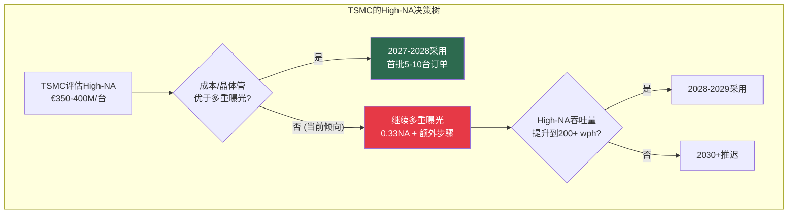
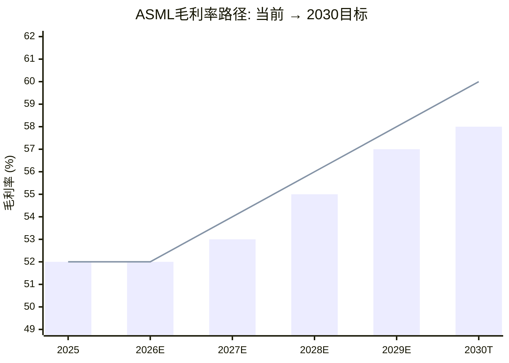
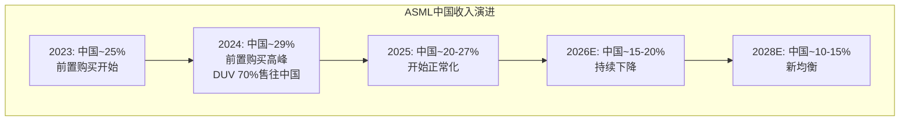
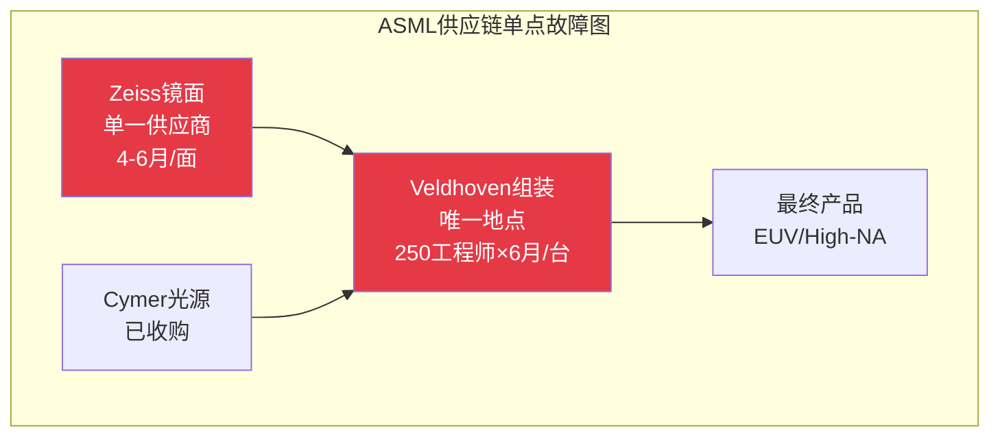
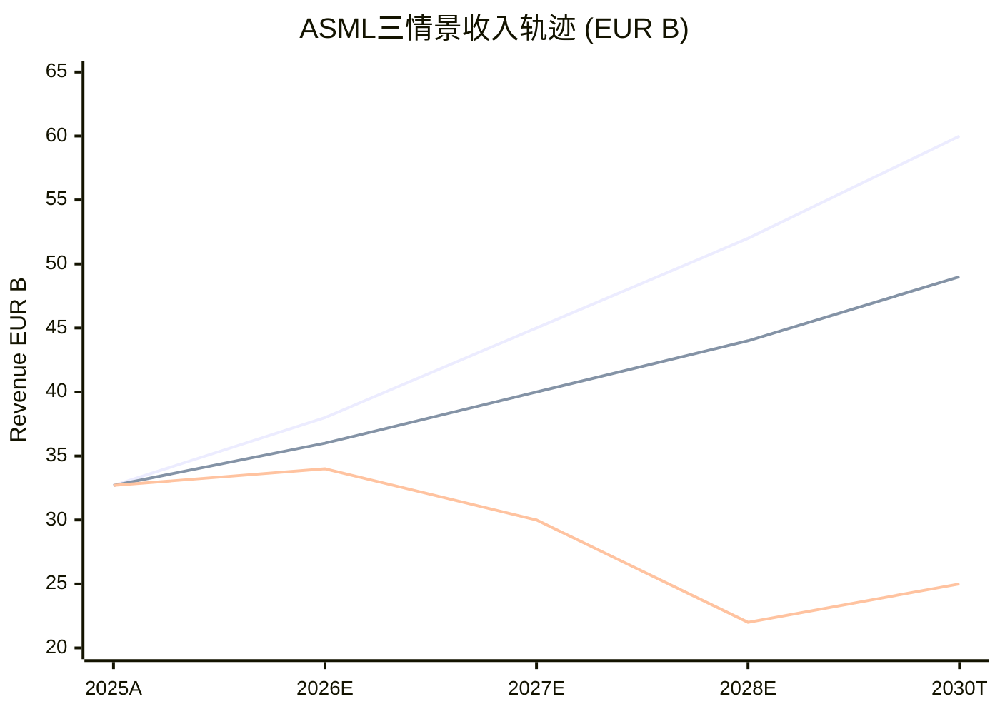
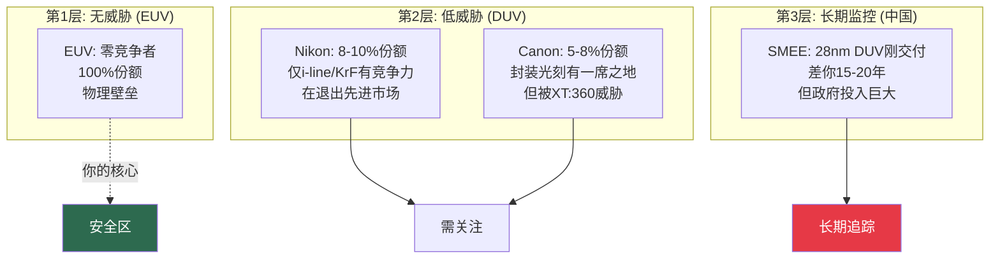
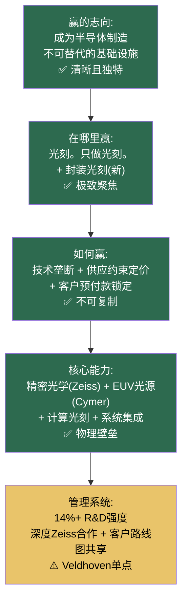

# Chapter 12: ASML Fouquet私密备忘录

## 致 Christophe Fouquet — ASML首席执行官

> **机密 | 仅限CEO/董事会阅读**
> **日期**: 2026年3月
> **基准数据**: FY2025实际 + Q1 2026指引 | 股价: EUR 1,407 | 市值: EUR 541.8B

---

## 12.1 Situation: 你继承了人类工业史上最强的垄断

Fouquet先生，

让我们从事实开始——不是意见，不是分析，只是事实。

**你控制着的东西**：
- 100%的EUV光刻市场。全球唯一供应商。
- 85%+的DUV光刻市场（Nikon ~8-10%，Canon ~5-8%）。
- 94.1%的按价值计算的全球光刻市场。
- EUR 38.8B+的积压订单。客户需要排队18个月。
- 500+台EUV工具在全球fab中运行，每台每年产生EUR 50-80M服务收入。
- 38,000+专利，跨32个司法管辖区。60%覆盖下一代技术。

**你的垄断的性质与众不同**。微软的垄断基于网络效应——如果有更好的操作系统，用户可以切换。英特尔的曾经的垄断基于规模——AMD通过更好的设计打破了它。

你的垄断基于**物理学**。

制造EUV光刻系统需要在13.5纳米波长下操控极紫外光——这要求：
- 精确到原子级别的光学镜面（仅Carl Zeiss能制造，需4-6个月/面）
- 100,000+精密零件的系统集成（High-NA增加到140,000+）
- 3,000+软件工程师编写的10M+行代码控制系统
- 250名工程师用6个月组装一台机器

**任何新进入者需要$10B+和10-20年——而且成功概率极低。** 这不是市场壁垒，这是物理壁垒。

[参阅: ASML v1.0 Ch1-2, A-Score 8.12/10]

---

## 12.2 Complication 1: TSMC不买High-NA——你2030年目标的存亡之战

你的2030年目标是EUR 44-60B收入，毛利率56-60%。你2025年做到了EUR 32.7B。

这个目标的高端（EUR 60B）需要一个关键假设：**TSMC在2027-2028年大规模采用High-NA EUV。**

但TSMC公开表示倾向于在更便宜的0.33 NA工具上使用多重曝光。

### 问题的量化

| 情景 | TSMC High-NA采用时间 | ASML 2030收入 | 概率 |
|------|:---:|:---:|:---:|
| **情景A: TSMC 2027-2028采用** | 首批量产订单2027 | EUR 55-60B | 30% |
| **情景B: TSMC 2028-2029采用** | 延迟1-2年 | EUR 48-52B | 45% |
| **情景C: TSMC 2030+才采用** | 基本推迟到下一个节点 | EUR 44-46B | 25% |
| **概率加权** | — | **EUR 49-52B** | — |

### 为什么TSMC犹豫

TSMC不犹豫是因为技术——TSMC完全有能力使用High-NA。犹豫是因为**经济学**：

| 方案 | 每层成本 | 吞吐量 | 每晶体管成本 | TSMC偏好 |
|------|:---:|:---:|:---:|:---:|
| High-NA单次曝光 | 高(€350-400M工具) | 175-200 wph | 待证明更低 | 观望 |
| 0.33NA多重曝光 | 中(€200M工具×2-3次) | 有效100-130 wph | 当前可竞争 | **当前偏好** |

**翻转点**：当High-NA吞吐量达到200+ wph且二代工具成本下降10-15%时，经济天平将明确倾向High-NA。但这可能要到2028年才能实现。

### 你从不直接回应这个问题

在你的每次财报电话会上，分析师都会问关于TSMC和High-NA的问题。你的回答始终聚焦于Intel和Samsung的进展——从不直接讨论TSMC的犹豫。

**你的沉默可能是明智的**（不想公开施压最大客户），**也可能是危险的**（市场将你的沉默解读为"Fouquet也不确定TSMC会买"）。

---

## 12.3 Complication 2: 毛利率压缩——从51%到60%的桥在哪里

你的2026年毛利率指引是51-53%。你的2030年目标是56-60%。

这中间有一个500-900个基点的缺口，而你没有给出桥接路径。

| 年份 | 毛利率 | 驱动力 |
|------|:---:|---------|
| 2025实际 | ~52% | 标准EUV主导 |
| 2026指引 | 51-53% | **High-NA稀释**——早期产品利润率低 |
| 2027-2028 | 53-55%? | High-NA学习曲线 + 产量提升 |
| 2030目标 | 56-60% | 需要High-NA达到成熟利润率 + 混合改善 |

### 压缩源分析

**High-NA的毛利率挑战**：
- 每台High-NA工具包含140,000个零件（vs 标准EUV 100,000个）——复杂度+40%
- Carl Zeiss变形透镜系统——全新光学架构，初期良率较低
- 早期产量低（10-15台/年）→固定成本分摊不充分
- 客户可能要求性能保证/价格让步以换取早期采用

**恢复路径**（你需要向市场解释的）：
1. High-NA学习曲线——每代EUV的历史模式是早期利润率低,3-4年后恢复
2. 服务收入占比提升（60%+毛利率的服务占总收入从30%→35%+）
3. 标准EUV工具的定价权维持——已安装基数的升级套件利润率极高
4. 产量爬坡——从10-15台/年到20+台/年将显著改善固定成本分摊

---

## 12.4 Complication 3: 中国收入悬崖——管控的双刃剑

出口管控对你是**净正面**的——这是四家公司中独一无二的。

| 维度 | 损失 | 收益 |
|------|------|------|
| 直接收入 | ~EUR 3.7B中国收入下降（从25%→12%） | — |
| 垄断加固 | — | +12-18%估值溢价 |
| 定价权 | — | 减少竞争→更强定价权 |
| 合规成本 | -EUR 85-140M/年 | — |
| **净效果** | — | **+12-18%估值提升** |

但你的DUV中国销售——2024年占DUV系统的70%——正在经历结构性下滑。

### 荷兰许可政策——你独有的政策风险

你面临一个其他三家公司不面临的独特变量：**荷兰政府的许可政策演变**。

- 美国BIS管控全球适用——确定性高
- 日本管控与美国对齐——确定性中高
- **荷兰管控独立演变**——确定性中等

2026年中可能的荷兰许可政策调整是你的关键拐点。如果荷兰进一步收紧（VEU豁免已被撤销），你的DUV中国收入可能加速下降。

### 你的战略优势

**出口管控是你的护城河**。每一次管控收紧都让中国更难获得你的竞争对手的设备（日本TEL/Nikon也被限制），同时让你的EUV垄断更加不可动摇。

中国的SMEE在28nm DUV刚交付首台——差你15-20年。共识时间表是中国EUV突破需要8-10年。**在这8-10年窗口内，管控每收紧一次都是你的估值保险。**

---

## 12.5 Complication 4: 供应链单点——Veldhoven和Zeiss

你的A-Score中得分最低的维度是A1 = 5/10（供应链韧性）。

| 单点故障 | 影响 | 冗余度 |
|---------|------|--------|
| **Carl Zeiss光学** | 每面镜面4-6月制造；无替代供应商 | **零**——ASML持有~25%股份但无法替代 |
| **Veldhoven总部** | 100%的系统集成在Veldhoven完成 | **极低**——无地理备份 |
| **Cymer光源** | EUV光源供应 | 低——ASML已收购Cymer |
| **250工程师组装** | 每台6个月，高度专业化人才 | 低——培训周期长 |

**CEO关键问题**：如果Veldhoven发生任何导致生产中断30天以上的事件（自然灾害、劳资纠纷、地缘事件），你的产出将直接归零。你不像TSMC那样在多个厂区有冗余。

这不是一个需要现在就解决的问题——但它是一个你需要**开始规划**的问题。评估是否在美国或亚洲建立部分组装能力。CHIPS Act资金可以支持这一投资。

---

## 12.6 Complication 5: H2 2026后端加载风险

你的2026年收入指引EUR 34-39B暗示H2 > H1。"Move rate ramp"和"fab readiness improves"是标准的半导体设备季节性语言。

| 半年 | 隐含收入 | 风险 |
|------|:---:|---------|
| H1 2026 | EUR 15-17B | 较确定——已在积压中 |
| H2 2026 | EUR 19-22B | **取决于fab建设进度和客户验收** |

**如果需求softens**，H2后端加载叙事很容易从"计划中的"变为"未达预期"。这是一个你与所有同行共享的风险——所有四家都指引H2 > H1。

---

## 12.7 财务战争室——三情景量化模型

在给出战略建议之前，先用数字说话。以下是基于我们前期ASML深度报告（810KB, 9方法估值收敛）的三情景财务模型，重新以CEO决策变量为轴重构。

### 情景定义——由你的决策决定

| 情景 | 核心假设 | 你能控制的 | 你不能控制的 |
|------|---------|---------|-----------|
| **牛市(30%)** | High-NA按时商业化 + TSMC 2027-2028大规模采用 + AI CapEx持续+30%/年 | High-NA产品路线图执行 | TSMC采购决策, AI投资回报验证 |
| **基准(40%)** | High-NA延迟1-2年 + TSMC 2028-2029采用 + AI CapEx增速放缓至+10-15% | 毛利率桥接叙事, 服务收入优化 | 宏观周期, 地缘政策 |
| **熊市(30%)** | AI泡沫 + 中国EUV突破信号 + WFE衰退>15% | 成本管理, 服务韧性 | 几乎所有宏观变量 |

### 三情景财务投影

| 指标 | 2025A | 2026E | 2027E | 2028E | 2030T |
|------|:---:|:---:|:---:|:---:|:---:|
| **牛市收入 (EUR B)** | 32.7 | 38 | 45 | 52 | **60** |
| **基准收入 (EUR B)** | 32.7 | 36 | 40 | 44 | **49** |
| **熊市收入 (EUR B)** | 32.7 | 34 | 30 | 22 | **25** |
| 概率加权收入 | 32.7 | 36.0 | 38.5 | 40.6 | **45.5** |

| 指标 | 牛市2030 | 基准2030 | 熊市2030 |
|------|:---:|:---:|:---:|
| 收入 (EUR B) | 60 | 49 | 25 |
| 毛利率 | 59% | 55% | 48% |
| 营业利润率 | 40% | 34% | 18% |
| EUV年出货量 | 100+ | 80-90 | 50-60 |
| High-NA年出货量 | 25-30 | 15-20 | 5-8 |
| 服务收入占比 | 28% | 32% | 40% |
| 股价隐含 (EUR) | 1,800-2,200 | 1,200-1,500 | 600-900 |
| vs 当前EUR 1,407 | +28~+56% | -15~+7% | -36~-57% |

### 关键变量敏感性

| 如果这个变量变化±10%... | 对2030收入的影响 | 你的控制度 |
|----------------------|:---:|:---:|
| TSMC EUV层数/晶圆 | ±EUR 3-4B | 低(TSMC决定) |
| High-NA年产量 | ±EUR 2-3B | 高(供应链管理) |
| High-NA ASP | ±EUR 1.5-2B | 中(定价vs需求弹性) |
| 中国DUV收入 | ±EUR 1-2B | 低(政策决定) |
| 服务ARPU/工具 | ±EUR 0.8-1.2B | 高(服务策略) |
| Fab利用率(影响需求) | ±EUR 2-3B | 低(客户运营) |

**CEO行动指引**: 你能控制High-NA产量和服务ARPU——这两个变量合计影响EUR 3-4B收入。集中精力在你能控制的事情上。TSMC的采用决策和宏观周期你控制不了——为它们准备预案而非试图影响。

[参阅: ASML v1.0 Ch7(六方法估值), Ch8(Reverse DCF), Ch17(情景分析)]

---

## 12.8 竞争情报深度简报

### 12.8.1 你的三层竞争格局

### 12.8.2 封装光刻——你的新战场

ASML XT:360进入先进封装光刻是你2024-2025年最重要的战略举措。以下是竞争格局：

| 竞争对手 | 现有封装光刻产品 | XT:360 vs 它 | 威胁等级 |
|---------|-------------|:---:|:---:|
| **Onto Innovation** | i-line步进器 | XT:360吞吐量4x | 🔴 对Onto是生存威胁 |
| **Canon** | FPA-5520iV i-line | XT:360更高分辨率+产场 | 🟡 中等——Canon有封装经验 |
| **Ushio** | 投影光刻 | 不同技术路径 | 🟢 低 |

**先进封装设备TAM**: $42-51B (2025) → $70-90B (2034), CAGR ~8-10%
**封装光刻子市场**: $3-5B (2025) → $8-12B (2034), CAGR ~12-15%

你的XT:360优势:
- 400nm分辨率, 35nm overlay
- 52mm × 66mm image field: 可处理3,432mm²中间层**无需场拼接**
- 4x产率 vs 现有方案

**建议**: 在2026-2027年的先行者优势窗口内，目标是在TSMC/Samsung/Intel各获得≥2台XT:360安装——一旦工艺标准在你的工具上固化，后来者面临的切换成本将急剧上升。

### 12.8.3 SMEE——差15-20年但不能忽视

| 维度 | SMEE当前能力 | ASML对应 | 差距 |
|------|-----------|---------|:---:|
| 最先进DUV | SSA800 28nm ArF浸没 | TWINSCAN NXE:3600D 3nm EUV | **15-20年** |
| 年产量 | 估计<10台/年 | 60-80台EUV/年 | **差距巨大** |
| EUV进展 | 原型阶段 | 500+台商用部署 | **不在同一代际** |
| 28nm多重曝光至7nm | 理论可行(SAQP/LELE) | EUV单次曝光 | 成本10x+, 吞吐量0.1x |
| 关键客户 | SMIC, 华虹 | TSMC, Samsung, Intel | 完全不同的生态 |

**SMEE不是你2025-2030年的竞争对手。** 但它是你2030-2035年的长期监控对象。关键追踪指标:
- SMEE年出货量(当前<10 → 如果突然>50 = 警报)
- 中国EUV相关专利年申请量(<100=安全, >500=关注)
- SMIC使用SMEE 28nm的良率和产能利用率

[参阅: ASML v1.0 Ch2(技术路线图), Ch4(地缘); Ch5竞争对手画像]

---

## 12.9 董事会须知——Fouquet的3-5年战略抉择

### 抉择1: High-NA定价策略——坚持还是让步?

| 选项 | 优势 | 风险 | 建议 |
|------|------|------|------|
| **坚持€350-400M** | 维持毛利率; 信号技术价值 | TSMC延迟采用→2030高端失效 | ⚠️ 当前选择 |
| **推出"lite"版本€280-320M** | 加速TSMC采用; 扩大装机基数 | 毛利率稀释2-3pp; 信号定价权松动 | 值得评估 |
| **性能保证换价格维持** | 客户获得确定性; 你维持ASP | 如果性能不达标=双重损失 | 🟡 中风险 |

**我们的建议**: 不降低ASP，但可以通过**服务包捆绑**降低客户总拥有成本(TCO)。例如: "€380M设备 + 前3年服务全包"——客户感知TCO下降15-20%，但ASML的服务收入前置锁定。

### 抉择2: 地理分散——Veldhoven之外建产能?

| 选项 | 时间线 | 投资 | 影响 |
|------|:---:|:---:|------|
| **维持现状(Veldhoven only)** | — | $0 | A1维持5/10; 单点风险不变 |
| **美国DUV组装** | 3-5年 | $1-2B | CHIPS Act支持; DUV供应链韧性+1 |
| **亚洲服务中心** | 1-2年 | $200-500M | 服务响应速度提升; 客户满意度+ |
| **完整EUV备份工厂** | 7-10年 | $5B+ | 从根本解决A1问题; 但极其复杂 |

**我们的建议**: 先推进"亚洲服务中心"(低成本, 快见效) + 启动"美国DUV组装"可行性研究(中期)。完整EUV备份在当前阶段过于昂贵且复杂。

### 抉择3: 中国DUV收入——主动管理还是被动承受?

| 选项 | 含义 | 建议 |
|------|------|------|
| **最大化当前窗口** | 在管控进一步收紧前尽可能多卖DUV | 短视——助长前置购买泡沫 |
| **平稳过渡** | 按20-25%目标主动管理中国占比下降 | ✅ 当前策略——正确 |
| **主动退出** | 提前将中国占比降至<15% | 过度——牺牲EUR 2-3B收入无必要 |

**我们的建议**: 维持当前"平稳过渡"策略。关键是确保中国收入下降被非中国增长(AI/先进封装)完全补偿——目前数据支持这一判断。

---

## 12.10 Resolution: Fouquet的四步战略手册

### 行动1: 制定不依赖TSMC在2028前采用High-NA的Plan B

**做什么**：构建一个EUR 48-52B的2030收入路径，不假设TSMC在2028前采用High-NA。这个路径应基于：
- Intel和Samsung的High-NA采用（已确认）
- 标准EUV工具的持续强劲需求（2nm/1.4nm增加EUV层数）
- 封装光刻（XT:360）作为新收入流
- 服务收入的机械增长（装机基数扩大）

**为什么**：如果TSMC确实在2027-2028采用，EUR 55-60B成为上行惊喜。如果不采用，你有一个可信的备选叙事。**CEO永远不应该让最大客户的单一决策定义公司的成败。**

### 行动2: 构建51%→60%毛利率桥接叙事

**做什么**：在下次Investor Day或财报电话会上，提供从2026年51-53%到2030年56-60%的具体桥接：
- High-NA学习曲线贡献：+Xbps
- 服务占比提升贡献：+Xbps
- 标准EUV定价/混合改善：+Xbps

**为什么**：市场目前看到的是两个数字（51%和60%），中间是一片空白。空白空间让分析师填充各自的假设——通常偏悲观。用数据填充这个空白。

### 行动3: 评估Veldhoven以外的部分组装能力

**做什么**：启动可行性研究——在美国或亚洲建立DUV系统的最终组装能力。不是转移EUV核心（那仍需要Zeiss镜面和Veldhoven），而是：
- DUV系统的最终组装和测试
- 备件和升级套件的区域仓储
- 服务工程师的区域培训中心

**为什么**：
- 降低A1（供应链韧性）的单点故障风险
- 符合CHIPS Act精神——可能获得美国政府支持
- 不影响EUV/High-NA的核心竞争力（仍在Veldhoven）

### 行动4: 在封装光刻建立标准

**做什么**：积极推广XT:360封装光刻系统，在先行者优势窗口（~2年）内建立装机基数和工艺标准。

**为什么**：先进封装设备市场正在从"碎片化"向"专精化"演进（参阅Ch4）。定义标准的公司将在标准固化后享有类似EUV的锁定效应——虽然规模小得多，但利润池在快速增长（$42-51B→$70-90B by 2034）。

---

## 12.8 Fouquet的沉默分析——CEO不说的话

| 沉默领域 | CEO在说什么 | CEO没说什么 | 可能的原因 | 风险等级 |
|---------|-----------|-----------|---------|:---:|
| TSMC High-NA犹豫 | "Intel已安装，Samsung评估中" | TSMC何时采用 | 不想公开施压最大客户 | 🔴 高 |
| 毛利率桥接 | "2030目标56-60%" | 从51%到60%的路径 | High-NA初期利润率尚不确定 | 🟡 中 |
| 供应链韧性 | "我们与Zeiss的合作关系" | Veldhoven单点风险 | 短期无解决方案 | 🟡 中 |
| 中国收入替代 | "正常化到~20%" | 累计EUR收入损失量化 | AI需求增长正在掩盖中国下降 | 🟡 中 |
| H2后端加载 | "Move rate ramp" | 如果demand softens怎么办 | 行业标准沟通方式 | 🟢 低 |

**最值得关注的沉默**：TSMC High-NA。这是影响EUR 8-14B收入差额（EUR 46B vs EUR 60B）的单一最大变量，但Fouquet从不直接讨论。

---

## 12.9 Playing to Win瀑布——ASML的战略一致性

**一致性评分: 39/40** — 半导体设备行业最高。

唯一的扣分点在管理系统层——Veldhoven供应链单点。改变这一层（地理分散制造）需要5-10年投入，但不会破坏其他四层的一致性。

**关键洞察**：你的Playing to Win完美一致性意味着**任何偏离都是风险**。不要收购量测公司（A3场景），不要进入你没有物理壁垒的领域。封装光刻是唯一可接受的扩展——因为它仍然是"光刻"。

---

## 12.10 决策矩阵——Fouquet的月度/季度追踪

| 决策领域 | 追踪信号 | 频率 | 牛市阈值 | 熊市触发 | 行动触发 |
|---------|---------|------|---------|---------|---------|
| **High-NA采用** | TSMC High-NA订单讨论 | 季度 | 新订单意向 | 2026年底无TSMC信号 | 启动Plan B叙事 |
| **毛利率路径** | 季度毛利率轨迹 | 季度 | 每季度+30-50bps | 连续2季度<51% | 加速服务收入占比 |
| **中国收入** | 荷兰许可政策更新 | 实时 | 政策稳定 | 进一步收紧 | 调整DUV产能分配 |
| **供应链韧性** | Zeiss镜面交付时间 | 月度 | ≤4月/面 | >6月/面 | 评估替代供应选项 |
| **封装光刻** | XT:360客户采用数 | 季度 | ≥3客户验证 | <2客户 | 增加封装R&D投入 |
| **订单趋势** | 季度新订单 | 季度 | >EUR 4B | <EUR 2B | 调整产能规划 |
| **竞争情报** | SMEE/中国EUV进展 | 半年 | 无突破 | 功能性芯片产出 | 更新垄断耐久性评估 |

---

## 12.11 Fouquet先生，你最后需要知道的三件事

**第一**：你的公司可能是全球最高质量的工业企业——ROIC 135.6%（调整后50-60%仍是最高）、100%市场份额、零替代品。在100年后回看，ASML可能与标准石油、德比尔斯并列为历史上最伟大的工业垄断。

**第二**：你的唯一弱点是**价格**。在EUR 1,407/股，市场已经假设了近乎完美的执行10年以上。概率加权预期回报约为-3%。这不是你的管理问题——这是市场给完美企业的完美定价。

**第三**：你的前任Wennink是一个外交家——他用个人魅力导航地缘政治。你是一个工程师——你的本能是向内看、优化效率。**两种技能你都需要。** 效率优化是正确的方向，但High-NA的成败取决于外部——取决于TSMC的经济计算和你说服他们的能力。不要让工程师本能阻止你成为ASML最大客户关系的外交家。

---

*[Fouquet备忘录完 | 下一份: Ch13 LRCX Archer备忘录]*
