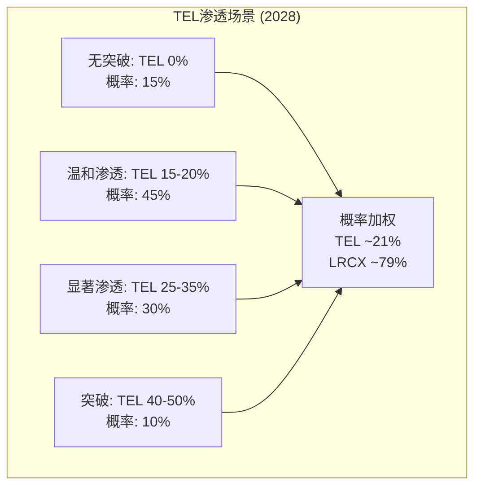
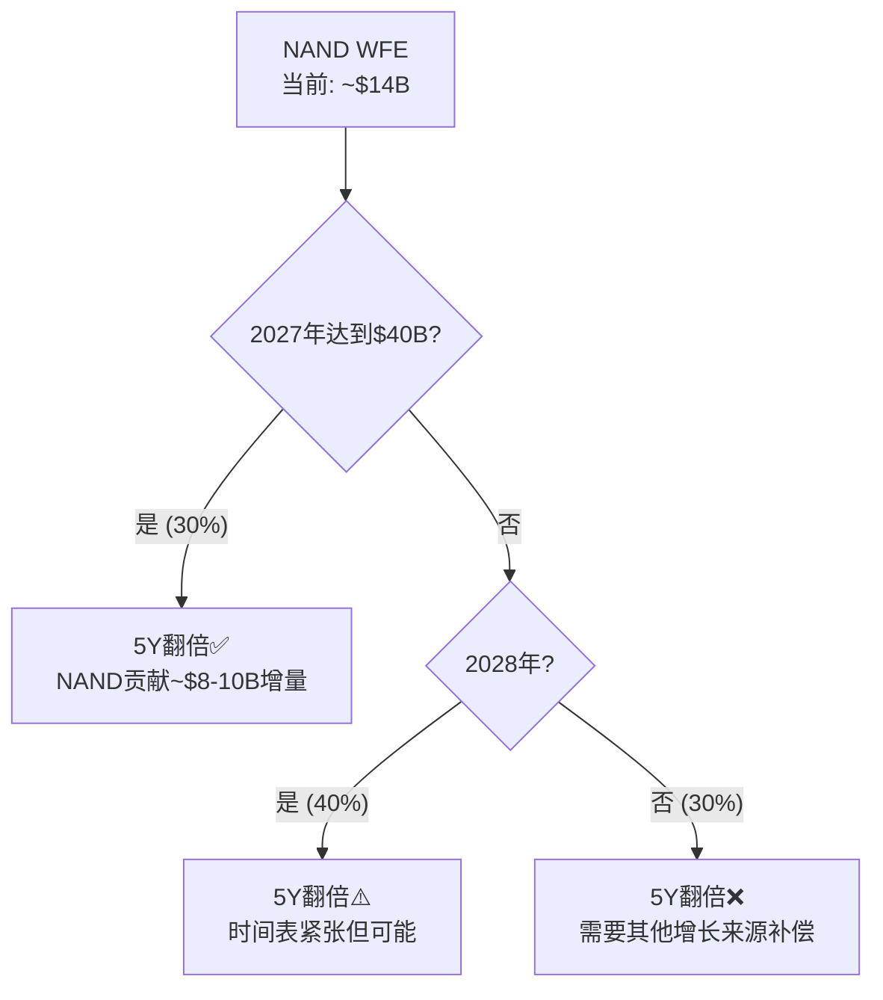
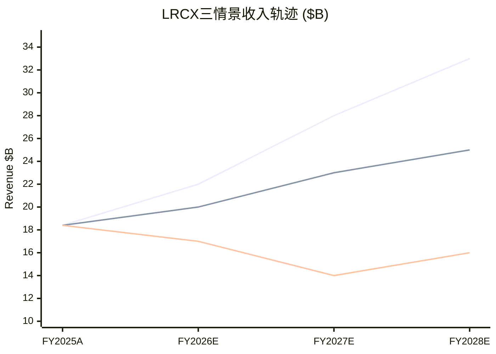
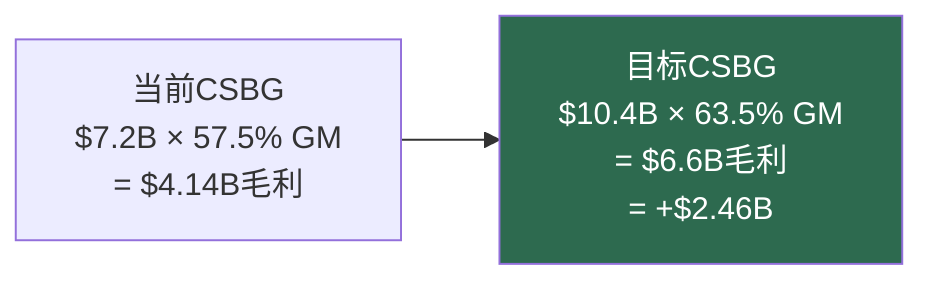
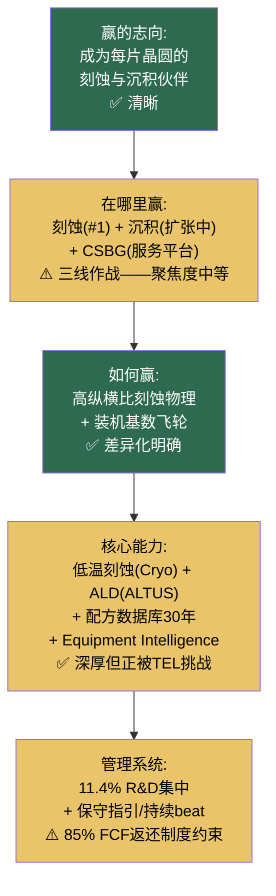

# Chapter 13: LRCX Archer私密备忘录

## 致 Tim Archer — Lam Research首席执行官

> **机密 | 仅限CEO/董事会阅读**
> **日期**: 2026年3月
> **基准数据**: FY2025实际 + Q2 FY2026 | 股价: $240.09 | 市值: ~$302B

---

## 13.1 Situation: 刻蚀冠军的黄金时代——和它的第一道裂缝

Archer先生，

你领导Lam Research已经七年。在这七年里，你把一家$11B收入的公司变成了一家$18.4B收入的公司。CSBG从$3.5B增长到$7.2B——翻了一倍。你的市场份额从42%增长到45%。你的产品路线图覆盖了每一个技术转型方向。

**你的竞争地位事实**：
- 全球刻蚀设备#1——45%市场份额（TEL 27%，AMAT 15%，合计87%三寡头）
- NAND通道孔刻蚀——**100%市场份额，维持了10+年**
- 100,000+活跃腔体，$72K ARPU，>90%续约率
- 五维护城河评分4.38/5——仅次于ASML的4.55
- 切换成本$12-44M/工具（购买价3-8倍），NAND产线切换$100-500M+
- 23,104项全球专利，13,245项活跃
- 14个连续季度盈利超预期（平均超出+5.89%）

**你的Investor Day承诺**："五年翻倍"——暗含~15% CAGR——是四家公司中最激进的财务目标。

[参阅: LRCX v3.0 Ch3, Ch5, Ch19-20; SEMI_EQUIPMENT Ch9 A-Score 7.02]

但在这份闪亮的成绩单上，2025年出现了第一道裂缝。

---

## 13.2 Complication 1: TEL打破了你的十年垄断

2025年，Tokyo Electron获得了你NAND通道孔刻蚀市场的**第一个量产POR (Process of Record)**。

这是你从2014年左右以来首次在这个市场面临真正的竞争。

### TEL低温刻蚀技术参数

| 维度 | TEL低温刻蚀 | Lam传统方法 | 差异 |
|------|:---:|:---:|:---:|
| 刻蚀深度 | >10微米 | 标准 | 可比 |
| 速度 | **2.5x传统方法** | 基准 | TEL显著领先 |
| 层数能力 | 400+层 | 300+层(Cryo 3.0) | TEL声称更高 |
| 功耗 | **-40%** | 基准 | TEL显著领先 |
| 温室效应潜力 | **-84%** | 基准 | TEL ESG优势 |

### 渗透时间线

| 年份 | 事件 | LRCX份额 |
|------|------|:---:|
| 2014 | TEL开始低温刻蚀R&D | 100% |
| 2023 | TEL发布技术,客户试样 | 100% |
| **2025** | **Samsung确认TEL为400层NAND客户** | **~95%** |
| 2025-2026 | SK Hynix测试TEL刻蚀机 | ~90-95% |
| 2026 | 高量产爬坡预期 | ~85-90% |
| **2028E** | **概率加权TEL份额~21%** | **~79%** |

### 为什么收入影响小于定价权影响

**关键数学**：NAND通道孔刻蚀TAM从2023年的$500M增长到2028年的~$2B（4x）。即使TEL拿到35%份额（显著渗透情景），LRCX的通道孔收入仍从$500M增长到~$1.3B——**绝对收入在增长**。

但**定价权影响远大于收入影响**。

| 垄断状态 | 定价动态 | ASP影响 |
|---------|---------|:---:|
| 100%独家 (2024前) | 客户无替代→LRCX定价权接近绝对 | 基准 |
| 80%主导 (2028E) | 客户有TEL作为备选→谈判筹码增加 | **-5~10% ASP** |
| 60%强势 (假设) | 双寡头→价格竞争开始 | **-10~15% ASP** |

**从100%到80%的份额变化，在收入上影响不大，但在定价权上影响巨大。** ASP压缩5-10%不仅影响通道孔刻蚀——它辐射到你整个刻蚀产品组合，因为客户会用"TEL在通道孔给了我们X价格"来谈判其他产品的价格。

### 你从不点名TEL

在你每一次财报电话会上，竞争对手以"aggregate"形式被讨论。你从不说"TEL"。

**两种解读**：
1. **你认为威胁可控**——在这种情况下，市场需要听到你的防御计划
2. **你的沉默是策略信号**——不想给TEL免费宣传

**无论哪种，你需要一个公开的竞争回应策略**——因为分析师和客户在你的沉默中填充的叙事，通常比现实更悲观。

---

## 13.3 Complication 2: NAND复苏时间——你"五年翻倍"的关键假设

你的"五年翻倍"目标（从Feb 2025 Investor Day）暗含~15% CAGR。这个目标的可实现性高度依赖于NAND WFE的复苏时间。

### 你说了什么

你表示"$40B NAND WFE可能比我们原来预期的更快到来"，但你也承认"产能增加可能要到2027-2028年，因为洁净室限制"。

### 数学验证

| 情景 | NAND WFE恢复到$40B时间 | 对你的5Y CAGR贡献 | 5Y翻倍可行性 |
|------|:---:|:---:|:---:|
| 乐观 | 2027 | +2-3pp CAGR | ✅ 可实现 |
| 基准 | 2028 | +1-2pp CAGR | ⚠️ 勉强 |
| 悲观 | 2029+ | +0-1pp CAGR | ❌ 不可实现 |

**CEO关键洞察**：你的"五年翻倍"从NAND那里需要至少$8-10B的增量贡献（从$14B NAND WFE翻倍=~$6-7B增量给LRCX）。如果NAND复苏延迟到2029年，你需要从GAA/先进封装/CSBG找到补偿量。**现在就准备一个"如果NAND延迟"的备选叙事。**

---

## 13.4 Complication 3: CSBG的真实质量——是SaaS还是硬件?

CSBG是你最强的战略资产。$7.2B收入，100K+腔体，>90%续约率。市场叙事将其描述为"类SaaS"。

但我们的深度分析揭示了一个重要修正：

### CSBG收入的真实构成

| 组成 | 估算收入 | 占比 | 真正经常性? | SaaS对标折扣 |
|------|:---:|:---:|:---:|:---:|
| 维保合同 | $2.3-2.5B | 32-35% | ✅ 是 | 适用SaaS倍数 |
| 备件/耗材 | $2.0-2.3B | 28-32% | ✅ 是(物理消耗) | 中等折扣 |
| 设备升级 | $1.4-1.6B | 20-22% | ⚠️ 准经常性 | 高折扣 |
| **Reliant翻新系统** | **$1.0-1.4B** | **14-19%** | **❌ 周期性** | **不适用SaaS** |

**真正经常性收入**: 60-67%（$4.3-4.8B）——不是100%。

### CSBG独立估值修正

| 估值方法 | 初始（过度乐观） | 修正后 | 修正原因 |
|---------|:---:|:---:|---------|
| SaaS可比 | $90-126B (13-18x Sales) | **$30-38B** | 需65-75%折扣(硬件含量+周期性+客户集中) |
| 逐腔体NPV | — | $21-54B | 15-20年生命周期×$72K ARPU |
| FCF归因 | — | $26-47B | CSBG FCF贡献分配 |
| **三方法重叠** | — | **$30-40B** | 中值$35B |

### "Systems-Free"测试

如果CSBG值$35B→隐含系统业务估值=$302B-$35B=**$267B**→隐含系统EV/Sales=**23.2x**——远超AMAT(10-12x)、ASML(12-15x)。

**结论**: CSBG无法证明$302B市值的合理性。CSBG的真正价值是设定**估值地板**（$30-35B），不是抬高天花板。在深度WFE衰退中，CSBG确保LRCX有一个硬底——这是真正的战略价值。

### CSBG服务中断风险——你独有的隐性威胁

如果出口管控扩展到成熟节点的**维保服务**（Ch5路径4），$1.0-1.5B的CSBG中国服务收入将直接受到威胁。这将损害"类SaaS"叙事的基础——因为SaaS的核心价值主张是收入的可预测性和持续性。

---

## 13.5 Complication 4: 中国——最大客户和最快对手

你的中国暴露度在四家中最高（~34%，$6.2B）。

### 概率加权年收入影响模型

| 情景 | 概率 | 收入影响 | P/E影响 |
|------|:---:|:---:|:---:|
| 管控放松 | 15% | +$1-2B | +3-5x |
| 维持现状 | 55% | -$600M | 持平 |
| 全面限制 | 30% | -$3-4B (中国→10-15%) | -5-8x |
| **概率加权** | — | **-$1.155B/年** | — |

**vs 管理层指引的差异**：管理层指引暗含~-$600M影响（维持现状情景）。我们的概率加权估计是-$1.155B——差额来自管理层低估了尾部风险（全面限制30%概率）。

### 六条出口管控路径

| 路径 | 概率 | 对LRCX特殊含义 |
|------|:---:|---------|
| 全面限制 | 15% | 中国收入-$4.2B，P/E -8x |
| 扩展到日本/TEL | 10% | LRCX相对获益（TEL也被限制） |
| 管控放松 | 15% | 收入+$1.5B，P/E +5x |
| **成熟节点/CSBG中断** | **20%** | **最阴险——直接攻击CSBG** |
| 中国报复 | 10% | 收入趋近零 |
| 多边协调 | 30% | 收入下降但竞争对手同等受损 |

**路径4（成熟节点/CSBG服务中断）是Archer应该最关注的**——它直接攻击LRCX最有差异化的资产，且概率不低（20%）。

---

## 13.6 财务战争室——三情景量化模型

### 三情景定义

| 情景 | 核心假设 | 概率 |
|------|---------|:---:|
| **牛市** | AI超级周期持续到2028+ + NAND WFE 2027年达$40B + TEL通道孔份额<15% | 28% |
| **基准** | WFE温和增长 + NAND 2028年复苏 + TEL获~21%通道孔份额 + P/E均值回归 | 47% |
| **熊市** | AI CapEx高原 + 存储衰退 + TEL突破>35% + 出口管控升级 | 25% |

### 三情景财务投影

| 指标 | FY2025A | 基准FY2027E | 牛市FY2027 | 熊市FY2027 | 5Y翻倍目标 |
|------|:---:|:---:|:---:|:---:|:---:|
| 收入 ($B) | 18.4 | 23 | 28 | 14 | ~37 |
| 毛利率 | 47.6% | 48.5% | 50% | 44% | — |
| CSBG ($B) | 7.2 | 8.5 | 9.5 | 6.5 | 10.4 |
| 刻蚀WFE份额 | 45% | 44% | 46% | 42% | high-30s% |
| P/E | 49.3x | 30-35x | 45-50x | 15-20x | — |
| 股价隐含 | $240 | $151-185 | $300-370 | **$34-80** | — |

**概率加权预期回报: -29.5%。** 这意味着即使在基准情景(最可能的47%概率)中，LRCX也亏钱——因为P/E从49x压缩到30-35x的估值效应大于EPS增长。

### 承重墙脆弱度分析

你的P/E 49.3x同时要求以下**全部6个信念**成立：

| 承重墙 | 信念内容 | 脆弱度 | 历史先例 |
|--------|---------|:---:|---------|
| **B1** | WFE 5年CAGR 8-10% | 🟡 中 | 过去40年平均~6%，需AI超额 |
| **B2** | 刻蚀份额维持45%+ | 🟢 低 | TEL侵蚀但TAM扩大补偿 |
| **B3** | CSBG ARPU持续增长 | 🟢 低 | 历史趋势支持 |
| **B4** | 中国收入温和下降 | 🟡 中 | 政策不确定性 |
| **B5** | AI需求结构性非周期性 | 🔴 高 | **2027-2028 ROI验证窗口** |
| **B6** | **5年不出现>10%WFE衰退** | 🔴 **极高** | **40年历史中零先例** |

**B6是最致命的承重墙**: 半导体设备行业40年历史中，从未出现过连续5年WFE不下降>10%。你的P/E要求打破这个历史记录。B6崩塌概率: 65-75%在任何5年窗口内。

**当B5+B6同时崩塌** (联合概率~25%): EV下降57%至$130B，隐含股价~$103。

[参阅: LRCX v3.0 Ch9(Reverse DCF信念反演), Ch14(承重墙量化), Ch18(周期-估值联动)]

---

## 13.7 竞争情报深度简报

### 13.7.1 TEL低温刻蚀——逐客户渗透追踪

| 客户 | TEL低温刻蚀状态 | LRCX当前地位 | 风险 |
|------|-------------|-----------|:---:|
| **Samsung** | ✅ 已确认400层NAND POR | 独家→双供应商 | 🔴 高 |
| **SK Hynix** | 测试中 | 独家（尚未被突破） | 🟡 中 |
| **Micron** | 未公开信号 | 独家 | 🟢 低(短期) |
| **Intel** | NAND业务已出售给SK Hynix | 不适用 | — |
| **YMTC** | 不受TEL低温限制（日本管控较宽） | 可能被TEL接触 | 🟡 中 |

### 13.7.2 TEL的完整战略画像——你需要了解的对手

| 维度 | TEL数据 | vs LRCX对比 |
|------|--------|---------|
| 总收入 | ¥2,431B (~$15.7B) | LRCX $18.4B (LRCX更大) |
| R&D | ¥148.7B → FY2026计划¥300B(**翻倍**) | LRCX $2.1B (TEL R&D翻倍=进攻信号) |
| 刻蚀份额 | 27% (近年+6pp DRAM) | 45% (LRCX领先但TEL在追赶) |
| 装机基数 | 96,000+工具 | 100,000+腔体 (可比规模) |
| FY2027目标 | ¥3T (~$19.4B) + OP margin 35%+ | 超过LRCX FY2025收入 |
| 涂胶/显影 | **92%份额=与ASML共生** | 无对应业务 |
| 中国暴露 | 峰值**50%** (行业最高) | ~34% |
| 管控管辖 | 日本政府(非美国BIS) | 美国BIS |

**TEL R&D翻倍的战略含义**: TEL FY2026 R&D从¥148.7B翻倍至¥300B (~$1.9B)，几乎追平你的$2.1B。考虑到TEL的R&D是聚焦在刻蚀进攻+涂胶防御两条线上，其刻蚀相关R&D可能达到$800M-1B——接近你刻蚀R&D的一半。**这不是边际竞争者的试探，这是全面进攻。**

### 13.7.3 AMEC/NAURA——成熟节点侵蚀

| 中国对手 | 2024收入 | 刻蚀能力 | 对LRCX的威胁 |
|---------|:---:|---------|:---:|
| AMEC(中微) | ~$1.3B | CCP介电刻蚀量产@28nm; 声称5nm | 🟡 中(中国成熟节点) |
| NAURA(北方华创) | ~$4.4B | ICP刻蚀@28nm量产; 14nm开发 | 🟡 中(中国成熟节点) |

**你在中国成熟节点(28nm+)的刻蚀份额正在被侵蚀——这是不可逆的趋势。** 但在先进节点(<5nm)，AMEC/NAURA差你3+代，短期内不构成威胁。

**战略含义**: 不要花资源防御成熟节点——让出给AMEC/NAURA。聚焦在先进节点(GAA/CFET/BSPDN)的刻蚀领先，这是中国在2030年前无法追赶的领域。

[参阅: LRCX v3.0 Ch5(五维护城河), Ch7(风险全景), Ch20(技术路线图与替代威胁)]

---

## 13.8 董事会须知——Archer的3-5年战略抉择

### 抉择1: "五年翻倍"——坚持还是修正?

| 选项 | 条件 | 概率 | 建议 |
|------|------|:---:|------|
| **坚持(15% CAGR)** | NAND 2027达$40B + GAA份额>45% + CSBG $10.4B | 30% | 如果2027年NAND WFE达$30B+，可以坚持 |
| **修正至12% CAGR** | NAND 2028 + 温和GAA增长 | 45% | 更现实——提前调整预期好于最后miss |
| **放弃目标** | NAND延迟+TEL侵蚀+周期调整 | 25% | 仅在三重打击情景下 |

**我们的建议**: 现在就准备一个"12% CAGR备选叙事"——不是公开宣布修改，而是内部准备好万一NAND延迟时的沟通方案。等到miss的那个季度再调整=被动；提前框架调整=主动管理预期。

### 抉择2: CSBG——收入引擎还是利润引擎?

| 战略方向 | 投入 | 产出 | 风险 |
|---------|------|------|------|
| **收入优先**: 最大化ARPU和新腔体覆盖 | 中等 | CSBG $10.4B by 2028 | 毛利率可能不变(55-60%) |
| **利润优先**: Sense.i/Dextro全面部署→毛利率提升 | 高 | CSBG毛利率62-65% | 需要2-3年投入期 |
| **平台转型**: Equipment Intelligence独立SaaS化 | 极高 | 长期颠覆性收入(SaaS倍数) | 执行风险+客户接受度未知 |

**我们的建议**: 利润优先(B选项)。CSBG体量已经足够大($7.2B)——下一步的竞争优势来自利润质量。从55-60%提升到62-65%毛利率 = 额外$350-500M/年利润，这比追求更多收入增长更有价值。

### 抉择3: TEL竞争——沉默还是公开回应?

| 选项 | 优势 | 风险 |
|------|------|------|
| **继续沉默** | 不给TEL免费宣传 | 市场用最悲观假设填充沉默 |
| **防御性回应** "我们不担心" | 简单 | 缺乏可信度——客户和分析师不会相信 |
| **进攻性回应** "这是我们的下代技术" | 展示技术自信; 稳定市场 | 公开承认TEL威胁 |

**我们的建议**: 进攻性回应(C选项)。在下次技术会议(IEDM/SEMICON)上展示Vantex/Cryo 3.0的性能优势。不需要点名TEL——只需要展示你的下一代技术在性能参数上继续领先。让数据替你说话。

---

## 13.9 Resolution: Archer的四步战略手册

### 行动1: 制定并公开你的低温刻蚀防御策略

**做什么**：
- 加速Cryo 3.0/Vantex平台的下一代开发——确保在TEL的性能参数上保持2年以上技术领先
- 在下次财报电话会或技术会议上，首次公开讨论你对TEL竞争的看法——用技术自信替代沉默
- 利用你30年的配方数据库优势——TEL有新工具，但没有30年累积的工艺优化经验

**为什么**：沉默正在被市场解读为脆弱。一个"我们知道TEL在做什么，这是我们的回应"的简洁声明，比持续沉默更能稳定市场情绪。

### 行动2: 将CSBG从收入引擎升级为利润引擎

**做什么**：
- 加速Equipment Intelligence（Sense.i）部署：渗透率从25-30%→目标>50%
- 全面推广Dextro协作机器人：从6种工具扩展到覆盖全系列
- ARPU提升路径：$72K→$85-95K——通过高级服务层+数字化溢价
- 目标：CSBG毛利率从55-60%提升到62-65%

**为什么**：CSBG体量已经很大（$7.2B）——下一步的竞争优势来自利润质量，不是收入规模。从55-60%提升到62-65%毛利率意味着每年多$350-500M利润——这比大多数半导体设备公司的整个年利润还多。

### 行动3: 重新平衡回购 vs R&D

**做什么**：
- 将年度回购从~$4.9B（年化H1 FY2026）减少到$3-3.5B
- 释放$1-1.5B用于：
  - CFET(Complementary FET)刻蚀研发加速
  - Equipment Intelligence商业化
  - 先进封装刻蚀能力建设

**为什么**：
- 在P/E 49.3x回购=隐含IRR 2.03%——低于无风险利率(4.3%)
- FY2022在$45回购获得+433%回报；当前$240回购的预期回报远低
- $1B增量R&D在CFET/Equipment Intelligence的IRR估计8-12%——是回购IRR的4-6倍

**风险管理**：减少回购可能触发分析师下调和短期卖出。缓解方式：同时宣布增加的R&D投入方向和预期回报——让市场理解这是资本配置优化，不是信心问题。

### 行动4: 为CSBG服务管控做预案

**做什么**：
- 内部量化：如果出口管控扩展到成熟节点维保服务，$1.0-1.5B收入面临风险
- 制定中国CSBG收入的三级应急预案（管控扩展/部分扩展/维持现状）
- 评估非中国市场的CSBG增长加速路径——能否用非中国ARPU增长弥补中国服务损失

**为什么**：Path 4（CSBG服务管控）的概率20%不算低，但你似乎没有为此准备预案。CSBG是你"类SaaS"估值叙事的基础——如果这个叙事被管控冲击动摇，P/E可能从50x压缩到35-40x（纯叙事损害，不需要实际收入损失）。

---

## 13.7 Archer的沉默分析

| 沉默领域 | CEO在说什么 | CEO没说什么 | 可能的原因 | 风险等级 |
|---------|-----------|-----------|---------|:---:|
| TEL竞争 | "aggregate"讨论竞争 | 从不点名TEL | 不想给TEL宣传/认为可控 | 🔴 高 |
| NAND时间 | "$40B NAND WFE比预期更快" | 具体年份和5Y翻倍的依赖度 | 时间确实不确定 | 🟡 中 |
| 回购IRR | "85%+ FCF返还" | 在50x P/E回购是否最优 | 制度约束——不能说"我们的股票太贵" | 🟡 中 |
| CSBG真实构成 | "Record CSBG" | Reliant非经常性占比 | 分拆披露可能降低"SaaS"叙事 | 🟡 中 |
| 中国CSBG管控风险 | "China flattish" | 服务管控扩展预案 | 可能认为概率低/不想制造恐慌 | 🔴 高 |
| 利润率轨迹 | "Continuous improvement" | 长期毛利率/营业利润率目标 | vs ASML/KLAC有明确2030目标 | 🟢 低 |

---

## 13.8 Playing to Win瀑布——LRCX的战略一致性

**一致性评分: 31/40**

扣分点：
- "在哪里赢"三线作战（刻蚀+沉积+CSBG平台）——不如ASML/KLAC聚焦
- "核心能力"正在被TEL在通道孔刻蚀挑战——首次出现能力层的裂缝
- "管理系统"的85% FCF返还是制度约束，限制了战略灵活性

---

## 13.9 决策矩阵——Archer的月度/季度追踪

| 决策领域 | 追踪信号 | 频率 | 牛市阈值 | 熊市触发 | 行动触发 |
|---------|---------|------|---------|---------|---------|
| **TEL通道孔** | TEL NAND POR客户数 | 季度 | 仍=1客户 | ≥3客户 | 加速下代HAR刻蚀R&D |
| **NAND复苏** | NAND WFE季度趋势 | 季度 | 连续3季度增长 | FY2027仍<$20B | 调整5Y翻倍叙事 |
| **CSBG ARPU** | 季度ARPU计算 | 季度 | 趋向$80K+ | 停滞在$72K | 加速Sense.i/Dextro投资 |
| **中国CSBG风险** | 出口管控扩展信号 | 实时 | 管控不涉及服务 | 服务/备件许可要求 | 启动CSBG中国应急预案 |
| **回购效率** | 隐含IRR vs R&D IRR | 季度 | P/E<35x | P/E>50x | 减回购→增R&D |
| **刻蚀份额** | WFE中刻蚀份额 | 年度 | 维持45%+ | <42% | 竞争回应策略升级 |
| **ALD进展** | ALTUS Halo客户采用 | 半年 | ≥3 Tier-1客户 | <2 | 评估ALD战略方向 |

---

## 13.10 六个你需要知道的洞察

### 洞察1: "最好的公司在最差的价格"

LRCX拥有行业第二强的护城河（4.38/5），结构性刻蚀需求增长来自每个工艺路线图方向，以及行业最强的经常性收入基础。但在P/E 49.3x——所有六个承重墙假设必须同时成立，且WFE必须连续5年不出现>10%下降（40年历史中零先例）。概率加权预期回报: **-29.5%**。

### 洞察2: "温水煮青蛙"是最可能的路径

基准情景不是戏剧性崩溃，而是渐进恶化：WFE增速从+11%→+9%→+7%→中度衰退(-9%)；TEL每年缓慢获取2-3pp刻蚀份额；中国收入从34%→<30%；P/E从49x→30-35x。在这个"温水"情景中，股价在2-3年内下跌29-46%——没有任何单一灾难性事件。

### 洞察3: AI溢价80%是叙事，20%是收入

~$302B市值中，~$189B是AI溢价。其中仅~$38B被实际AI收入支撑；$151B（80%）来自P/E倍数扩张。LRCX作为二阶AI受益者（不可替代性3/5 vs ASML的5/5），其AI溢价的脆弱度结构性高于ASML——尽管两者P/E几乎相同。

### 洞察4: 刻蚀超线性增长是条件性优势

LRCX收入增长结构性快于WFE（8年Alpha=1.20-1.35x）。但关键不对称：Alpha>1.3x在WFE上行时放大收益，但在WFE下行时可能降至0.5-0.8x。**超线性是进攻武器，不是防御盾牌。**

### 洞察5: 护城河在"上窄下宽"——先进端在宽化，成熟端在收窄

在先进节点（<5nm），GAA/CFET复杂度创造了LRCX独占的新刻蚀步骤——护城河在宽化。在成熟节点（28nm+），AMEC/NAURA以40%+采用率侵蚀LRCX地位——护城河在收窄。净效果取决于两者的相对速度。

### 洞察6: COO更替的战略信号

Patrick Lord（EVP & COO，20+年）将于3月6日退休，Sesha Varadarajan（27年LRCX老将）接任。新COO角色扩展包含**政府事务**——这表明公司认识到出口管控导航已成为C-suite战略优先级。**这是一个正确的信号——但迟到了2年。**

---

## 13.11 Archer先生，你最后需要知道的三件事

**第一**：你的"五年翻倍"目标是一把双刃剑。如果实现——你将领导半导体设备行业增长最快的公司之一。如果因为NAND延迟或TEL侵蚀而落空——P/E压缩将是惩罚性的。**现在就开始准备"如果NAND延迟"的备选叙事。不要等到miss的那个季度。**

**第二**：CSBG是你最持久的竞争优势——100K腔体的装机基数不可复制。但它的价值在于防守（估值地板$30-35B），不在于进攻（无法证明$302B市值）。**把CSBG从收入引擎升级为利润引擎（毛利率55%→63%）——这才是CSBG的下一章。**

**第三**：关于TEL——沉默不是战略。你在NAND通道孔刻蚀的十年垄断首次被打破。这不是世界末日（TAM在扩大4x，你的绝对收入仍在增长），但**定价权的侵蚀是渐进且不可逆的**。你需要一个公开的回应——不是防御性的（"我们不担心"），而是进攻性的（"这是我们的下一代技术如何继续领先"）。在技术会议上展示Vantex/Cryo 3.0的性能优势。让市场看到你不仅知道TEL在做什么，而且你的回应已经在路上。

---

*[Archer备忘录完 | 下一份: Ch14 KLAC Wallace备忘录 (Session 4)]*
