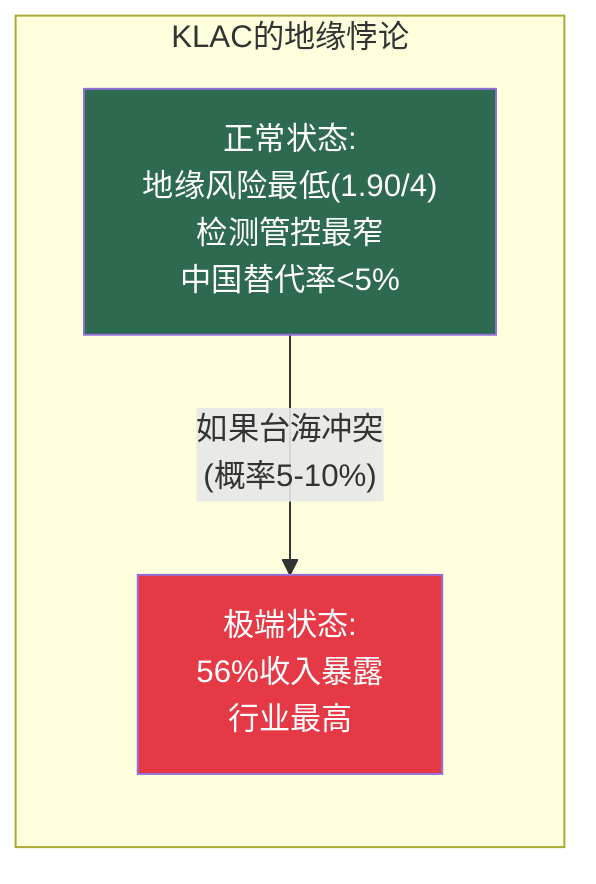
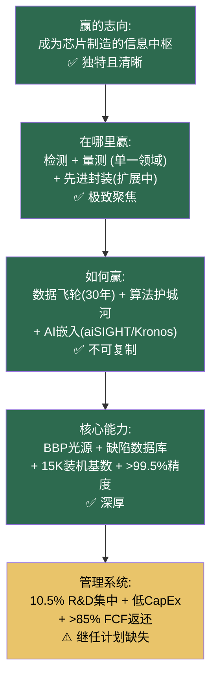

# Chapter 14: KLAC Wallace私密备忘录

## 致 Rick Wallace — KLA Corporation首席执行官

> **机密 | 仅限CEO/董事会阅读**
> **日期**: 2026年3月
> **基准数据**: FY2026 Q2 (Dec 2025) | 股价: $1,464 | 市值: $192.4B

---

## 14.1 Situation: 你建造了半导体设备行业中最接近软件公司的生意

Wallace先生，

你是四位CEO中任期最长的——2006年1月至今，20年。你加入KLA是1988年。在你掌舵的两个十年中，你做了三件定义性的事：

1. **深度优于广度**。你选择了不扩展到相邻设备领域，而是在检测/量测内越挖越深。63%市场份额——从2010年的50%增长而来。

2. **数据飞轮**。你积累了30+年、数万亿样本的半导体缺陷数据库。这个数据库不可被购买、不可被复制、不可被加速——它是时间的函数。

3. **软件经济学**。你把一家光学硬件公司变成了一家信息公司——62%毛利率、2.8% CapEx/Revenue、9.7x固定资产周转率。这些数字属于软件公司，不属于设备公司。

**你在我们横向对比中的成绩单**：

| 维度 | KLAC排名 | 数值 |
|------|:---:|---------|
| 概率加权预期回报 | **#1** | +17.7% |
| 牛市回报 | **#1** | +98% |
| 熊市保护 | **#1** | -57%（最小损失） |
| 风险调整系数 | **#1** | 0.31 |
| 遗憾最小化 | **#1** | 全情景最优 |
| 基准情景回报符号 | **#1** | 正（唯二之一，另一个是ASML） |

**六维全部第一——clean sweep。** 在横向对比分析中极为罕见。

[参阅: KLAC v1.0 Ch2-3, Ch6; SEMI_EQUIPMENT Ch9, Ch16-17]

---

## 14.2 Complication 1: 20年CEO——继任是你最大的未解决问题

你是半导体设备行业在任最久的CEO。市场已经开始定价key-man风险——即使你本人从未公开讨论继任。

### 量化影响

| 维度 | 估算 |
|------|------|
| Key-man风险折价 | P/E被压低2-4x (估算$8-15B市值) |
| 同行对比 | Fouquet(ASML, 2024接任)有清晰过渡; Archer(LRCX, 2018接任)=正常周期 |
| 机构投资者关切 | 治理评分中"继任计划透明度"低分 |

**3月12日Investor Day是你的窗口。**

你不需要宣布退休时间表。你需要做的是展示：
- 管理团队的深度（谁是你的2-3个关键副手）
- 他们对KLA战略方向的理解
- 过渡的组织准备度

**这是一个成本为零、收益$8-15B市值的行动。**

---

## 14.3 Complication 2: 大中华区56%收入集中——和平时安全≠永远安全

你的地缘政治风险评分在正常状态下是四家中最低的（1.90/4）。但你有一个独特的尾部风险：

| 地区 | KLAC收入占比 | 含义 |
|------|:---:|---------|
| 台湾 | ~30% | TSMC为主 |
| 中国大陆 | ~26% | 检测管控最晚/最窄 |
| **大中华区合计** | **~56%** | **行业最高的区域集中度** |

**台海冲突场景的KLAC特殊影响**：
- TSMC生产中断→KLAC检测工具闲置→收入下降30-40%
- 中国反制→中国26%收入风险
- 总极端影响：收入可能下降50%+（最差情景）

**你需要做的不是减少台湾暴露**（TSMC是你最好的客户），而是**确保你有非台湾增长来源的多元化**——先进封装检测、非台湾的EUV DRAM检测需求（Samsung/SK Hynix）。

---

## 14.4 Complication 3: 过程控制天花板——你的强度扩张论文有上限吗

你的核心增长论文：每个新技术节点增加约100-200bps的过程控制强度（检测占WFE的比例）。

| 技术驱动 | 强度增量 | 机制 |
|---------|:---:|---------|
| EUV DRAM采用 | +~100bps | 新增EUV层需要reticle检测+overlay量测+缺陷检测 |
| HBM堆叠(8Hi→16Hi) | +~100bps | 每层独立检测 |
| High-NA EUV(±1nm overlay) | +100-200bps | 更紧公差=更高频量测 |
| 先进封装(2.5D/3D) | 密度5-6x | 全新检测需求 |

**你从未承认过过程控制占WFE比例的理论天花板。**

当前检测/量测占WFE约10%。你的论文暗示这将增长到12-14%甚至更高。但在某个点上，Fab会开始推回检测成本——"我们已经在检测上花了足够多"。

| 检测占WFE% | 可能性 | 客户反应 |
|:---:|---------|---------|
| 10%→12% | **很可能** (当前趋势) | 接受——良率改进的ROI清晰 |
| 12%→14% | **可能** | 开始质疑——"够了吗?" |
| 14%→16% | **可能性降低** | 推回——寻找减少检测步骤的方法 |
| >16% | **不太可能** | AI优化可能减少检测需求 |

**这不是一个紧迫问题**——从10%到12%还有2-3年的跑道。但作为20年CEO，你应该在Investor Day上主动定义这个天花板，而不是让分析师猜测。

---

## 14.5 Complication 4: H1 2026增长暂停

你指引H1 2026收入"大致持平到温和增长" vs H2 2025。在牛市叙事中，这个暂停容易被忽略。但在估值极端的环境下，任何增长暂停都会被放大。

| 半年 | 收入轨迹 | 叙事 |
|------|---------|------|
| H2 2025 | 创纪录 | "强劲增长!" |
| H1 2026 | **持平/温和增长** | "暂时暂停/洁净室限制" |
| H2 2026E | 预期恢复增长 | "下半年加速" |

**风险**：如果H2 2026恢复不达预期，"暂时暂停"叙事将转为"增长见顶"叙事——在P/E 49x的股票上，这个叙事转换的惩罚是巨大的。

---

## 14.6 Resolution: Wallace的四步战略手册

### 行动1: 3月12日Investor Day——继任+封装+SaaS三合一

**做什么**：在一次Investor Day上解决三个最重要的市场问题：

| 议题 | 信息 | 预期市值影响 |
|------|------|:---:|
| **继任计划** | 展示2-3位关键高管的战略能力 | +$8-15B |
| **封装利润率** | 确认≥60%毛利率（与核心可比） | +$5-10B |
| **MACH SaaS路线图** | 从增值服务→独立SaaS产品的路径 | +$3-5B叙事溢价 |

**潜在总市值影响: +$16-30B (8-16%)**——全部来自信息披露，不需要任何运营改变。

### 行动2: 构建"静默冠军"叙事

**做什么**：你在六维场景分析中取得了clean sweep。你的市值($196B)仅为LRCX($302B)的64%——但你在每个风险调整维度都优于LRCX。这个不对称需要被市场看到。

在Investor Day上展示以下对比（不直接点名LRCX，用"行业同行"）：
- 你的毛利率(62%) vs 行业中位数(48%)
- 你的CapEx/Revenue(2.8%) vs 行业中位数(5-8%)
- 你的FCF利润率(34.4%) vs 行业中位数(28%)
- 你的周期Beta(0.7x) vs 行业中位数(1.0-1.3x)

**让数据替你说话。**

### 行动3: 加速MACH SaaS平台投入

**做什么**：
- 将MACH从"工具附加分析"升级为独立的按晶圆/按分析收费的SaaS产品
- 设定SaaS收入目标：FY2028-2030 $300-500M/年（>80%毛利率）
- 利用你30年缺陷数据库的AI训练优势——竞争对手即使有更好的算法，缺乏训练数据也无法复制

**为什么**：这是将你的数据飞轮从被动资产转化为主动收入的唯一路径。每$1 MACH SaaS收入对估值的贡献是设备收入的2-3倍（因为SaaS倍数>设备倍数）。

### 行动4: 多元化非台湾增长来源

**做什么**：
- 确保先进封装检测增长(当前$950M, +70% YoY)不过度依赖台湾客户
- 加速Samsung/SK Hynix的HBM检测份额——HBM检测步骤随堆叠翻倍
- 利用CHIPS Act项目（Intel Ohio/Arizona, Samsung Texas, TSMC Arizona）建立美国检测收入基础

**为什么**：降低56%大中华集中度到45-50%需要3-5年——不是通过减少台湾而是通过增加非台湾。

---

## 14.7 Wallace的沉默分析

| 沉默领域 | CEO在说什么 | CEO没说什么 | 风险等级 |
|---------|-----------|-----------|:---:|
| 继任计划 | (沉默) | 20年后谁接班 | 🔴 高 |
| 封装利润率 | "$950M, +70% YoY" | 毛利率是否≥60% | 🟡 中 |
| AMAT e-beam竞争 | (不直接讨论) | PDC对KLA检测收入的影响 | 🟢 低 |
| 过程控制天花板 | "强度持续扩张" | 理论上限是多少 | 🟡 中 |
| 台湾集中度 | "全球化客户基础" | 56%大中华暴露 | 🟡 中 |

---

## 14.8 Playing to Win瀑布

**一致性评分: 35/40** — 仅次于ASML(39/40)

扣分唯一在管理系统层——继任计划缺失。修复这一项不需要任何运营改变，只需要信息披露。

---

## 14.9 决策矩阵

| 决策领域 | 追踪信号 | 牛市阈值 | 熊市触发 |
|---------|---------|---------|---------|
| **继任计划** | 管理层展示深度 | Investor Day回应 | 2026年底仍无信号 |
| **封装利润率** | 利润率确认 | ≥60% | <55% |
| **MACH SaaS** | SaaS渗透率 | >50% | <30% |
| **检测强度** | 占WFE%趋势 | 趋向12-14% | 停滞在10% |
| **先进封装增长** | 年收入和YoY | >$1.2B | <$900M |
| **台湾集中度** | 大中华占比 | 趋向<50% | >60% |

---

## 14.10 Wallace先生，你最后需要知道的三件事

**第一**：你是半导体设备行业的"静默冠军"——在每个风险调整维度排名第一，但市值仅为LRCX的64%。差距来自"AI叙事偏差"——市场为HBM/EUV故事付费，不为效率/质量复利付费。时间是你的朋友。

**第二**：3月12日是你2026年最重要的一天。在一次Investor Day上解决继任+封装利润率+MACH路线图=可能释放$16-30B市值。这可能是你20年任期中投入产出比最高的单日。

**第三**：你的护城河形状（"平台型"，标准差1.06——最低）比任何人的护城河高度都更安全。ASML更深(8.12 vs 7.66)但更尖锐（标准差1.68，A1=5/10 Zeiss依赖）。**在95%的时间里高度获胜。在5%的尾部事件中——你的形状决定存亡。** 这就是为什么概率调整后你们的差距从0.46缩小到0.25。

---

*[Wallace备忘录完 | 下一份: Ch15 AMAT Dickerson备忘录]*
