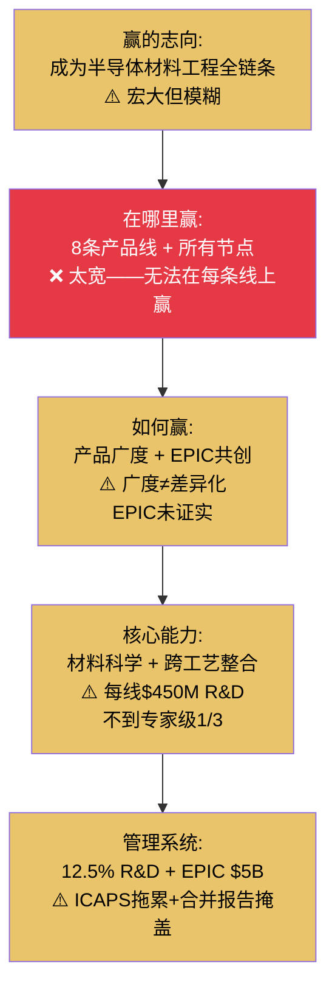

# Chapter 15: AMAT Dickerson私密备忘录

## 致 Gary Dickerson — Applied Materials首席执行官

> **机密 | 仅限CEO/董事会阅读**
> **日期**: 2026年3月
> **基准数据**: FY2025实际 + Q1 FY2026 | 股价: ~$220 | 市值: ~$283.5B

---

## 15.1 Situation: 半导体设备行业最大的公司——和最大的身份危机

Dickerson先生，

你领导Applied Materials已经12年。你管理着行业中最大的收入规模（FY2025 ~$27.2B）、最广的产品组合（8条产品线）和最大的单一CapEx项目（$5B EPIC中心）。

你的事实清单很长：
- WFE市场份额#2（~19%），仅次于ASML
- 8条产品线覆盖PVD/CVD/ALD/刻蚀/CMP/离子注入/检测/RTP
- GAA收入翻倍至$5B——最大的单一技术转型受益者
- 先进封装覆盖75%的19个新HBM工艺步骤
- EPIC中心2026春开业，Samsung为创始成员
- Sym3 Magnum刻蚀达到$1.2B——十年来最显著的进攻性份额增长

**但市场不买账。**

| 指标 | AMAT | LRCX | KLAC | ASML |
|------|:---:|:---:|:---:|:---:|
| P/E (TTM) | **37.9x** | 50.9x | 49.0x | 51.7x |
| 质量调整P/E (P/E÷A-Score) | **6.99x** | 7.25x | 6.40x | 6.37x |
| A-Score | **5.42** | 7.02 | 7.66 | 8.12 |

你的P/E看起来"最便宜"（37.9x vs 同行49-52x）。但质量调整后（P/E÷A-Score），你实际上比KLAC更贵（6.99x vs 6.40x）。

**"便宜"和"低估"是完全不同的概念。** 市场给你折价——不是因为误解，而是因为理解。

[参阅: AMAT v1.1 Ch3, Ch5, Ch16; SEMI_EQUIPMENT Ch9, Ch13, Ch16]

---

## 15.2 Complication 1: 通才折价30-40%——这不是误解，是结构性定价

### 折价的数学

| 如果AMAT以LRCX的P/E定价 | 如果AMAT以KLAC的P/E定价 |
|:---:|:---:|
| P/E 50.9x × AMAT EPS → 市值~$380B | P/E 49x × AMAT EPS → 市值~$365B |
| vs 当前$283B = **+34%折价** | vs 当前$283B = **+29%折价** |

### 折价的根源——A-Score解剖

| A-Score维度 | AMAT | LRCX | KLAC | ASML | AMAT的问题 |
|------------|:---:|:---:|:---:|:---:|---------|
| A1 供应链 | 5 | 6 | 7 | 5 | 一般 |
| A2 切换成本 | 5 | 8 | 8.5 | 8 | **远低于同行** |
| A3 杠杆效应 | 4 | 7 | 8 | 9 | **远低于同行** |
| A4 壁垒-利润池 | 5 | 8 | 9 | **10** | **远低于同行** |
| A5 技术半衰期 | 5 | 7 | 7 | **10** | 一般 |
| A9 范式免疫 | **7** | 7 | **9** | 8 | 唯一相对优势 |

**你在11个维度中没有任何一个达到A级（8+）。** LRCX有2个8+，KLAC有3个8+，ASML有2个10分。

这不是分析偏见——这是"广度战略"的数学后果。当R&D $3.57B分散到8条产品线时，每线$450M——不到KLAC集中在检测上的$1.4B的1/3。**你在每条产品线上都投入不够多，但在总量上花得最多。**

### Mizuho的关键发现

"大约60%的AMAT收入来自市场份额正在下降的细分领域。"

这意味着你的WFE份额5年持平（19%）不是均衡——而是攻守相抵的假象：你在GAA/刻蚀赢，在PVD/检测/成熟节点输。

---

## 15.3 Complication 2: EPIC中心——正确的战略，错误的optics

EPIC是你12年CEO任期中最大的赌注。

| EPIC基本面 | |
|-----------|------|
| 投资规模 | $5B（半导体设备行业历史最大单一CapEx） |
| 设施 | 180,000平方英尺先进洁净室，Sunnyvale |
| 开业时间 | 2026年春 |
| 创始成员 | Samsung Electronics（2026年2月11日宣布） |
| 五大技术领域 | 原子级沉积/刻蚀, 未来存储, 3D集成, 背面供电, 下代晶体管材料 |
| 当前收入贡献 | **$0** |

**EPIC的战略逻辑是正确的。**

你的核心问题（通才折价）来自"广度=浅度"的市场认知。EPIC试图将"广度"从被动属性转化为主动竞争武器——通过共创平台把你的8条产品线整合为客户无法替代的工艺解决方案。

**但EPIC的optics是错误的。**

| 维度 | 市场看到的 | 市场没有看到的 |
|------|---------|------------|
| $5B投资 | ✅ | — |
| Samsung创始成员 | ✅ | — |
| **ROI时间表** | ❌ | 什么时候回本？ |
| **收入归因机制** | ❌ | EPIC如何创造可度量的收入？ |
| **第二/三创始成员** | ❌ | TSMC? Intel? |
| **网络效应阈值** | ❌ | 几个成员才够？ |

**你没有给市场任何可以跟踪的EPIC ROI指标。** $5B是一个巨大的数字——在没有明确回报路径的情况下，市场将其定价为接近零（或者更糟，作为估值拖累）。

### EPIC成功的条件概率

| 条件 | 概率 | 如果成立→ |
|------|:---:|---------|
| Samsung成功验证EPIC工艺 | 65% | 建立概念验证 |
| **TSMC加入EPIC** | **30%** | **网络效应启动=价值指数增长** |
| Intel加入EPIC | 45% | 增量价值但非决定性 |
| 首个量产POR从EPIC产出 | 25% (FY2028前) | P/E从37.9x→42-45x |
| EPIC产出3+量产POR | 10% (FY2028前) | 通才折价消除→P/E→48-50x |

**关键变量: TSMC是否加入。** Samsung alone不构成网络效应。TSMC加入=3个全球顶级代工厂/存储厂都在EPIC上开发下代工艺=AMAT工具被深度嵌入所有主要客户的工艺流程=切换成本剧增=通才折价消除。

---

## 15.4 Complication 3: ICAPS拖累——低增长业务掩盖了AI增长故事

ICAPS (IoT, Communications, Automotive, Power, Sensors)——你的成熟节点业务组合——正在"消化"中。

| ICAPS状态 | 数据 |
|-----------|------|
| 当前贡献 | ~30%收入 |
| 增速 | "Flattish"（已两年） |
| 长期目标 | 中到高个位数增长 |
| vs AI增长业务 | CY2026半导体设备增长>20% |

**ICAPS是你AI增长故事的"稀释器"。** 当你报告"总收入增长X%"时，30%的ICAPS以0%增长拉低了数字。如果能单独披露：

| 分部 | 增速 | 市场给的倍数 |
|------|:---:|:---:|
| AI增长业务(GAA+封装+HBM+先进刻蚀) | +20-25% | P/E 45-50x |
| ICAPS成熟节点 | ~0% | P/E 20-25x |
| **合并报告（当前）** | +10-12% | **P/E 37.9x** |

**如果分开报告**：AI业务可能获得更高倍数（45-50x），ICAPS获得更低但合理的倍数（20-25x）。加权结果可能高于当前合并P/E——释放被合并报告掩盖的价值。

---

## 15.5 Complication 4: GAA是你唯一的专家级机会——如果你错过了

你声称在GAA和布线领域将获得>50%的服务市场份额。GAA收入从$2.5B翻倍至$5B(CY2025E)。

**GAA是你从"通才"变为"某个领域的专家"的唯一机会。**

| GAA维度 | AMAT地位 |
|---------|---------|
| 纳米片外延沉积(Centura) | >60%份额 |
| 选择性刻蚀 | 领先 |
| 高k金属栅ALD | 有力竞争者 |
| 新产品(Viva径向处理) | 首发 |

**如果GAA按预期发展**（每个代工厂从FinFET转向GAA,工艺步骤从~40增加到~80+），AMAT可能在一个$30-40B的TAM中获得>50%份额=**$15-20B GAA相关收入**。这将使GAA成为你最大的单一收入来源,超过任何现有产品线。

**但如果你在GAA中只获得40%而非50%**（LRCX在选择性刻蚀竞争、TEL在CVD竞争、ASM在ALD竞争），差额可能是$3-5B/年收入。

---

## 15.6 Resolution: Dickerson的五步战略手册

### 行动1: 为EPIC制定公开的ROI框架

**做什么**：在下次财报电话会上发布EPIC里程碑追踪框架：

| 里程碑 | 目标日期 | 可度量指标 |
|--------|---------|---------|
| 创始成员数量 | 2026年底 | ≥3（当前1: Samsung） |
| 首个技术验证 | 2027 H1 | 可公开的技术成果 |
| 首个量产POR | 2027-2028 | 可归因的量产订单 |
| EPIC相关工具收入 | 2028 | $X亿（首次量化） |

**为什么**：市场目前给EPIC的定价=0。给出可追踪的里程碑→让市场能为进展定价→逐步释放EPIC期权价值。

### 行动2: 争取TSMC加入EPIC

**做什么**：这是你最重要的商务优先级——比任何产品发布都重要。

**为什么**：TSMC加入EPIC = 游戏改变者。它意味着全球最先进、最挑剔的代工厂选择在你的平台上开发下一代工艺。这将：
- 建立网络效应（3个顶级客户都在EPIC上=第4个不来就落后）
- 创造前所未有的切换成本（在EPIC上开发的工艺=深度绑定AMAT工具）
- 消除或大幅收窄通才折价

### 行动3: 分部报告结构改革

**做什么**：将财报中的分部划分从当前的"半导体系统+AGS+显示"改为：

| 新分部 | 组成 | 增速预期 |
|--------|------|:---:|
| **先进技术** | GAA, 先进封装, HBM, EUV相关, EPIC | +20-25% |
| **基础设施** | ICAPS, 成熟节点PVD/CVD | 0-5% |
| **AGS服务** | 纯经常性服务（已调整后） | +8-12% |

**为什么**：让市场分别定价AI增长业务（高倍数）和ICAPS消化（低倍数）。合并报告掩盖了你增长最快的业务——分离后市场可以给予差异化定价。

### 行动4: 保护三座利润堡垒

**做什么**：PVD(85%)、CMP(65%)、离子注入(60%)贡献33-38%收入但45-50%利润。保护它们：
- PVD: 接受成熟节点份额缓慢流失给NAURA（不可逆），但确保先进节点PVD份额稳固
- CMP: 维持与Ebara的双寡头均衡——不需要进攻，防御即可
- 离子注入: 确保VIISta平台路线图覆盖下一代节点

**为什么**：这三座堡垒是你利润率的底线。如果PVD份额从85%→70%（NAURA侵蚀），你的利润率将下降2-3个百分点。

### 行动5: 如果ICAPS到2027年仍无复苏——认真评估组合优化

**做什么**：设定内部时间线——如果ICAPS到FY2027(Oct 2026-Sep 2027)仍在"flattish"：
- 评估ICAPS业务组合中哪些产品线有战略价值（保留）
- 评估哪些只是收入但非利润贡献（考虑剥离或合并）
- 不一定是全面剥离——可以是选择性瘦身

**为什么**：两年的"flattish"可以接受（消化期）。三年的"flattish"就不是消化——是结构性低增长。在三年时间点，你需要做出判断：ICAPS是暂时低迷还是永久性增长受限？

---

## 15.7 Dickerson的沉默分析

| 沉默领域 | CEO在说什么 | CEO没说什么 | 风险等级 |
|---------|-----------|-----------|:---:|
| 通才折价 | (不承认) | P/E比同行低30-40% | 🔴 高 |
| EPIC ROI | "Samsung创始成员" | 什么时候回本/通过什么机制 | 🔴 高 |
| ICAPS恢复时间 | "Flattish→中高个位数长期" | 什么时候恢复?如果不恢复? | 🟡 中 |
| PVD份额侵蚀 | (不直接讨论) | NAURA每年抢2-5pp份额 | 🟡 中 |
| 刻蚀竞争力 | "Sym3 Magnum $1.2B突破" | 在刻蚀仍是#3(15% vs LRCX 45%) | 🟢 低 |
| 中国合规 | (谨慎) | $2.52亿罚款的长期影响 | 🟡 中 |

---

## 15.8 Playing to Win瀑布

**一致性评分: 24/40** — 四家中最低。

**核心问题**：赢的志向（全链条）要求的赛场（8线）与方法（广度）和能力（$450M/线 R&D）之间存在**结构性不匹配**。EPIC是试图用一个$5B的能力层赌注来修复整个瀑布——如果成功，它将重新定义"如何赢"（从广度→共创平台），从而解决方法层的弱点。

---

## 15.9 决策矩阵

| 决策领域 | 追踪信号 | 牛市阈值 | 熊市触发 |
|---------|---------|---------|---------|
| **EPIC合作伙伴** | 创始成员数量 | ≥3 (含TSMC) | 2026年底仍=1 |
| **GAA份额** | GAA+布线市场份额 | >50%确认 | <40% |
| **通才折价** | P/E vs 同行差距 | 差距<20% | 差距>40% |
| **ICAPS复苏** | ICAPS增速 | >5% | FY2027仍~0% |
| **PVD份额** | 年度份额变化 | 稳定>80% | <75% |
| **分部报告** | 是否分离AI增长 vs ICAPS | 分离 | 继续合并 |
| **EPIC首个POR** | 可归因的量产订单 | FY2028前 | FY2029仍无 |

---

## 15.10 Dickerson先生，你最后需要知道的三件事

**第一**：你的30-40%估值折价不是市场的错误——是你的战略在BCG优势矩阵中位置的准确反映。你试图用规模型策略在专精型行业获胜。EPIC是你唯一的出路——但它需要TSMC加入才能产生网络效应。**争取TSMC是你2026-2027年的第一优先级。**

**第二**：停止试图同时防御8条产品线。主动让出成熟节点PVD给NAURA，主动承认检测不是你的战场（8% vs KLAC 63%是不可逾越的鸿沟）。**聚焦在你真正能赢的地方：GAA沉积/刻蚀、先进封装、EPIC平台。** 资源有限——每一美元花在保卫衰退中的成熟节点份额，就是一美元没花在建设未来的先进节点领导力。

**第三**：分部报告改革是你最低成本、最高回报的即时行动。让市场看到你的AI增长业务以20-25%增长，而不是被ICAPS稀释到10-12%。这不会改变基本面——但会改变市场如何给你的基本面定价。**在信息透明度上，你落后于同行。ASML有2030目标框架，LRCX有5年翻倍目标，KLAC即将发布新长期模型——你需要同等级别的战略透明度。**

---

*[Dickerson备忘录完 | Part IV 四份CEO私密备忘录全部完成]*
