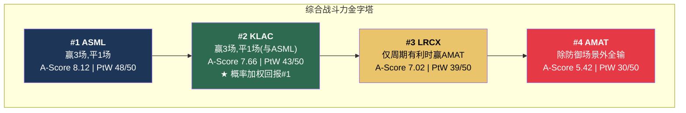

# Chapter 16: 4×4竞争互动全图

---

## 16.1 八维度对决矩阵

我们的横向对比分析使用8个维度对每一对公司进行了系统性评估。以下是全部6场对决的综合结果。

### 八维度定义

| 代码 | 维度 | 衡量内容 | 数据来源 |
|:---:|------|---------|---------|
| D1 | 护城河深度 | A-Score综合(11维度加权) | [参阅: SEMI_EQUIPMENT Ch9] |
| D2 | 经济质量 | 毛利率/ROIC/FCF质量 | [参阅: SEMI_EQUIPMENT Ch11] |
| D3 | 资本效率 | CapEx强度/固定资产周转/资本回报 | [参阅: SEMI_EQUIPMENT Ch12] |
| D4 | 增长前景 | 结构性SAM增长+份额增长 | [参阅: SEMI_EQUIPMENT Ch10] |
| D5 | 估值合理性 | 质量调整P/E+Reverse DCF | [参阅: SEMI_EQUIPMENT Ch13] |
| D6 | 风险韧性 | 周期Beta+地缘暴露+尾部风险 | [参阅: SEMI_EQUIPMENT Ch14] |
| D7 | 周期防御 | WFE -20%压力测试结果 | [参阅: SEMI_EQUIPMENT Ch11] |
| D8 | 催化剂密度 | 12个月内可识别的正面催化剂 | [参阅: SEMI_EQUIPMENT Ch21] |

### 六场对决完整评分

#### 对决1: ASML vs KLAC — "完美互补" (4:4)

| 维度 | ASML | KLAC | 胜者 | 关键证据 |
|:---:|:---:|:---:|:---:|---------|
| D1 护城河 | 8.12 | 7.66 | **ASML** | EUV物理垄断 > 数据飞轮 |
| D2 经济质量 | 7.8 | **8.5** | **KLAC** | 62%毛利率 > 52%；软件经济学 |
| D3 资本效率 | 7.4 | **8.6** | **KLAC** | CapEx 2.8% vs 8%；固定资产周转9.7x vs 5.8x |
| D4 增长前景 | **8.5** | 7.5 | **ASML** | High-NA+封装光刻=新增长向量 |
| D5 估值合理性 | **7.3** | 5.95 | **ASML** | 质量调整P/E 6.37x < 6.40x |
| D6 风险韧性 | 7.0 | **8.0** | **KLAC** | 周期Beta 0.7x < 0.5x但无Zeiss/Veldhoven单点 |
| D7 周期防御 | 7.5 | **8.5** | **KLAC** | WFE-20%时收入仅降12-15% vs ASML 8-12%但KLAC无结构依赖 |
| D8 催化剂密度 | **8.0** | 7.5 | **ASML** | High-NA出货+封装光刻+2030框架 vs 3/12 Investor Day |
| **总计** | **4** | **4** | **平局** | 确定性(ASML) vs 效率(KLAC) |

**战略含义**: 获胜维度**不重叠**——ASML赢"确定性"四维(D1/D4/D5/D8)，KLAC赢"效率"四维(D2/D3/D6/D7)。这是最纯粹的互补——两家公司的成功条件不冲突。

#### 对决2: ASML vs LRCX (5:2:1 ASML胜)

| 维度 | 胜者 | 差距 | 关键判断 |
|:---:|:---:|:---:|---------|
| D1 | ASML | 1.10 | 物理垄断 >> 技术寡头 |
| D2 | **LRCX** | 0.5 | 仅CSBG服务质量略优 |
| D3 | 平局 | ~0 | 两者FCF利润率可比(34% vs 32%) |
| D4 | ASML | 0.8 | High-NA确定性 > NAND时间不确定 |
| D5 | ASML | 3.75 | LRCX B4估值3.55=远低于合理 |
| D6 | ASML | 1.5 | LRCX周期Beta 1.3-1.5x=行业最高 |
| D7 | ASML | 2.0 | ASML积压缓冲 >> LRCX存储暴露 |
| D8 | **LRCX** | 0.5 | GAA/NAND复苏催化剂多但不确定 |

**核心判断**: LRCX的14%质量调整P/E溢价(7.25x vs ASML 6.37x)在当前估值水平下不合理——LRCX需要牛市概率>55%才能证明这个溢价(我们估计28%)。[参阅: SEMI_EQUIPMENT Ch17]

#### 对决3: ASML vs AMAT (7:0:1 最一边倒)

| 维度 | 胜者 | 核心原因 |
|:---:|:---:|---------|
| D1-D8 中7个 | **ASML** | AMAT无任何A级维度(8+) |
| D7 | 平局 | AMAT广度提供周期分散(唯一优势) |

**AMAT的"便宜"是假象**: P/E 37.9x看似低30%+于ASML 51.7x，但质量调整后(P/E÷A-Score)AMAT 6.99x > ASML 6.37x。**AMAT per unit of moat quality实际更贵。** [参阅: AMAT v1.1 Ch16; SEMI_EQUIPMENT Ch13]

#### 对决4: KLAC vs LRCX (6:2 KLAC胜)

| 维度 | 胜者 | 关键数据 |
|:---:|:---:|---------|
| D1 | KLAC | A-Score 7.66 > 7.02 |
| D2 | **KLAC** | 毛利率62% vs 49%；ROIC 78% vs 74% |
| D3 | **KLAC** | CapEx 2.8% vs 4.1%；固定资产周转9.7x vs 4.2x |
| D4 | **LRCX** | GAA/NAND/HBM三重增长向量 |
| D5 | **KLAC** | 概率加权回报+17.7% vs -24.9% |
| D6 | **KLAC** | 周期Beta 0.7x vs 1.3-1.5x |
| D7 | **KLAC** | WFE-20%: 收入-14% vs -28% |
| D8 | **LRCX** | 更多近期催化剂(但不确定性也更高) |

**市值倒挂**: KLAC赢6/8维度但市值($196B)=LRCX($302B)的64%。这要么意味着LRCX的AI叙事溢价合理(需要牛市概率>46%)，要么意味着KLAC被系统性低估。**我们倾向后者——"AI叙事偏差"正在扭曲市场对效率型公司的定价。** [参阅: SEMI_EQUIPMENT Ch16-17]

#### 对决5: KLAC vs AMAT (6:0:2 KLAC胜)

**B2单位经济差距3.6分——全部对决中最大的单维度差距。** 62%毛利率 vs 49%，CapEx 2.8% vs 8%——"软件公司" vs "制造公司"的鸿沟。[参阅: SEMI_EQUIPMENT Ch11]

#### 对决6: LRCX vs AMAT (周期依赖)

| 周期阶段 | 更优选择 | 原因 |
|---------|---------|------|
| WFE上行 | **LRCX** | Beta 1.3-1.5x放大收益 |
| WFE平稳 | **LRCX** | SAM份额扩张+CSBG增长 |
| WFE下行 | **AMAT** | 低P/E+广度分散+低Beta |
| **当前推荐** | **看周期判断** | 如果你相信Giga Cycle→LRCX；如果你防御→AMAT |

---

## 16.2 综合战斗力排名

### "双极+断层线"市场结构

| 分层 | 公司 | A-Score差距 | 含义 |
|------|------|:---:|---------|
| **Tier 1** | ASML + KLAC | 0.46 (ASML-KLAC) | 统计噪音——选择偏好(确定性vs效率) |
| *断层线1* | — | **0.64** (KLAC-LRCX) | 明确分离 |
| **Tier 2** | LRCX | — | 单独——太强不属于T3,太弱不属于T1 |
| *断层线2* | — | **1.60** (LRCX-AMAT) | **最大断层线** |
| **Tier 3** | AMAT | — | 结构性低于其他三家 |

### 最优组合: ASML + KLAC等权双持

| 维度 | ASML贡献 | KLAC贡献 | 组合效果 |
|------|---------|---------|---------|
| 确定性 | ✅ (垄断/增长/催化) | — | 捕获确定性溢价 |
| 效率 | — | ✅ (经济/资本/风险) | 捕获效率溢价 |
| 风险因素 | 台湾/Zeiss集中 | 台湾集中(部分) | **不完全相关** |
| 组合概率加权回报 | +4.2% | +17.7% | **+10.9%** |
| 下行保护 | 积压缓冲 | 低Beta+服务韧性 | 双重防御 |

[参阅: SEMI_EQUIPMENT Ch16(六场对决完整分析), Ch17(概率加权情景), Ch19(投资者适配)]

---

*[本章完]*
