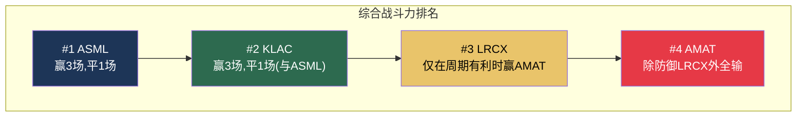

# Chapter 16: 4×4竞争互动全图

---

## 16.1 八维度对决矩阵

我们的横向对比分析使用8个维度对每一对公司进行了系统性评估。以下是全部6场对决的综合结果。

### 八维度定义

| 代码 | 维度 | 衡量内容 |
|:---:|------|---------|
| D1 | 护城河深度 | A-Score综合 |
| D2 | 经济质量 | 毛利率/ROIC/FCF质量 |
| D3 | 资本效率 | CapEx强度/固定资产周转/资本回报 |
| D4 | 增长前景 | 结构性SAM增长+份额增长 |
| D5 | 估值合理性 | 质量调整P/E+Reverse DCF |
| D6 | 风险韧性 | 周期Beta+地缘暴露+尾部风险 |
| D7 | 周期防御 | WFE -20%压力测试结果 |
| D8 | 催化剂密度 | 12个月内可识别的正面催化剂 |

### 六场对决结果汇总

| 对决 | 比分 | 判定 | 核心张力 |
|------|:---:|------|---------|
| **ASML vs KLAC** | **4:4** | 条件性——取决于投资哲学 | 确定性(ASML: D1/D4/D5/D8) vs 效率(KLAC: D2/D3/D6/D7) |
| **ASML vs LRCX** | **5:2:1** | ASML明确胜出 | 确定性 >> 叙事动量 |
| **ASML vs AMAT** | **7:0:1** | ASML全面碾压(最一边倒) | AMAT的"便宜"是假象(质量调整后更贵) |
| **KLAC vs LRCX** | **6:2** | KLAC明确胜出(风险调整) | 质量 >> AI叙事 |
| **KLAC vs AMAT** | **6:0:2** | KLAC明确胜出 | "软件公司" vs "制造公司"的鸿沟 |
| **LRCX vs AMAT** | 周期依赖 | 条件性 | 高Beta进攻(LRCX) vs 低P/E防御(AMAT) |

### ASML ↔ KLAC: 完美互补——获胜维度不重叠

| 维度 | ASML赢 | KLAC赢 |
|------|:---:|:---:|
| D1 护城河 | ✅ | |
| D2 经济质量 | | ✅ |
| D3 资本效率 | | ✅ |
| D4 增长前景 | ✅ | |
| D5 估值合理性 | ✅ | |
| D6 风险韧性 | | ✅ |
| D7 周期防御 | | ✅ |
| D8 催化剂密度 | ✅ | |

**它们的获胜维度完美互补——没有一个维度两者同时获胜。** ASML赢在"确定性"维度，KLAC赢在"效率"维度。这意味着没有单一战略能同时最大化两者——也意味着"ASML+KLAC等权双持"在投资组合层面捕获两种溢价，风险因素不相关。

### KLAC vs LRCX: 市值倒挂

KLAC赢6/8维度，但市值($196B)仅为LRCX($302B)的64%。

| 解释 | 含义 |
|------|------|
| LRCX是对的: 市场定价LRCX的未来增长 | 需要牛市概率>55%才合理(我们估计28%) |
| **KLAC是对的(我们的倾向)**: KLAC质量溢价被系统性低估 | "AI叙事偏差"——市场为故事付费不为效率付费 |
| 都是理性的: 不同投资者群体, 非错误定价 | 可能但不完全令人满意 |

---

## 16.2 CEO战略含义

| 你是... | 你应该关注的对决 | 关键洞察 |
|---------|:---:|---------|
| **Fouquet** | ASML vs KLAC (平局) | 你赢的维度(确定性)和KLAC赢的维度(效率)不冲突——合作>竞争 |
| **Archer** | KLAC vs LRCX (KLAC赢6:2) | 市场给你更高市值但KLAC在风险调整后更优——你需要证明AI叙事不只是P/E膨胀 |
| **Wallace** | KLAC vs 所有人 (赢或平) | 时间站在你这边——质量终将被重新定价 |
| **Dickerson** | AMAT vs 所有人 (除防御场景外全输) | 你需要EPIC改变博弈——否则结构性折价将持续 |

---

*[本章完]*
