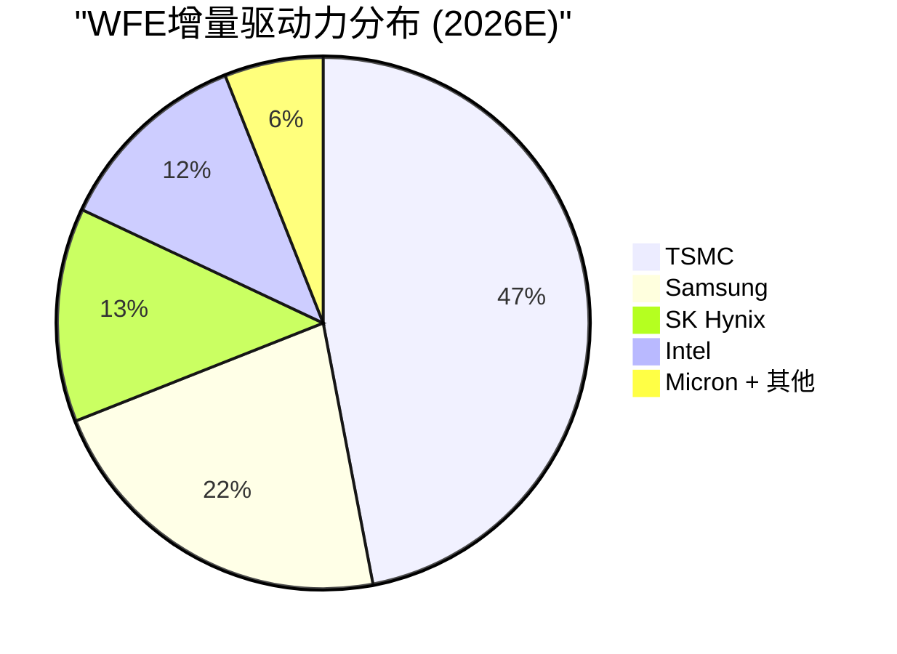
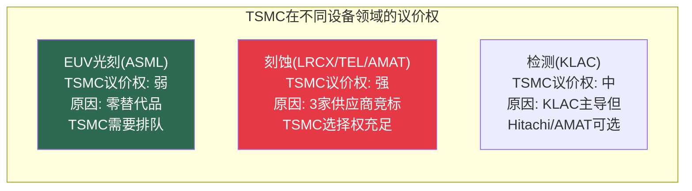

# Chapter 17: 客户力量平衡——TSMC/Samsung/Intel

---

## 17.1 三大客户的Stackelberg领导结构

半导体设备行业的客户不是均匀分布的。三家公司控制着WFE增量的绝大部分。

### 客户力量排名

| 客户 | 2026 CapEx | 占WFE增量 | 技术路线图定义权 | 对各设备公司的差异化杠杆 |
|------|:---:|:---:|:---:|---------|
| **TSMC** | $52-56B | **~45-50%** | 定义GAA/BSPDN/EUV时间表 | ASML: 排队(弱)；LRCX/AMAT: 竞标(强) |
| **Samsung** | ~$30B | ~20-25% | 存储+逻辑双重 | AMAT: EPIC创始成员(锁定) |
| **Intel** | ~$20B | ~12-15% | IFS成败=设备方向变量 | ASML: High-NA锚定客户 |
| **SK Hynix** | $21.5B | ~12-15% | HBM标准定义 | LRCX: TSV刻蚀关键 |
| **Micron** | $20B | ~10-12% | NAND/DRAM技术跟随者 | — |

---

## 17.2 TSMC——系统性力量

**TSMC不是"一个客户"——它是一个产业操作系统。**

| TSMC的力量维度 | 量化 | 对设备公司的含义 |
|-------------|------|-------------|
| 占全球先进代工 | ~53%(趋向60%+) | 设备路线图=TSMC路线图 |
| 占ASML收入 | ~30-35% | Fouquet的最大变量 |
| 占WFE增量 | ~45-50% | TSMC CapEx调整=全行业调整 |
| 技术路线图定义权 | 定义节点时间表 | 设备公司必须按TSMC节奏开发 |
| High-NA采用决策权 | TSMC犹豫=ASML 2030失效 | [参阅: Ch12 C1] |
| 供应商竞标 | 刻蚀标书同时邀LRCX/TEL/AMAT | LRCX/AMAT在TSMC面前是价格接受者 |

### TSMC的"双面议价权"

**CEO关键洞察**: TSMC在EUV上是价格接受者（排队买ASML），但在刻蚀上是Stackelberg领导者（让LRCX/TEL/AMAT互相竞争）。**这个不对称解释了为什么ASML的毛利率(52%)可以高于LRCX(49%)——尽管LRCX在刻蚀也有45%份额。** 垄断定价权 > 寡头定价权。

---

## 17.3 Samsung——EPIC的赌注

Samsung在设备行业中扮演独特角色：它同时是**逻辑代工客户+存储客户+AMAT EPIC创始成员**。

| Samsung角色 | 对设备公司的含义 |
|-----------|-------------|
| 逻辑代工(GAA) | LRCX/AMAT的GAA工具在Samsung率先验证 |
| 存储(HBM/DRAM) | SK Hynix的竞争对手→驱动并行设备投资 |
| **EPIC创始成员** | **AMAT获得了TSMC未给的深度绑定机会** |
| 先进封装(I-Cube) | 与TSMC CoWoS竞争→驱动封装设备投资 |

**Samsung选择加入EPIC的战略逻辑**: Samsung在先进代工落后TSMC 1-2个节点。EPIC的"缩短开发周期数年"的承诺对Samsung比对TSMC更有吸引力——TSMC已经是工艺领先者，不需要加速；Samsung需要追赶。

**对Dickerson的含义**: Samsung加入EPIC是因为需要追赶TSMC，不是因为AMAT的技术最好。如果Intel(同样需要追赶)也加入，EPIC的"追赶者联盟"叙事将变得可信。但**TSMC加入才是游戏改变者**——它将EPIC从"追赶者工具"升级为"行业标准平台"。[参阅: Ch15 C2]

---

## 17.4 Intel——最大的不确定性

Intel IFS(Intel Foundry Services)的成败是设备行业中最大的单一不确定性之一。

| IFS情景 | 概率 | 对设备行业的影响 |
|---------|:---:|---------|
| **IFS成功(18A量产)** | 35% | WFE增量+$5-8B/年；ASML High-NA锚定验证 |
| **IFS部分成功** | 40% | 温和WFE增量；Intel CapEx维持$15-20B |
| **IFS失败** | 25% | 代工整合加速→TSMC集中度更高→设备行业更依赖TSMC |

**Intel对ASML的特殊意义**: Intel是High-NA EUV的**锚定客户**——首批30K晶圆已在Intel D1X用High-NA生产。如果Intel 18A成功，High-NA的商业验证将完成，加速Samsung/TSMC采用。如果Intel 18A失败，High-NA的commercial case将受损。[参阅: Ch12 C1]

---

## 17.5 客户之间的竞争 = 设备公司的结构性机会

| 客户竞争对 | 对设备需求的放大效应 |
|-----------|:---:|
| TSMC vs Samsung vs Intel (先进逻辑) | 三方竞相投资→设备需求3x放大 |
| SK Hynix vs Micron vs Samsung (HBM) | 三方扩产→存储设备需求翻倍 |
| 各国政府 (CHIPS Act vs EU Chips Act vs日韩补贴) | 同一产能多地建设→需求乘数效应 |
| TSMC CoWoS vs Samsung I-Cube (先进封装) | 封装设备TAM因竞争而翻倍 |

**这是设备公司最强的结构性顺风**: 客户之间的"军备竞赛"确保即使总需求增速放缓，竞争驱动的投资仍会维持设备支出。[参阅: Ch2.2超级计算商CapEx传导链]

---

## 17.6 客户集中度风险——温水煮青蛙路径3的量化

| 设备公司 | 前3客户估计收入占比 | 最大单客户 | 趋势 | 风险 |
|---------|:---:|:---:|:---:|:---:|
| ASML | >65% | TSMC (~30-35%) | ↑ | 🔴 |
| KLAC | ~55% | TSMC (~25%) | → | 🟡 |
| LRCX | ~60% | TSMC (~25%) | → | 🟡 |
| AMAT | ~55% | TSMC (~20%) | → | 🟡 |

**所有四家的共同系统性风险**: TSMC CapEx下调10% ≈ WFE -5~8%。没有设备公司能从TSMC决策免疫。

### TSMC High-NA决策——影响力最大的单一客户决策

| TSMC决策 | 对ASML影响 | 对其他三家影响 | 差异 |
|---------|:---:|:---:|:---:|
| 2027采用High-NA | +EUR 12-16B (→EUR 60B) | +$2-5B合计 | **ASML暴露5-8x** |
| 2029+延迟 | EUR 44-48B | 影响较小 | |

**ASML对TSMC High-NA决策的暴露度是其他三家的5-8倍。** 这是Fouquet最需要管理的单一变量。[参阅: Ch12 C1]

---

*[本章完]*
