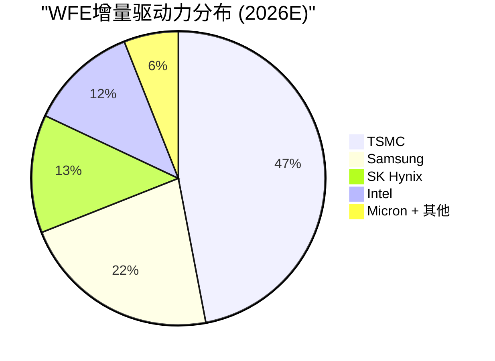

# Chapter 17: 客户力量平衡——TSMC/Samsung/Intel

---

## 17.1 三大客户的Stackelberg领导结构

半导体设备行业的客户不是均匀分布的。三家公司——TSMC、Samsung、Intel——控制着WFE增量的绝大部分。

### 客户力量排名

| 客户 | 2026 CapEx | 占WFE增量 | 对设备公司的杠杆 | 设备公司的反杠杆 |
|------|:---:|:---:|---------|---------|
| **TSMC** | $52-56B | **~45-50%** | 极高——单一公司定义WFE方向 | 仅在EUV(ASML): TSMC必须排队 |
| **Samsung** | ~$30B | ~20-25% | 高——存储+逻辑双重购买力 | EPIC创始成员(AMAT锁定) |
| **Intel** | ~$20B | ~12-15% | 中——IFS成功与否仍不确定 | High-NA锚定客户(ASML) |
| **SK Hynix** | $21.5B | ~12-15% | 中——HBM专注 | HBM设备供不应求 |
| **Micron** | $20B | ~10-12% | 中 | — |

### TSMC的超级客户地位

**TSMC不是"一个客户"——它是一个系统性力量。**

| TSMC的力量 | 量化 |
|-----------|------|
| 占全球先进代工 | ~53%(趋向60%+) |
| 占ASML收入 | ~30-35% |
| 占WFE增量 | ~45-50% |
| 技术路线图定义权 | TSMC选择节点 = 行业跟随 |
| High-NA采用决策权 | TSMC犹豫 = ASML 2030目标高端失效 |

**但TSMC的力量有一个硬限制**：在EUV领域，它没有议价权。ASML年产60-80台EUV工具，需求>100台。TSMC需要排队——这是少数几个买方必须竞争卖方产能的工业场景。

### 客户之间的竞争 = 设备公司的机会

| 竞争对 | 对设备需求的影响 |
|--------|-------------|
| TSMC vs Samsung vs Intel (先进逻辑) | 三方竞相投资→设备需求放大 |
| SK Hynix vs Micron vs Samsung (HBM) | 三方扩产→存储设备翻倍 |
| 各国政府 (CHIPS Act vs EU Chips Act) | 同一产能多地建设→需求乘数 |

**CEO关键洞察**：客户之间的竞争是设备公司最强的结构性顺风——它确保即使总需求增速放缓，"军备竞赛"效应仍维持设备投资。

---

## 17.2 各设备公司的客户集中度风险

| 设备公司 | 前3客户收入估占 | 最大单客户 | 集中度风险 |
|---------|:---:|---------|:---:|
| ASML | >65% | TSMC (~30-35%) | 🔴 高 |
| KLAC | ~55% | TSMC (~25%) | 🟡 中 |
| LRCX | ~60% | TSMC (~25%) | 🟡 中 |
| AMAT | ~55% | TSMC (~20%) | 🟡 中 |

**所有四家公司共同的系统性风险**: TSMC CapEx下调10% ≈ WFE -5~8% ≈ 全行业收入压力。没有设备公司能从TSMC决策中免疫——差别只在暴露程度。

---

## 17.3 TSMC的High-NA决策：全行业影响力最大的单一客户决策

| TSMC决策 | 对ASML | 对LRCX | 对KLAC | 对AMAT |
|---------|---------|---------|---------|---------|
| 2027-2028采用High-NA | 2030 EUR 60B可实现 | 更多EUV层→更多刻蚀 | 更严量测需求 | 更多GAA沉积 |
| 延迟到2029-2030 | 2030 EUR 44-48B | 影响较小(刻蚀仍增长) | 影响较小 | 影响较小 |
| **影响差异** | **EUR 12-16B** | ~$2-3B | ~$1B | ~$1-2B |

**ASML对TSMC的High-NA决策暴露度是其他三家的5-8倍**——这是Fouquet最需要管理的单一变量。

---

*[本章完]*
