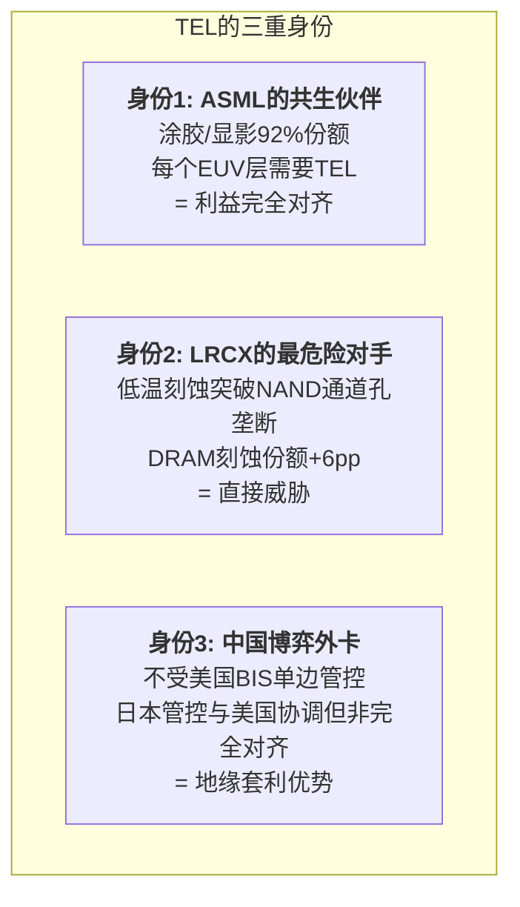

# Chapter 18: TEL外卡——没人关注的第五力量

---

## 18.1 TEL: 被低估的全球#4

Tokyo Electron (8035.T)在西方分析师的雷达上系统性地被低估。

| 维度 | TEL | vs 四巨头的定位 |
|------|------|---------|
| FY2025收入 | ¥2,431B (~$15.7B) | 介于KLAC($12.7B)和LRCX($18.4B)之间 |
| 毛利率 | 47.1% (创纪录) | 与LRCX/AMAT可比 |
| 营业利润率 | 28.7% | 低于KLAC(43%)/ASML(35%)/LRCX(32%) |
| R&D | ¥148.7B (6.1%) → FY2026计划¥300B翻倍 | R&D翻倍=进攻信号 |
| 装机基数 | 96,000+工具 | 接近LRCX的100K腔体 |
| FY2027收入目标 | ¥3T (~$19.4B) + 35%+ OP margin | 超过LRCX FY2025收入 |

### TEL的三重身份

---

## 18.2 TEL在各领域的竞争地位

| 设备类别 | TEL份额 | 全球排名 | 对四巨头的威胁 | 趋势 |
|---------|:---:|:---:|:---:|:---:|
| **涂胶/显影** | **92%** | **#1** (垄断) | ASML: 零(共生) | 稳定 |
| 晶圆探针 | 38% | #1 | 无直接影响 | 稳定 |
| CVD | 38% | #1-2 | **AMAT: 直接竞争** | 稳定 |
| 氧化/扩散 | 37% | #1 | 无直接影响 | 稳定 |
| 晶圆键合 | 32% | #1 | AMAT: 封装竞争 | **增长** |
| **干法刻蚀** | **27%** | **#2** | **LRCX: 重大威胁** | **增长中** |
| 清洗 | 21% | #2 | 无直接影响 | 稳定 |
| ALD | 16% | #3 | 间接(ASM主导) | 弱势 |

### 低温刻蚀——TEL最大的战略赌注

**性能参数**:
- 刻蚀深度>10微米，速度2.5x传统方法
- 可达400+层NAND
- 功耗-40%，温室效应-84%
- Samsung确认为400层NAND客户; SK Hynix测试中

**TAM影响**: NAND通道孔刻蚀市场从~$500M(2023)→~$2B(2027)，CAGR 40%。

**对Archer的含义**: TEL不需要赢整个刻蚀市场——它只需要在NAND通道孔这个LRCX最集中的利润袋中获得20-35%份额。这足以将LRCX从"独家供应商定价"降级为"双寡头定价"——ASP压缩5-10%将辐射到LRCX整个刻蚀组合。

---

## 18.3 TEL的涂胶/显影垄断——隐藏的行业命脉

TEL的涂胶/显影92%份额是**半导体设备行业中仅次于ASML EUV的最强垄断**——但很少被讨论。

| 事实 | 含义 |
|------|------|
| 每个EUV曝光层需要TEL涂胶/显影 | TEL与ASML深度共生 |
| 100% EUV涂胶/显影份额 | EUV扩张→TEL自动受益 |
| 100% High-NA EUV涂胶/显影份额 | High-NA扩张→TEL自动受益 |
| LRCX干法光刻胶(替代湿法涂胶) | 唯一真正的威胁但采用缓慢 |
| TEL MOR(金属氧化物光刻胶)反击 | 成本降1/3，兼容现有湿法工艺 |

**CEO含义**: TEL的涂胶垄断使它成为EUV/High-NA生态系统的不可分割组成部分。ASML的每一次成功都是TEL的成功。**这创造了半导体设备行业中最完美的共生关系。**

---

## 18.4 TEL的中国地缘套利

| 维度 | TEL | 美国四巨头 |
|------|------|---------|
| 管控管辖 | 日本政府 | 美国BIS |
| 与美国协调程度 | 部分对齐但非完全 | 完全对齐 |
| 中国峰值暴露 | **50%** (Q1 FY2025) | 最高~43% (LRCX) |
| 继续向中国销售能力 | **更高** | 受限 |
| 中国客户偏好 | **更高**(供应中断风险低) | 管控风险高 |

**对LRCX和AMAT的含义**: 在刻蚀和沉积领域（两者都直接竞争），TEL可以在美国公司受限时继续向中国客户销售。中国客户可能系统性偏好TEL——不是因为技术更好，而是因为供应连续性风险更低。

---

## 18.5 对四位CEO的TEL影响评估

| CEO | TEL威胁等级 | 核心风险 | 建议回应 |
|-----|:---:|---------|---------|
| **Fouquet** | 🟢 极低(共生) | 无——TEL是EUV生态伙伴 | 深化合作 |
| **Archer** | 🔴 **高** | 低温刻蚀+中国地缘套利 | 技术防御+CSBG深度锁定 |
| **Wallace** | 🟢 极低 | TEL无检测/量测业务 | 无需行动 |
| **Dickerson** | 🟡 中 | CVD/沉积竞争+中国套利 | 聚焦EPIC差异化 |

---

*[本章完 | Part V互动矩阵结束]*
