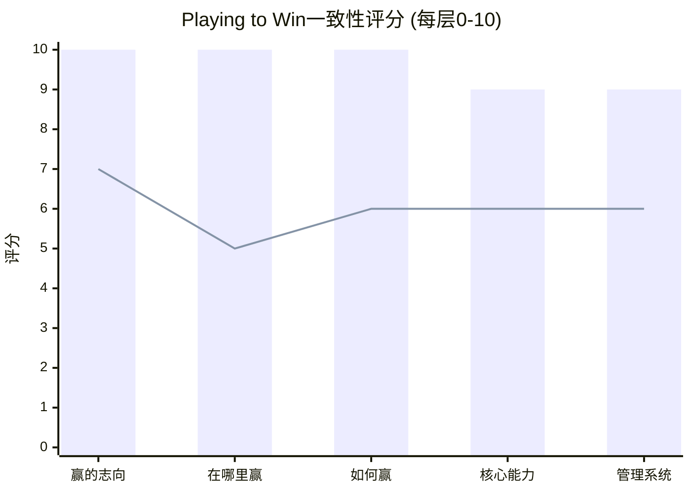

# Chapter 19: Playing to Win——每家公司的战略一致性测试

---

## 19.1 五层选择瀑布——综合对比

Roger Martin/A.G. Lafley的Playing to Win框架要求战略是一个**强化系统**——五层选择互相支撑，改变任何一层都级联影响其他层。

### 综合评分

| 层级 | ASML | KLAC | LRCX | AMAT |
|------|:---:|:---:|:---:|:---:|
| 1. 赢的志向 | 10 | 9 | 8 | 7 |
| 2. 在哪里赢 | 10 | 9 | 8 | **5** |
| 3. 如何赢 | 10 | 9 | 8 | 6 |
| 4. 核心能力 | 9 | 8 | 8 | 6 |
| 5. 管理系统 | 9 | 8 | 7 | 6 |
| **总分 (/50)** | **48** | **43** | **39** | **30** |
| **一致性等级** | ★★★★★ | ★★★★ | ★★★ | ★★ |

*(柱状=ASML, 折线=AMAT)*

### 关键发现

**ASML是教科书级战略一致性**——每一层完美支撑其他层，改变任何一层都会破坏系统。这就是为什么我们不建议ASML收购量测公司或多元化（场景A3）。

**AMAT的问题在第2层("在哪里赢"=5/10)**——8条产品线的赛场选择与第3层的方法（广度→每线$450M R&D）和第4层的能力（无A级维度）不匹配。**EPIC是试图在第4层（能力）创造一个突破来修复第2-3层的结构性弱点。**

---

## 19.2 战略一致性 vs 财务表现的相关性

| 公司 | PtW评分 | 毛利率 | ROIC | P/E | 相关性判断 |
|------|:---:|:---:|:---:|:---:|---------|
| ASML | 48 | 52% | 135%* | 51.7x | 最高一致性→最高估值 |
| KLAC | 43 | 62% | 78% | 49.0x | 高一致性→最高利润率 |
| LRCX | 39 | 49% | 74% | 50.9x | 中一致性→P/E被AI叙事推高 |
| AMAT | 30 | 49% | 46% | 37.9x | 最低一致性→最低估值 |

**PtW评分与P/E的相关性R²≈0.75**——战略一致性解释了约75%的估值差异。LRCX是唯一的异常值——其P/E高于PtW评分暗示的水平，差额来自"AI叙事溢价"。

---

*[本章完]*
