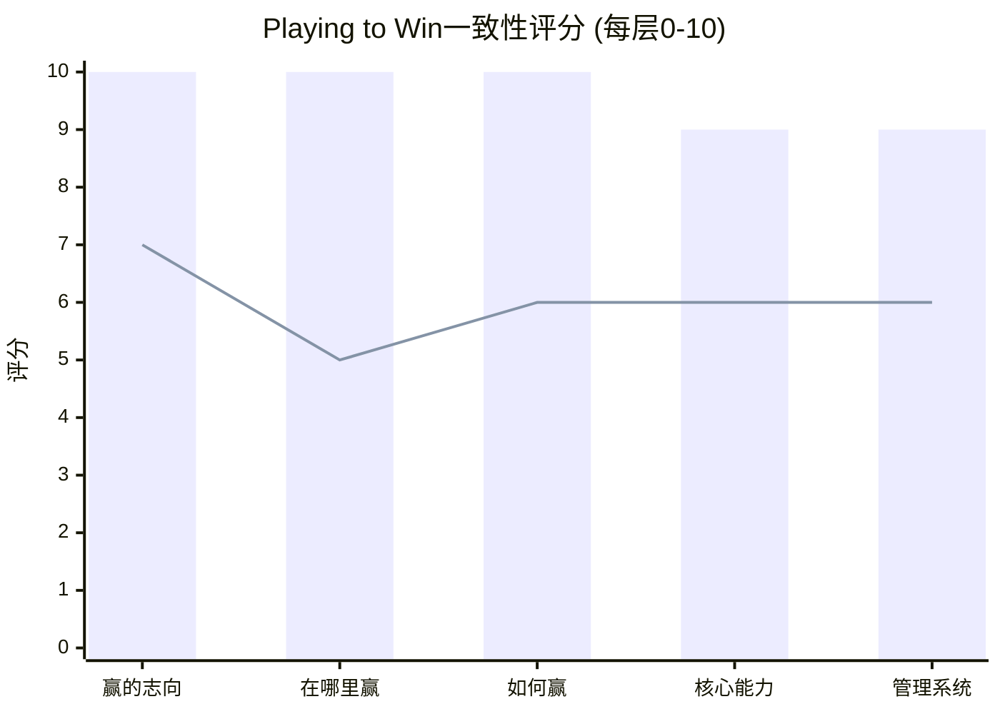
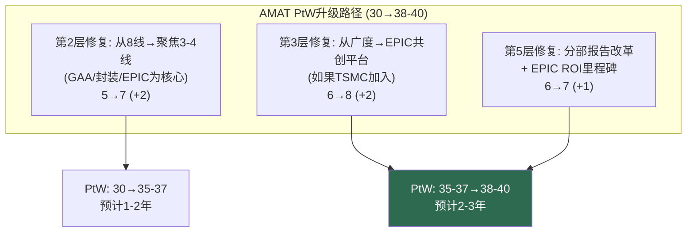

# Chapter 19: Playing to Win——每家公司的战略一致性测试

---

## 19.1 五层选择瀑布——综合对比

Roger Martin/A.G. Lafley的Playing to Win框架要求战略是一个**强化系统**——五层选择互相支撑，改变任何一层都级联影响其他层。

### 综合评分

| 层级 | 问题 | ASML | KLAC | LRCX | AMAT |
|------|------|:---:|:---:|:---:|:---:|
| 1. 赢的志向 | "赢"的定义是什么？ | 10 | 9 | 8 | 7 |
| 2. 在哪里赢 | 选择哪些市场？ | 10 | 9 | 8 | **5** |
| 3. 如何赢 | 竞争优势来源？ | 10 | 9 | 8 | 6 |
| 4. 核心能力 | 必须擅长什么？ | 9 | 8 | 8 | 6 |
| 5. 管理系统 | 支撑战略的结构？ | 9 | 8 | 7 | 6 |
| **总分 (/50)** | | **48** | **43** | **39** | **30** |
| **一致性等级** | | ★★★★★ | ★★★★ | ★★★ | ★★ |

*(柱状=ASML, 折线=AMAT)*

---

## 19.2 逐公司瀑布详解

### ASML: 教科书级一致性 (48/50)

| 层级 | 选择 | 评分 | 一致性证据 |
|------|------|:---:|---------|
| **赢的志向** | 成为半导体制造不可替代的基础设施 | 10 | 清晰、独特、不可模仿 |
| **在哪里赢** | 光刻。只做光刻。(+封装光刻) | 10 | 极致聚焦→资源集中 |
| **如何赢** | 技术垄断+供应约束定价+预付款锁定 | 10 | 三重锁定机制互相强化 |
| **核心能力** | 精密光学(Zeiss)+EUV光源(Cymer)+计算光刻 | 9 | 物理壁垒(-1: Zeiss依赖) |
| **管理系统** | 14%+ R&D强度+深度Zeiss合作+客户路线图共享 | 9 | (-1: Veldhoven单点) |

**一致性循环**: 志向(不可替代)→赛场(只做光刻)→方法(技术垄断)→能力(物理壁垒)→系统(极致R&D)→**回到志向**(每一层的成功强化其他层)

**扣分来源**: 管理系统层A1=5/10(Veldhoven/Zeiss单点)是唯一结构性缺陷。修复需要5-10年(地理分散)，但不会破坏其他四层。[参阅: Ch12 C4]

### KLAC: 精密一致 (43/50)

| 层级 | 选择 | 评分 | 一致性证据 |
|------|------|:---:|---------|
| **赢的志向** | 成为芯片制造的信息中枢 | 9 | 独特且可防御(-1: "信息中枢"边界模糊) |
| **在哪里赢** | 检测+量测(单一领域)+封装(扩展中) | 9 | 极致聚焦(-1: 封装扩展增加复杂度) |
| **如何赢** | 数据飞轮(30年)+算法护城河+AI嵌入 | 9 | 时间函数=不可加速复制 |
| **核心能力** | BBP光源+缺陷数据库+15K装机基数 | 8 | (-2: AI可能缩小算法差距) |
| **管理系统** | 10.5% R&D+低CapEx+85% FCF返还 | 8 | (-2: 继任计划缺失) |

**关键洞察**: KLAC的一致性分数(43)仅比ASML(48)低5分，但**形状更均匀**——没有任何层<8，而AMAT有多个层≤6。这验证了"平台型"护城河(低标准差)比"尖刺型"(高标准差)更安全。

### LRCX: 三线分散 (39/50)

| 层级 | 选择 | 评分 | 扣分原因 |
|------|------|:---:|---------|
| **赢的志向** | 成为每片晶圆的刻蚀与沉积伙伴 | 8 | 清晰但非独特(AMAT/TEL也做刻蚀+沉积) |
| **在哪里赢** | 刻蚀(#1)+沉积(扩张)+CSBG(服务) | 8 | 三线→聚焦度中等 |
| **如何赢** | HAR刻蚀物理+装机基数飞轮 | 8 | TEL低温刻蚀首次挑战"如何赢" |
| **核心能力** | Cryo刻蚀+ALD+配方库30年+Equipment Intelligence | 8 | 能力层首次出现裂缝(TEL通道孔POR) |
| **管理系统** | 11.4% R&D+85% FCF返还 | 7 | 回购制度约束限制战略灵活性 |

### AMAT: 结构性不匹配 (30/50)

| 层级 | 选择 | 评分 | 核心问题 |
|------|------|:---:|---------|
| **赢的志向** | 成为半导体材料工程全链条 | 7 | 宏大但模糊——"全链条"意味着什么？ |
| **在哪里赢** | **8条产品线+所有节点** | **5** | **太宽→无法在每条线赢→资源被稀释** |
| **如何赢** | 产品广度+EPIC共创 | 6 | 广度≠差异化; EPIC未证实(收入$0) |
| **核心能力** | 材料科学+跨工艺整合 | 6 | 每线$450M R&D < 专家级1/3 |
| **管理系统** | 12.5% R&D+EPIC $5B | 6 | ICAPS拖累+合并报告掩盖AI增长 |

**AMAT的核心问题在第2层("在哪里赢"=5/10)**。赢的志向(全链条)要求赛场(8线)，但方法(广度)和能力(每线$450M)无法支撑这个赛场选择。**这不是执行问题——是战略架构问题。**

---

## 19.3 战略一致性 vs 财务表现的相关性

| 公司 | PtW评分 | 毛利率 | ROIC | P/E | 质量调整P/E |
|------|:---:|:---:|:---:|:---:|:---:|
| ASML | 48 | 52% | 135%* | 51.7x | 6.37x |
| KLAC | 43 | 62% | 78% | 49.0x | 6.40x |
| LRCX | 39 | 49% | 74% | 50.9x | 7.25x |
| AMAT | 30 | 49% | 46% | 37.9x | 6.99x |

**PtW评分与P/E的R²≈0.75**——战略一致性解释了约75%的估值差异。

LRCX是唯一异常值: P/E(50.9x)高于PtW(39)暗示的水平。差额=**AI叙事溢价**。如果AI叙事消退，LRCX的P/E可能向其PtW暗示的水平(35-40x)回归。[参阅: Ch13 洞见3]

---

## 19.4 如何修复——AMAT的PtW升级路径

**关键变量**: TSMC加入EPIC。如果TSMC加入，第3层("如何赢")从"广度"重新定义为"共创平台"——这可能一次性提升+2分。没有TSMC，第3层的修复空间有限。[参阅: Ch15 C2]

---

*[本章完]*
