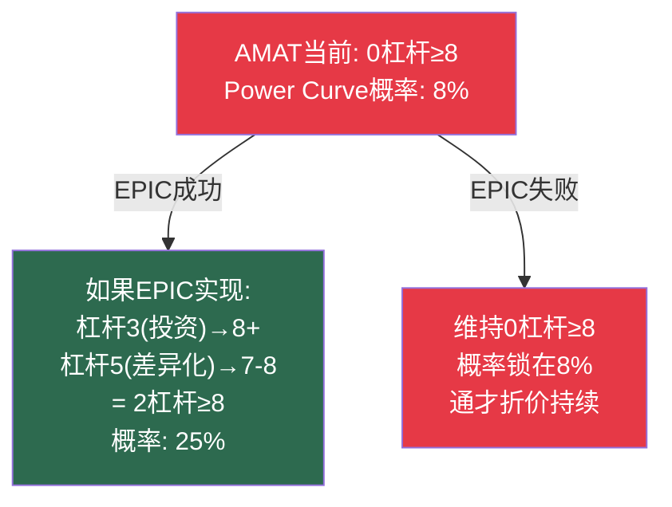

# Chapter 20: McKinsey五大杠杆——谁在拉对的杠杆

---

## 20.1 Power Curve与五大动作

McKinsey的研究表明：经济利润遵循幂律分布——顶部20%的公司攫取~30倍于平均的经济利润。从中间60%移动到顶部20%需要**同时拉动2+杠杆**到≥8分的强度。单一杠杆的效果边际。

---

## 20.2 五大杠杆评分总表

| 杠杆 | 定义 | 阈值 | ASML | KLAC | LRCX | AMAT |
|------|------|------|:---:|:---:|:---:|:---:|
| **1. 程序化M&A** | 每年系列小中型收购，累计占市值有意义比例 | +2.3%年超额TSR | 2 | 5 | 2 | 6 |
| **2. 动态资源重配** | 10年内>50%资本跨业务重配 | >50%资本重配 | 7 | 6 | 5 | 4 |
| **3. 超越对手投资** | CapEx+R&D显著超过行业中位 | CapEx/Rev>行业中位 | **9** | 6 | 7 | 7 |
| **4. 生产率提升** | 利润率改善速度快于行业平均 | 毛利率扩张>同行 | 8 | **9** | 7 | 5 |
| **5. 强差异化** | 定价权+毛利率溢价持续多个周期 | 毛利率溢价>10pp | **10** | **9** | 8 | 5 |
| **总分 (/50)** | | | **36** | **35** | **29** | **27** |
| **≥8分杠杆数** | | | **3** | **2** | 1 | **0** |

### Power Curve上升概率对照

| ≥8分杠杆数 | 从中间60%→顶部20%概率 | 对应公司 |
|:---:|:---:|---------|
| 3+ | ~40% | **ASML** |
| 2 | ~25% | **KLAC** |
| 1 | ~15% | LRCX |
| **0** | **~8%** | **AMAT** |

**AMAT是唯一零杠杆≥8的公司。** 在McKinsey数据中，这类公司跳入Power Curve顶部20%的概率仅为8%——需要同行犯错或外部幸运才能实现。

---

## 20.3 逐杠杆深度分析

### 杠杆1: 程序化M&A (差异化最大)

| 公司 | 近5年重大M&A | 评分 | 分析 |
|------|-----------|:---:|------|
| ASML | 无重大收购(Cymer已早期收购) | 2 | 有机增长为主——对垄断者而言正确 |
| KLAC | Orbotech ($3.4B, 2019) + ECI ($431M) | 5 | 选择性——填补能力缺口 |
| LRCX | 无重大收购; CEA-Leti合作 | 2 | 有机为主——刻蚀领域缺乏标的 |
| AMAT | Kokusai Electric + EPIC $5B(准M&A) | 6 | 最活跃——但EPIC归类为CapEx非M&A |

### 杠杆4: 生产率提升 (KLAC最强)

| 公司 | 毛利率(5年前→现在) | 改善 | 评分 |
|------|:---:|:---:|:---:|
| KLAC | 59%→62% | +3pp | **9** |
| ASML | 48%→52% | +4pp | 8 |
| LRCX | 46%→48% | +2pp | 7 |
| AMAT | 47%→49% | +2pp | 5 (低于行业均值改善速度) |

KLAC的生产率改善来自**软件化**——更高比例的收入来自算法/分析(边际成本接近零)。这是结构性的，不是周期性的。[参阅: Ch10 KLAC服务]

### 杠杆5: 强差异化 (ASML=教科书)

| 公司 | 毛利率溢价vs行业中位 | 定价弹性 | 评分 |
|------|:---:|:---:|:---:|
| ASML | +5pp vs中位47% | 价格弹性接近零(EUV) | **10** |
| KLAC | **+15pp** vs中位47% | 检测定价权强(数据壁垒) | **9** |
| LRCX | +2pp | 强但TEL开始侵蚀 | 8 |
| AMAT | +2pp | 每条线都有竞争者→弱 | 5 |

**KLAC的毛利率溢价(+15pp)实际上是行业最高的**——超过ASML(+5pp)。这是因为KLAC的"信息产品"(缺陷检测结果)本质上是软件输出，边际成本趋近于零。[参阅: Ch3利润池, Ch14 KLAC备忘录]

---

## 20.4 每位CEO应该聚焦的杠杆

| CEO | 最强杠杆 | 应该加强的杠杆 | 为什么 | 不应碰的 |
|-----|:---:|:---:|---------|:---:|
| **Fouquet** | 差异化(10)+投资(9) | 资源重配(DUV→封装光刻) | 封装光刻=新增长向量 | M&A(偏离核心) |
| **Archer** | 差异化(8)+投资(7) | **生产率(7→9)** | CSBG毛利率从55%→63%=最高ROI | M&A(估值太高) |
| **Wallace** | 生产率(9)+差异化(9) | 资源重配(核心→MACH SaaS) | SaaS化=永久估值提升 | 投资(低CapEx是你的优势) |
| **Dickerson** | M&A/投资(6-7) | **差异化(5→8+)=EPIC关键** | 没有差异化杠杆=Power Curve概率锁在8% | 维持8线均投 |

### AMAT的杠杆危机与EPIC的解法

**EPIC对AMAT是存亡级别的赌注**——不是因为$5B本身，而是因为它是将AMAT从"零≥8杠杆"提升到"两个≥8杠杆"的唯一路径。成功=Power Curve概率从8%→25%。失败=概率锁定在8%并且多$5B沉没成本。[参阅: Ch15 C2]

---

*[本章完]*
