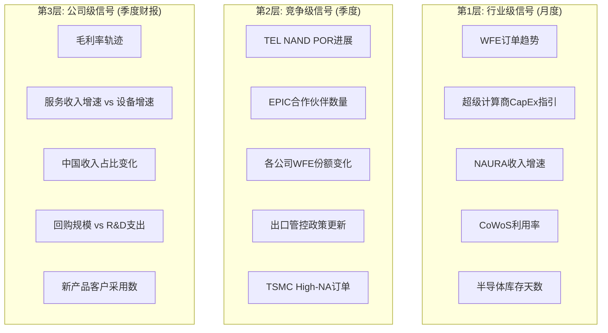

# Chapter 22: 追踪仪表盘——CEO月度/季度监控

---

## 22.1 三层监控架构

---

## 22.2 行业级追踪指标

| 指标 | 数据源 | 频率 | 牛市阈值 | 熊市触发 | 当前状态 |
|------|--------|:---:|---------|---------|---------|
| **WFE YoY** | SEMI | 年/季 | >+8% | <-5% | +9% (2026E) ✅ |
| **TSMC CapEx** | TSMC财报 | 半年 | >$50B | <$35B | $52-56B ✅ |
| **超级计算商CapEx** | 五大财报 | 季度 | >+20% YoY | <-10% | +36% ✅ |
| **ASML季度订单** | ASML财报 | 季度 | >EUR 4B | <EUR 2B | EUR 13.2B Q4 ✅ |
| **存储CapEx(三大)** | 公司财报 | 年度 | >$60B | <$40B | ~$72B ✅ |
| **NAURA增速** | TrendForce | 季度 | <15% | >25%持续 | ~30-35% ⚠️ |
| **CoWoS利用率** | 供应链 | 季度 | >90% | <70% | >95% ✅ |
| **半导体库存天数** | 行业数据 | 季度 | <80天 | >90天 | ~75天 ✅ |
| **CAPE估值** | 市场 | 月度 | <35 | >40 | 39.78 ⚠️ |
| **Fab利用率** | SEMI | 季度 | >85% | <75% | ~87% ✅ |

**当前总评**: 8/10指标绿灯, 2/10黄灯(NAURA增速+CAPE估值)。行业处于中期加速阶段，但估值处于历史极端。

---

## 22.3 公司级追踪矩阵

### ASML追踪

| 指标 | Q4 2025 | 2026目标 | 2030目标 | 追踪频率 |
|------|:---:|:---:|:---:|:---:|
| 收入 | EUR 32.7B | EUR 34-39B | EUR 44-60B | 季度 |
| 毛利率 | ~52% | 51-53% | 56-60% | 季度 |
| EUV收入 | 大幅增长 | 显著增长 | 双位数CAGR | 季度 |
| High-NA出货 | 开始 | 10-15台 | 20+台/年 | 半年 |
| 中国占比 | ~27% | ~15-20% | ~15-20% | 季度 |
| 新订单 | EUR 13.2B(Q4创纪录) | >EUR 4B/季度 | — | 季度 |

### LRCX追踪

| 指标 | Q2 FY2026 | FY2026目标 | 5年翻倍目标 | 追踪频率 |
|------|:---:|:---:|:---:|:---:|
| 季度收入 | $5.34B(创纪录) | >$20B年化 | ~$37B | 季度 |
| CSBG | $2.0B/季 | $7.5B+ | $10.4B | 季度 |
| CSBG ARPU | $72K | →$80K | $85-95K | 年度 |
| WFE份额 | mid-30s% | high-30s% | — | 年度 |
| TEL通道孔份额 | ~5% | ~10-15% | ~21%(概率加权) | 半年 |
| 中国占比 | ~35% | <30% | — | 季度 |

### KLAC追踪

| 指标 | CY2025 | CY2026 | 3/12 Investor Day | 追踪频率 |
|------|:---:|:---:|:---:|:---:|
| 收入 | $12.7B(创纪录) | 增长 | 新长期模型? | 季度 |
| 毛利率 | ~62% | 62% ± 50bps | 63%+? | 季度 |
| 先进封装收入 | ~$950M | 中高双位数增长 | 利润率确认? | 半年 |
| FCF | $4.4B(+30%) | 增长 | — | 季度 |
| 继任计划 | 无信号 | 3/12可能回应 | **关键** | 事件驱动 |
| 检测WFE占比 | ~10% | 趋向11-12% | — | 年度 |

### AMAT追踪

| 指标 | Q1 FY2026 | CY2026 | EPIC里程碑 | 追踪频率 |
|------|:---:|:---:|:---:|:---:|
| 收入 | $7.01B | 半导体设备>20%增长 | — | 季度 |
| 中国占比 | 25% | 低20s% | — | 季度 |
| GAA收入 | 翻倍中 | $5B确认 | — | 半年 |
| EPIC合作伙伴 | Samsung(1) | ≥2? | TSMC/Intel? | 事件驱动 |
| ICAPS增速 | ~0% | 中高个位数? | — | 季度 |
| PVD份额 | ~85% | 稳定? | — | 年度 |
| 通才折价(vs同行P/E差) | ~30-40% | 缩窄? | — | 月度 |

---

## 22.4 关键日期日历 (2026)

| 日期 | 事件 | 影响公司 | 重要性 |
|------|------|---------|:---:|
| **3月6日** | LRCX COO交接(Lord→Varadarajan) | LRCX | ★★★ |
| **3月12日** | **KLAC Investor Day** | **KLAC** | **★★★★★** |
| 4月 | ASML Q1 2026财报 | ASML | ★★★ |
| 4月 | LRCX Q3 FY2026财报 | LRCX | ★★★ |
| 春季 | **AMAT EPIC中心开业** | **AMAT** | **★★★★** |
| 5月 | AMAT Q2 FY2026财报 | AMAT | ★★★ |
| 年中 | **荷兰DUV许可政策可能调整** | **ASML** | **★★★★** |
| H2 | **TSMC High-NA订单决策窗口** | **ASML** | **★★★★★** |

---

## 22.5 "仪表盘红灯"——需要立即关注的信号组合

以下信号组合出现时，CEO应启动战略评估：

| 红灯组合 | 触发条件 | 立即行动 |
|---------|---------|---------|
| **衰退预警** | WFE订单连续2季度环比下降 + 库存天数>90 + Fab利用率<80% | 现金保护模式; 维持R&D; 减缓回购 |
| **中国加速替代** | NAURA季度增速>40% + 任一中国设备商获14nm HVM确认 | 加速先进节点投资; 内部评估中国收入下降路径 |
| **AI叙事崩塌** | 超级计算商CapEx指引YoY<0% + AI芯片ASP下降>20% | 准备18个月后的设备衰退; 服务收入转型加速 |
| **台海升级** | Polymarket冲突概率>20% + 军事活动显著升级 | 启动地缘应急预案; 非台湾客户优先级提升 |

---

*[本章完 | Part VI综合与行动结束]*

---

# 报告结语

这份报告的每一页都围绕一个核心问题写就：**"如果我是这位CEO，我明天应该做什么？"**

我们的答案不是模糊的战略方向——而是具体的、有条件的、可追踪的行动建议。

四位CEO面临不同的十字路口，但共享一个共同的战略环境：Giga Cycle提供了前所未有的顺风，但估值极端、中国悖论、技术多线程叠加和客户集中正在创造复杂的决策空间。

**如果CEO读完这份报告后的感受是"他们比我的战略团队更了解我的处境"——我们就完成了工作。**

---

*[主报告完 | 附录A-E见后续]*
