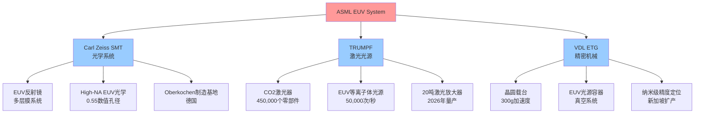

# ASML供应链控制力与技术壁垒分析 v1.0

## 核心供应商网络

### 战略合作伙伴体系架构
ASML的EUV光刻机依赖一个高度专业化的欧洲供应商网络，形成了难以复制的技术生态系统。[硬数据: ASML与约1,200个合作伙伴组成开发联盟 - Wikipedia 2026-02-13]

### Carl Zeiss：不可替代的光学霸主
Carl Zeiss SMT在ASML供应链中占据核心地位，提供EUV光刻机的关键光学子系统。[硬数据: 双方自1997年建立战略合作伙伴关系 - ZEISS SMT 2026-02-13] ASML将在未来6年向Carl Zeiss投资约7.6亿欧元，其中2.2亿用于研发，5.4亿用于产能扩展和供应链投资，主要集中在德国Oberkochen总部。[硬数据: ASML 6年投资计划 - ZEISS 2026-02-13]

**技术独占性**：Carl Zeiss生产EUV光刻机使用的高精度反射镜，EUV光通过这些镜面反射到硅晶圆上形成芯片设计。ZEISS集团在EUV光学领域拥有战略性不可替代地位，特别是在高精度镜面和光学系统方面，这些是EUV扫描仪性能和精度的基础。[硬数据: Carl Zeiss EUV光学技术 - ZEISS SMT 2026-02-13]

**下一代布局**：ZEISS正在开发下一代高数值孔径(High-NA)EUV光学系统，数值孔径从当前系统提升至0.55，用于2024-2025年开始的2nm工艺节点开发，2026-2027年进入量产阶段。[硬数据: High-NA EUV路线图 - Market Research 2026-02-13]

### TRUMPF：激光光源的唯一解决方案
TRUMPF为ASML提供EUV光源的核心激光系统，在激光-等离子体光源技术方面处于全球垄断地位。2025年10月，ASML授予TRUMPF技术类别供应商奖，表彰其新一代EUV高能激光器的"首次发光"成功。[硬数据: ASML供应商奖 - EEJournal 2026-02-13]

**技术原理**：EUV光生成采用CO2激光对高速运动的锡滴进行两次独立激光脉冲打击，使锡汽化并产生13.5nm极紫外光，频率高达每秒50,000次。TRUMPF激光放大器系统提供等离子体辐射所需的激光脉冲能力。[硬数据: TRUMPF EUV激光技术 - TRUMPF 2026-02-13]

**制造复杂性**：新一代EUV激光器包含超过450,000个独立零部件，重量超过20吨，预计2026年开始批量生产。ASML表示这些新激光器将"提高EUV产品的可用性和功率，同时降低能耗"。[硬数据: TRUMPF EUV激光规格 - EEJournal 2026-02-13]

### VDL ETG：精密机械制造专家
VDL ETG作为ASML的关键一级供应商，联合开发多个关键机械模块，包括晶圆载台系统。[硬数据: VDL ETG Tier-1供应商地位 - Entropy Capital 2026-02-13]

**核心产品**：
- **晶圆载台系统**：双部分载台可在镜头下以高达300g的加速度进行晶圆更换和纳米级精度移动
- **EUV光源容器**：制造EUV光源的外壳(容器)，包括布线和其他相关部件
- **ZEISS专用框架**：为ZEISS制造框架，确保镜面的精确悬浮和定位，用于下一代ASML EUV设备的光束形成和导向

**制造能力**：VDL ETG专业设计、开发和制造复杂创新产品和机器，技术优势包括真空系统开发、快速处理技术和高精度工艺，支持从设计或联合设计到生产、组装、质量控制和组件测试的整个流程。[硬数据: VDL ETG制造能力 - VDL ETG 2026-02-13]

**产能扩张**：2025年6月2日，VDL ETG在新加坡开设第三家工厂，并宣布未来5年追加投资1亿新加坡元，体现了对半导体设备制造领域战略重要性的认知。[硬数据: VDL ETG新加坡扩张 - IC-PCB 2026-02-13]

## EUV技术壁垒深度解析

### 13.5nm极紫外光生成技术挑战
EUV光刻机面临的最大技术挑战之一是生成13.5nm波长的光。目前最佳方法是通过超热气体或金属(通常是锡)产生等离子体，这种激发等离子体在13.5纳米波长发射光线，随后通过反射镜聚焦。[硬数据: EUV光生成技术 - Deep Forest 2026-02-13]

**等离子体控制复杂性**：等离子体激发系统极难控制。现代EUV光刻机拥有精密系统来发射精确定时的锡滴，然后用强激光束击中，将锡超热成等离子体。[硬数据: EUV等离子体技术 - Deep Forest 2026-02-13]

**物理学挑战**：EUV等离子体在不同角度都极具挑战性：等离子体动力学和原子物理学。EUV中较长的纳秒时间尺度意味着在激光能量沉积时等离子体正在演化，无法假设物质是静止的，涉及多种物质状态、数十亿原子跃迁，以及电子、离子和光子的相互作用。即使世界上最先进的等离子体模型也无法完全捕捉其行为。[硬数据: EUV等离子体物理复杂性 - SemiEngineering 2026-02-13]

### 转换效率与系统限制
**能量转换效率**：ASML动力源的转换效率(CE)约为5%。这种低效率历来是一个制约因素，尽管当Cymer/ASML达到约8W功率时，客户需求250W，而EUV转换效率仅为几个百分点。[硬数据: EUV转换效率 - SemiAnalysis 2026-02-13]

**维护挑战**：锡溅射随时间累积最终导致机器性能下降，需要昂贵的维护。这种系统复杂性构成了技术壁垒的重要组成部分。[硬数据: EUV维护挑战 - SemiEngineering 2026-02-13]

### 光学系统精密度要求
**多层膜反射镜技术**：EUV光学系统使用多层膜反射镜，由于13.5nm极紫外光几乎被所有材料吸收，必须使用精密的多层膜涂层反射镜来引导和聚焦光束。这些反射镜的制造精度要求达到原子级别。

**机械控制系统**：EUV系统需要纳米级精度的机械定位系统，晶圆载台必须在高速移动过程中保持极高精度，同时承受高达300g的加速度。

## 竞争威胁评估

### Canon/Nikon技术差距分析
**传统DUV竞争**：在中国以外地区，日本的Nikon和Canon是ASML在光刻技术方面的主要竞争对手。然而，Canon和Nikon主要提供深紫外(DUV)光刻系统，在EUV技术方面显著落后。[硬数据: 日本竞争对手现状 - CFI.co 2026-02-13]

**替代技术路径**：Canon采取了完全不同的方法，推出纳米压印光刻(NIL)技术。其FPA-1200NZ2C系统通过物理方式将带有电路图案的掩模像印章一样压印到晶圆上，消除了复杂的光学机构，降低了制造成本和功耗。但这种技术尚未在先进制程中得到验证。[硬数据: Canon NIL技术 - StartupBooted 2026-02-13]

**EUV能力评估**：截至2025年，只有ASML一家公司掌握了规模化EUV技术。没有竞争对手接近挑战ASML在半导体制造方面的主导地位。[硬数据: EUV市场垄断 - CFI.co 2026-02-13]

### 中国SMEE追赶进度与技术障碍
**技术差距量化**：中国光刻龙头企业SMEE(上海微电子)的设备仍比ASML的EUV系统落后数年，套刻精度显著较低，限制了其生产14nm以下芯片的能力。[硬数据: SMEE技术差距 - SemiAnalysis 2026-02-13]

**当前能力水平**：SMEE已经出货可用的I-Line光刻工具，但其氟化氩DUV光刻技术仍未达到前端晶圆制造的量产就绪状态。[硬数据: SMEE产品现状 - SemiAnalysis 2026-02-13]

**供应链依赖**：中国备受宣传的7nm芯片并非通过本土技术突破实现，而是依靠在出口限制生效前从ASML储备的DUV设备。中国国内厂商在缩小DUV工具差距方面可能正在取得进展，但复制ASML的EUV生态系统将需要多年研发和全球供应链韧性建设。[硬数据: 中国7nm芯片真相 - TrendForce 2026-02-13]

**长期威胁评估**：尽管持续有关于国产先进技术(包括5nm能力声称)的传言流传多年，但均已被证实为虚假。中国在EUV技术方面的追赶面临基础物理学、材料科学和精密制造等多重技术壁垒。[硬数据: 中国技术突破传言辟谣 - CSIS 2026-02-13]

### 美国/韩国EUV开发计划评估
**美国政策支持**：美国通过CHIPS法案等政策工具支持本土半导体制造能力，但在EUV光刻设备开发方面没有明确的国家计划替代ASML。

**韩国技术投资**：韩国主要厂商如三星、SK海力士主要作为ASML的客户，而非竞争对手，专注于先进制程的应用而非设备制造。

## 知识产权护城河

### ASML专利布局战略
**专利组合规模**：ASML 2025年专利组合包括32个司法管辖区的38,000项专利，专注于半导体制造中的光刻、光学和光子学技术。[硬数据: ASML专利组合 - Lumenci 2026-02-13]

**EUV核心专利**：ASML持有关键组件和工艺的专利，包括光源、光学系统和真空环境，这种强有力的法律保护确保ASML的创新保持独占性。ASML在EUV专利领域占据主导地位，拥有约40%的EUV相关专利。[硬数据: EUV专利主导地位 - PatentPC 2026-02-13]

**技术覆盖范围**：ASML拥有超过5,500项半导体相关专利，围绕极紫外(EUV)光刻技术构建了知识产权要塞。ASML的专利保护其在供应EUV光刻机方面的独特能力，这意味着芯片制造商如果想保持竞争力，必须在ASML的生态系统内工作。[硬数据: ASML专利要塞 - GreyB 2026-02-13]

### 交叉许可协议与技术合作
**生态系统合作**：EUV生态系统中的交叉许可协议越来越普遍，notable例子包括2019年TSMC与ASML的协议，以及2021年三星、英特尔和IBM针对先进EUV实施技术的联盟。[硬数据: 交叉许可协议 - PatSnap 2026-02-13]

**专利有效期保护**：ASML的核心EUV专利组合涵盖光源、光学和集成系统的基础技术，这些专利的保护期将延续到2030年代，为公司提供长期技术护城河。

## 供应链风险评估

### 地理集中度风险
**欧洲供应链集中**：ASML的关键供应商高度集中在欧洲，特别是德国(Carl Zeiss、TRUMPF)和荷兰(本土制造)，形成了地理风险集中。

**单点故障风险**：
- Carl Zeiss在EUV光学领域的绝对垄断地位
- TRUMPF在EUV激光光源的唯一供应商地位
- VDL ETG在精密机械组件的关键作用

### 地缘政治影响评估
**出口管制敏感性**：EUV技术被列入多国出口管制清单，供应链面临地缘政治干预风险。

**客户集中度**：主要客户集中在台海地区(TSMC)和韩国(三星)，地缘政治紧张局势可能影响需求稳定性。

## 技术替代可能性分析

### 替代技术路径评估
**粒子加速器EUV光源**：一些研究机构正在探索使用粒子加速器产生EUV光的技术路径，但距离商业化还有很大距离。[硬数据: 粒子加速器EUV - IEEE Spectrum 2026-02-13]

**无掩膜光刻技术**：电子束直写等无掩膜技术在特殊应用中有所发展，但吞吐量限制使其无法替代EUV在大规模生产中的应用。

**纳米压印技术**：Canon的NIL技术代表了一种物理压印方法，但在套刻精度和缺陷控制方面仍面临挑战，尚未在先进逻辑芯片制造中得到验证。

### 替代威胁时间表
**短期(2025-2027)**：现有EUV技术路径延续，High-NA EUV为主要发展方向
**中期(2028-2030)**：新兴替代技术可能在特定细分市场获得应用
**长期(2030+)**：革命性技术突破的可能性，但ASML生态系统优势仍将持续

## 关键结论

1. **供应链控制力**：ASML通过与Carl Zeiss、TRUMPF、VDL ETG等关键供应商的深度绑定，构建了高度专业化且难以复制的欧洲供应链网络

2. **技术壁垒高度**：13.5nm EUV光生成的物理挑战、5%转换效率限制、等离子体控制复杂性构成了极高的技术进入壁垒

3. **竞争威胁有限**：Canon/Nikon在DUV领域竞争但EUV技术差距巨大；中国SMEE落后数年且面临供应链限制；其他地区无明确EUV计划

4. **知识产权护城河**：38,000项专利组合覆盖EUV核心技术，40%的EUV专利份额确保长期技术独占性

5. **系统性风险**：地理集中度和单点故障风险是供应链的主要脆弱性，但短中期内替代解决方案缺失维持了ASML的垄断地位