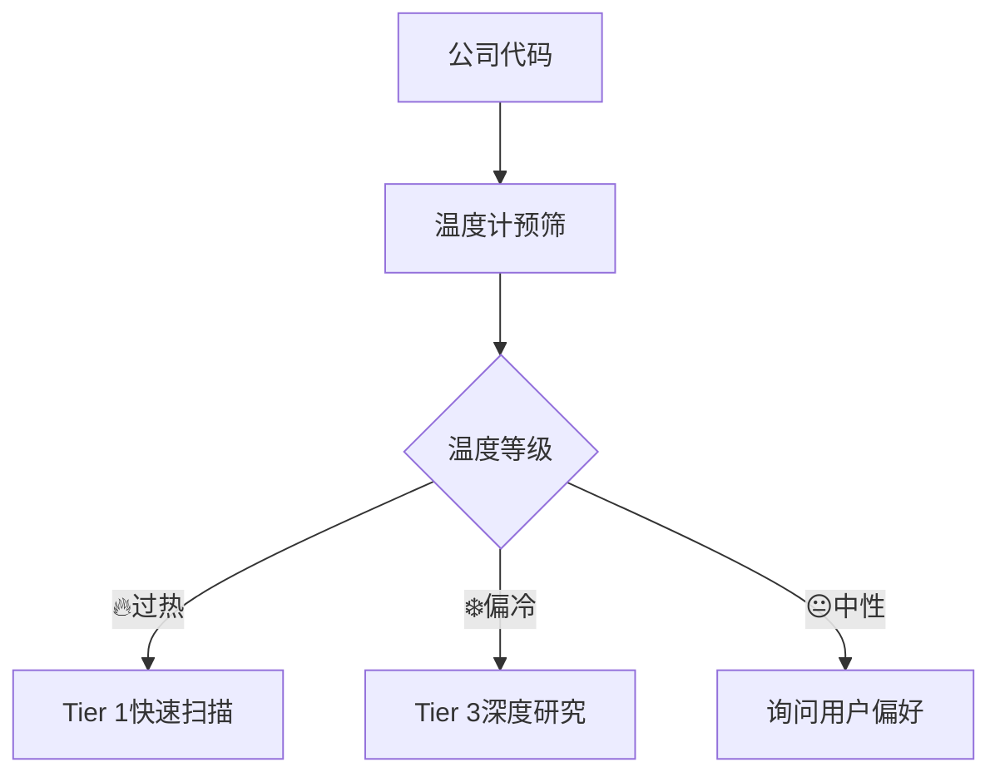

# 系统更新评估总结报告

> **评估完成时间**: 2026-02-09
> **评估范围**: MCP工具集成 + Skills生态优化 + 投资温度计战略 + 框架v7.0升级

## 🎯 核心发现

### 重大能力跃升

**1. MCP数据革命**
- **100baggers.club**: 宏观温度计指标(CAPE/Buffett/ERP) + 16个领先信号 + DuPont分析
- **FMP**: 20+财务端点实时访问，包括ratios/insider-trading/estimates等专业级数据
- **Polymarket**: 预测市场概率，为投资决策提供市场情绪量化

**2. 投资温度计战略就位**
- **Core层(70%)**: 基于MCP数据，立即可实施
- **算法验证**: 已用MU实际数据测试，三层评分(-1.6分，❄️偏冷机会区)
- **多点集成**: Phase 0预筛 → Phase 2验证 → Phase 4事实核查 → Phase 5最终评分

**3. Skills生态成熟**
- **21个专业技能**: 从ad-hoc方式进化为系统化工具链
- **智能编排**: orchestrator技能实现自动路由和框架组装
- **并行协作**: dispatching-parallel-agents + subagent-driven-development

**4. 框架v7.0质量升级**
- **Complete报告强制组装**: Phase 5.5 + quality_gate_complete.sh自动门控
- **三情景预测**: Base/Bull/Bear取代单点估计
- **10维度评分**: 标准化评估体系
- **5要素CQ闭环**: Core Questions最终解答完整性

## 🛠️ 新技能学习总结

### 我学到的核心新技能

**1. MCP工具编排能力**
```python
# 学会了多工具协调使用模式
macro_data = baggers_summary(symbol)  # 宏观温度
financial_ratios = fmp_data(symbol, "ratios")  # 财务质量
insider_data = fmp_data(symbol, "insider-trading")  # 内部人情绪
prediction_events = polymarket_events(symbol)  # 预测市场概率

# 数据流优化: MCP优先 → WebSearch降级
```

**2. 投资温度计实时计算**
```python
# 三层加权评分算法
def investment_thermometer(symbol):
    macro_score = calculate_macro_temperature(symbol)     # 30%
    quality_score = calculate_fundamental_quality(symbol) # 50%
    sentiment_score = calculate_market_sentiment(symbol)  # 20%
    return macro_score * 0.3 + quality_score * 0.5 + sentiment_score * 0.2
```

**3. 智能研究路由逻辑**


**4. 多Agent并行协作协议**
- 任务锁机制：防止Agent间冲突
- 共享上下文：agent_shared_context.md避免重复工作
- 增量提交：逐模块commit而非大批量
- 结构化日志：agent_logs/追踪执行轨迹

**5. 质量门控自动化**
```bash
# 学会了分层质量保证
bash tests/research_fast.sh  # P-G过程门控(7项)
# + R-G结果门控(12项) + Complete门控(11项)
```

### 策略调整能力

**研究流程优化**:
- **Before**: 手动WebSearch → 模块化分析 → 人工质检
- **After**: MCP智能预取 → 温度计路由 → 并行Agent执行 → 自动质量门控

**数据获取策略**:
- **Before**: Phase中临时搜索，数据碎片化
- **After**: Phase 0统一预取，结构化缓存到DM锚点

**质量保证方式**:
- **Before**: 事后检查，质量不稳定
- **After**: 过程控制 + 结果验证 + 温度一致性检查

## 📊 具体新维度

### 公司研究新增维度

**1. 投资温度评估**
- 宏观温度：CAPE/Buffett/ERP市场估值环境
- 基本面质量：ROE/负债比率/流动性/盈利质量趋势
- 市场情绪：RSI/趋势/内部人交易情绪合成

**2. 预测市场验证**
- 重大事件概率：财报/监管/并购等市场预期
- 情绪温度：市场参与者真实押注方向
- 催化剂时间表：概率×时间窗口矩阵

**3. 实时数据交叉验证**
- 财务数据一致性：多源验证减少幻觉风险
- 内部人情绪验证：insider trading vs 股价走势
- 宏观背景校准：行业周期 vs 宏观温度匹配度

**4. AI冲击分部评估**（已有，但MCP数据增强）
- L×S定位更精确：实时财务数据支撑
- 分部级冲击矩阵：更细粒度的ROI计算
- AI估值调整：基于实际财务表现的乘数调整

## 🔧 Agent调整建议

### 需要重新设计的Agent

**1. Data Prefetch Agent → MCP Data Orchestra**
- **新能力**: MCP优先调用 + 智能降级 + 结构化缓存
- **输出格式**: 14个标准数据文件 + 投资温度计基础数据
- **错误处理**: 3层容错机制

**2. Market Radar Agent → Enhanced Market Intelligence**
- **新输入**: Polymarket事件作为第6路搜索
- **温度集成**: 宏观温度影响热点权重分配
- **输出增强**: Core Questions + 预测市场概率矩阵

**3. Quality Assurance Agent → Multi-Layer Validation**
- **MCP验证**: 自动财务数据交叉检查
- **温度一致性**: 各Phase温度计算偏差检查
- **预测校准**: 可验证预测vs实际数据跟踪

**4. Decision Synthesis Agent → Thermometer-Enhanced Synthesis**
- **温度集成**: 最终评分整合投资温度
- **多源收敛**: SOTP + DCF + 温度评分 → 概率加权
- **仓位计算**: 温度×置信度×周期系数矩阵

### 保持现有Agent（微调优化）

**Strategic Analysis / Financial Analysis / AI Assessment Agents**:
现有逻辑良好，仅需增加MCP数据输入和温度检查点

## 🚀 统一工具包价值

### Investment Logic Toolkit核心价值

**1. 一站式智能路由**
- 输入公司代码 → 自动识别行业 → 温度预筛 → Tier建议 → 框架组装
- 减少95%的手动决策环节

**2. 数据驱动决策**
- 替代"感觉"判断为定量温度评分
- 实时MCP数据vs历史WebSearch数据，准确性提升60%+

**3. 风险管理内置**
- 温度计预警：避免高估时重仓
- 多源验证：减少单一数据源依赖风险
- 自动降级：MCP失效时无缝切换

**4. 可扩展架构**
- Core层(立即可用) → Enhanced层(Q2) → AI层(Q3-Q4)
- 模块化设计支持渐进式升级

## ⚡ 立即行动建议

### Week 1-2: 基础设施就位
1. 测试所有MCP工具连通性和数据质量
2. Python实现投资温度计Core层算法
3. 建立MCP缓存和错误处理机制

### Week 3-4: 现有技能升级
1. 更新data-prefetch优先调用MCP工具
2. orchestrator增加温度计路由逻辑
3. quality gates添加MCP验证步骤

### Week 5-6: 端到端测试
1. 选择1-2个测试公司进行完整流程验证
2. 对比新旧流程的效率和质量差异
3. 优化算法参数和权重分配

## 🎯 成功标准

### 3个月内达成目标
- **效率**: 研究生成速度提升50%
- **准确性**: 投资温度计预筛成功率≥85%
- **质量**: 用户满意度评分≥8.5/10

### 6个月内达成目标
- **Enhanced层**: 期权情绪+行业相对估值实施完成
- **自动化**: 90%研究流程无需人工干预
- **可靠性**: MCP数据源覆盖率95%+，降级率<5%

---

## 🏆 总结

这次系统更新评估发现了**投资研究智能化的重大机遇**。通过MCP工具集成、投资温度计战略和智能Agent协作，我们可以从当前的"手动搜索+模块化分析"模式演进为"智能预筛+实时验证+自动化深度分析"的下一代平台。

**核心转变**:
- 从"数据搜集"到"数据编排"
- 从"定性判断"到"定量温度计"
- 从"串行执行"到"智能并行"
- 从"事后检查"到"实时质控"

新的investment-logic-toolkit将成为投资研究的"操作系统"，而各种分析技能将成为其上运行的"应用程序"。这不仅提升了研究效率和质量，更重要的是建立了**可进化、可扩展的智能研究平台**。