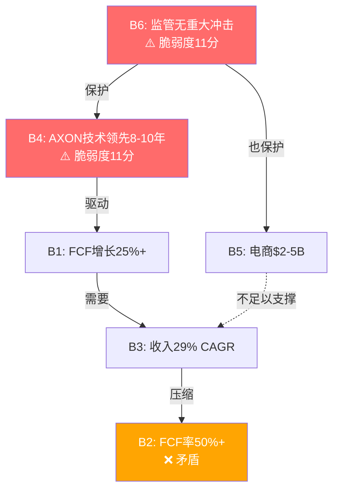

## APP信念一致性矩阵 — 逻辑冲突检测

**方法**: 测试6个信念两两之间的逻辑关系，识别不可能同时成立的组合。

### 关键信念对分析

| 信念对 | 关系 | 逻辑分析 |
|--------|:---:|----------|
| **B1×B3** | 协同 | FCF增长25%需要收入增长29% — 逻辑一致，FCF率假设稳定 |
| **B3×B5** | 矛盾 | 收入29% CAGR vs 电商仅贡献$2-5B — 数量级不匹配！ |
| **B4×B6** | 独立 | 技术领先与监管风险无直接关联 |
| **B1×B2** | 协同 | FCF高增长需要FCF率不恶化 — 相互支撑 |
| **B2×B3** | 矛盾 | 29%收入增长通常需要利润率让步，难以同时维持50%+ FCF率 |
| **B5×B6** | 协同 | 电商成功需要监管环境允许数据收集 |

### 核心矛盾发现

**三重矛盾组合**: B2(FCF率50%+) + B3(收入29% CAGR) + B5(电商仅$2-5B)

**逻辑问题**:
- 如果电商仅贡献$2-5B，现有游戏业务需要承担29%增长的主要压力
- 游戏业务在如此高增长下很难维持50%+ FCF率（通常需要大量CapEx/R&D投入）
- **这三个信念无法同时为真**

**最危险的依赖链**: B4(技术领先) → B1(FCF增长) → B3(收入增长) → B2(FCF率维持)
- 如果B4失败（AXON被追平），整个链条倒塌
- **单点故障风险**

### Mermaid信念关系图

### 关键洞察

1. **B4和B6是双支柱** — 任一倒塌，评级必然下调
2. **B2/B3/B5形成"不可能三角"** — 最多2个同时成立
3. **市场在赌单点故障不发生** — 技术领先+监管安全的联合概率